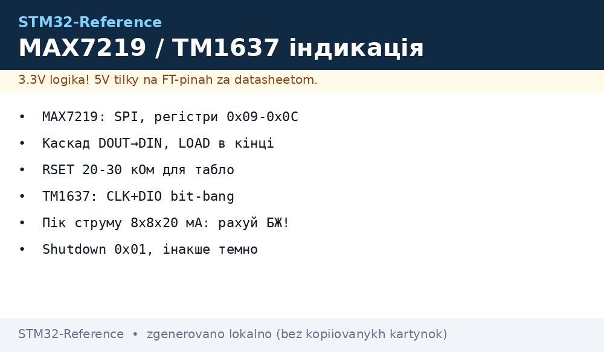
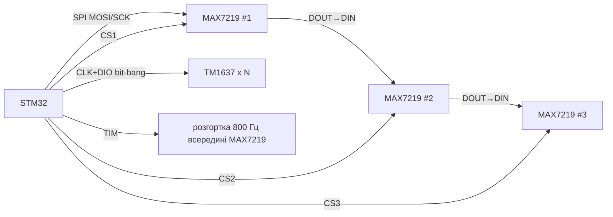

# STM32 і LED-індикація - MAX7219 матриці та TM1637 семисегментники


*Рис. MAX7219 каскадом по SPI крутить матриці 8x8, TM1637 - дешеві 4-розрядні індикатори по двох дротах.*

> [!tip] Що це за нота
> Коли OLED/TFT - забагато: табло температури, лічильник, годинник. MAX7219 - дорослий SPI-драйвер з каскадуванням, TM1637 - копійчаний I2C-подібний індикатор. База: [OLED-дисплеї](../../../STM32-Reference/11-Vivid/01-OLED-SSD1306.md), [шина SPI](../../../STM32-Reference/04-Shini/02-SPI.md), [режими GPIO](../../../STM32-Reference/03-GPIO/01-GPIO-rezhimi.md).

## 1. Мета

Закрити всю LED-індикацію двома мікросхемами:

- MAX7219: до 8 семисегментників або матриця 8x8, каскад до 8 штук;
- TM1637: 4 розряди + двокрапка, години/температура за копійки;
- яскравість - регістром, без ШІМ і мерехтіння;
- шрифт 5x7 для матриць зберігаємо у flash.

| Критерій | MAX7219 | TM1637 |
| --- | --- | --- |
| Інтерфейс | SPI 10 МГц, 16-бітні пакети | 2 дроти (CLK/DIO), свій протокол |
| Каскад | DOUT→DIN, скільки завгодно | немає, один на 2 піни (адреси немає) |
| Живлення | 4-5.5V, струм сегментів до 40 мА | 3.3-5V, яскравість 8 рівнів |
| Ціна | дорожчий, але один на 64 LED | найдешевший індикатор взагалі |

## 2. Архітектура



MAX7219 сам мультиплексує розгортку 800 Гц - MCU лише пише регістри. CS можна спільний (дані йдуть каскадом) або окремий на кожен - другий варіант простіший для старту.

## 3. Регістри MAX7219

| Адреса | Регістр | Значення для старту |
| --- | --- | --- |
| 0x09 | Decode-Mode | 0xFF - BCD-декодування всіх розрядів |
| 0x0A | Intensity | 0x08 - середня яскравість |
| 0x0B | Scan-Limit | 0x07 - всі 8 розрядів |
| 0x0C | Shutdown | 0x01 - увімкнути (0x00 - сон 150 мкА) |
| 0x0F | Display-Test | 0x00 - вимкнути тест |
| 0x01-0x08 | Digit 0-7 | дані, молодший розряд першим |

RSET-резистор між V+ і ISET задає струм сегментів: 10 кОм ≈ 40 мА. Для домашнього табло ставимо 20-30 кОм - тихіше і холодніше. Живлення драйвера - 5V окремою лінією, логіка SPI толерантна до 3.3V рівнів STM32.

## 4. Протокол TM1637

- старт: CLK HIGH → DIO падає, стоп - навпаки;
- команда 0x40 - запис даних, 0xC0 - адреса 0, далі 4 байти розрядів;
- команда 0x88+N - дисплей ON + яскравість 0-7;
- двокрапка - біт 0x80 у другому байті;
- ACK - модуль тягне DIO вниз на 9-му такті, читаємо і ігноруємо;
- таймінги мікросекундні - пишемо bit-bang з `__NOP` затримками.

## 5. Робочий код HAL

```c
void max7219_write(uint8_t addr, uint8_t data) {
  HAL_GPIO_WritePin(GPIOB, GPIO_PIN_6, GPIO_PIN_RESET);
  uint8_t pkt[2] = {addr, data};
  HAL_SPI_Transmit(&hspi1, pkt, 2, 50);
  HAL_GPIO_WritePin(GPIOB, GPIO_PIN_6, GPIO_PIN_SET);
}

void max7219_init(void) {
  max7219_write(0x0F, 0x00);
  max7219_write(0x09, 0xFF);
  max7219_write(0x0A, 0x08);
  max7219_write(0x0B, 0x07);
  max7219_write(0x0C, 0x01);
}

void max7219_number(int32_t v) {
  for (int d = 0; d < 8; d++) {
    max7219_write(d + 1, v < 0 && d == 7 ? 0x0A : abs(v) % 10);
    v /= 10;
  }
}

void tm1637_byte(uint8_t b) {
  for (int i = 0; i < 8; i++) {
    HAL_GPIO_WritePin(GPIOA, GPIO_PIN_5, GPIO_PIN_RESET);
    HAL_GPIO_WritePin(GPIOA, GPIO_PIN_6, (b & 1) ? GPIO_PIN_SET : GPIO_PIN_RESET);
    tm_tick();
    HAL_GPIO_WritePin(GPIOA, GPIO_PIN_5, GPIO_PIN_SET);
    tm_tick();
    b >>= 1;
  }
}
```

Каскад MAX7219: шлемо пакети для всіх мікросхем підряд (останній в ланцюгу - першим), один імпульс LOAD в кінці.

## 6. Шрифти і матриці

- BCD-декодер покриває 0-9, мінус, E, H, L, P, blank - решту малюємо no-decode побітово;
- матриця 8x8 в no-decode: кожен digit-регістр - один рядок, біти - стовпці;
- шрифт 5x7 для біжучого рядка тримаємо таблицею 96×5 байт у flash;
- біжучий рядок: зсув кадру кожні 120 мс по таймеру, без затримок у коді.

## 6.1 Каскад з окремими CS: коли простіше

Якщо матриць 2-3, окремий CS на кожну спрощує код: пишемо однакові пакети паралельно, LOAD - спільний. Пінів вистачить (PB6/PB7/PB8), швидкість та сама. Довгий ланцюг DOUT→DIN лишаємо для 4+ модулів - там економія пінів важливіша за простоту.

## 7. Живлення і струми

- 8 розрядів × 8 сегментів × 20 мА = пік 1.28 А при всіх вісімках - рахуємо блок живлення;
- реально середній струм у 8 разів менший (мультиплекс), але пік чесний;
- RSET підбираємо під яскравість приміщення, не «на око»;
- довгі шлейфи SPI - кручена пара SCK/GND, інакше фантоми на матриці.

## 8. Типові помилки

| Симптом | Причина | Лікування |
| --- | --- | --- |
| MAX7219 темний | Shutdown-регістр 0x00 | записати 0x0C = 0x01 після ініціалізації |
| Світяться всі сегменти | Display-Test увімкнений | 0x0F = 0x00 |
| Каскад показує одне й те саме | пакети в неправильному порядку | останній чип - першим у потоці, LOAD в кінці |
| TM1637 показує сміття | немає ACK-паузи або швидкий bit-bang | затримки 5-10 мкс, читати ACK-біт |
| Мерехтить на камері | scan-limit менший за кількість розрядів | Scan-Limit = кількість − 1 |
| Гріється драйвер | RSET занадто малий | підняти до 20-30 кОм для індикації |

## 9. Суміжні ноти

- [OLED-дисплеї](../../../STM32-Reference/11-Vivid/01-OLED-SSD1306.md) - коли треба графіка.
- [графічна бібліотека LVGL](../../../STM32-Reference/11-Vivid/05-LVGL.md) - важка артилерія.
- [шина SPI](../../../STM32-Reference/04-Shini/02-SPI.md) - швидкості, DMA-вивід.
- [режими GPIO](../../../STM32-Reference/03-GPIO/01-GPIO-rezhimi.md) - bit-bang для TM1637.
- [розрахунок живлення STM32](../../../STM32-Reference/02-Zhivlennya/03-Power-Design.md) - піки струму табло.

## Офіційні джерела

- [MAX7219 Datasheet (Analog Devices)](https://www.analog.com/en/products/max7219.html) - регістри, RSET, каскад.
- [Grove 4-Digit Display / TM1637 (Seeed)](https://www.seeedstudio.com/Grove-4-Digit-Display.html) - протокол, команди, таймінги.
- [MD_MAX72XX (MajicDesigns, GitHub)](https://github.com/MajicDesigns/MD_MAX72XX) - шрифти і матричні ефекти.
- [TM1637 (avishorp, GitHub)](https://github.com/avishorp/TM1637) - еталонний bit-bang драйвер.
