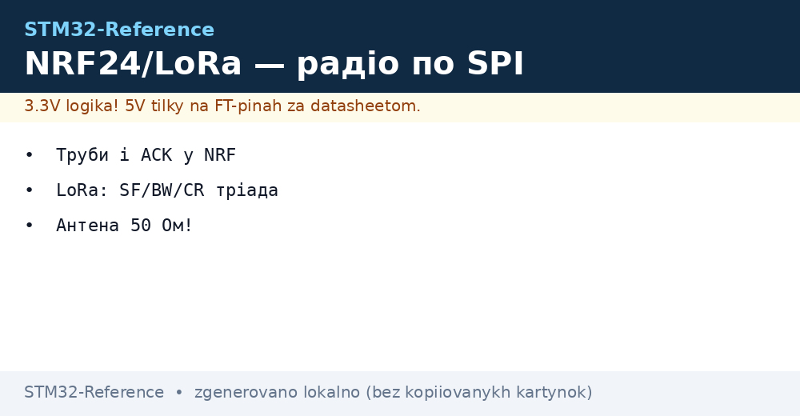
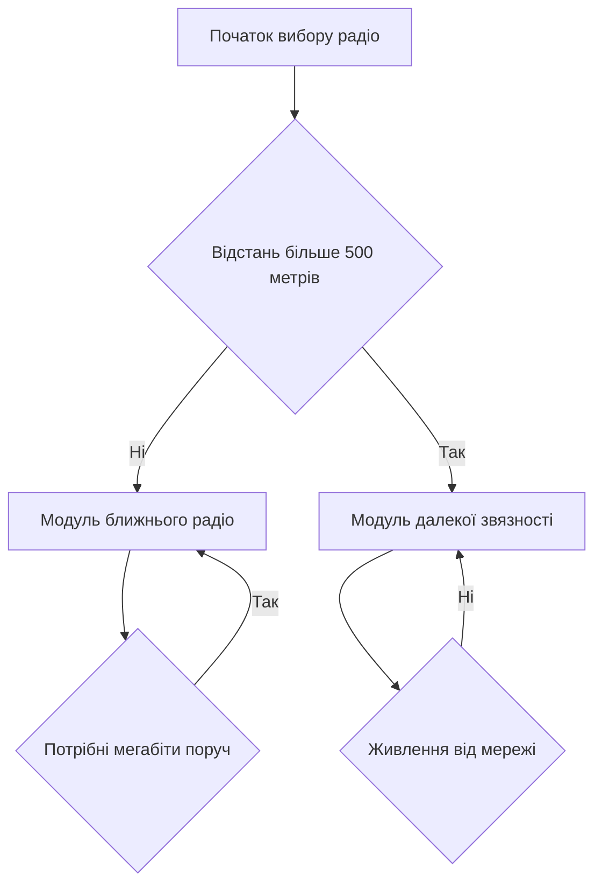

# NRF24 і LoRa - радіо по SPI


*Рис. Підключення радіомодулів до контролера через швидкий канал живлення і антени.*

> [!tip] Призначення ноти
> Дати практику вибору між швидким локальним радіо і повільним далеким радіо без теорії ефіру.

## 1. Призначення

Модуль NRF24 дає дешевий звязок у межах кімнати і будинку. Модуль LoRa дає кілометри при малих швидкостях. Обидва керуються через швидкий канал як периферія. Контролер формує пакети і читає статуси. Живлення радіо чутливе до пульсацій. Антена впливає більше ніж потужність. Правильний вибір економить місяці налагодження. Швидке радіо для пультів і сенсорів поруч. Далеке радіо для полів і вулиць.

## 2. Модуль NRF24 і труби

Модуль працює у діапазоні 2.4 ГГц. Швидкості 250 кбіт 1 Мбіт і 2 Мбіт. Менша швидкість дає кращу чутливість. Труби це шість адрес прийому. Перша труба з повною адресою. Решта труб з одним старшим байтом. Автопідтвердження повертає квитанцію без участі програми. Переповтори настроюються затримкою і кількістю. Канал вибирається з сітки 1 МГц. Потужність від мінус 18 до нуля дБм. Посилений варіант з підсилювачем дає сотні метрів.

| Параметр | Значення | Пояснення |
| --- | --- | --- |
| Діапазон | 2.4 ГГц | Спільний з домашніми мережами |
| Канали | 126 штук | Крок 1 МГц |
| Швидкості | 250 кбіт 1 і 2 Мбіт | Менше швидше і далі |
| Труби | 6 адрес | Один приймач багато передавачів |
| Пакет | До 32 байтів | Короткі команди і статуси |
| Квитанція | Автоматична | Без коду повторів |
| Переповтори | До 15 спроб | Затримка настроюється |

## 3. Адреси повтори і швидкості NRF24

Адреса труби пять байтів. Передавач і приймач мають збігатися. Молодші байти труб один і два можуть відрізнятися старшим. Швидкість 250 кбіт найстійкіша у шумі. Швидкість 2 Мбіт найшвидша але чутлива. Затримка повтору залежить від довжини пакета. Довгий пакет просить більшу затримку. Кількість повторів 5 досить для кімнати. Лічильник втрат показує якість каналу. Переповнення черги чиститься вручну. Переривання по відправці і прийому окремі.

| Налаштування | Кімната | Будинок | Вулиця |
| --- | --- | --- | --- |
| Швидкість | 2 Мбіт | 1 Мбіт | 250 кбіт |
| Потужність | Мінімальна | Середня | Максимальна |
| Переповтори | 3 спроби | 7 спроб | 15 спроб |
| Канал | Вільний від мереж | Вільний від мереж | Будь-який вільний |
| Антена | Друкована | Зовнішня | Зовнішня з підсилювачем |

```text
Карта труб приймача NRF24:
  Труба 0 : повна адреса 5 байтів, квитанції і передача
  Труба 1 : повна адреса 5 байтів, основний сенсор
  Труба 2 : старший байт свій, молодші спільні
  Труба 3 : старший байт свій, молодші спільні
  Труба 4 : старший байт свій, молодші спільні
  Труба 5 : старший байт свій, молодші спільні
  Канал ... 2 МГц, швидкість 250 кбіт для дальності
  Потужність 0 дБм, повтори 7, затримка 1 мс
```

## 4. LoRa і параметри SF BW CR

Технологія розширеного спектра дає чутливість нижче шуму. Коефіцієнт розширення від 7 до 12. Більший коефіцієнт дає далі і повільніше. Смуга 125 кГц стандартна для дальності. Ширша смуга 500 кГц дає швидше. Швидкість кодування додає надмірність від 4 до 8. Потужність до 20 дБм у версії з підсилювачем. Чутливість мінус 140 дБм реальна у полі. Бюджет лінії понад 150 дБ. Швидкість від сотень біт до десятків кілобіт.

| Параметр | Менша дальність | Більша дальність | Ціна вибору |
| --- | --- | --- | --- |
| Коефіцієнт SF | 7 | 12 | Час у ефірі росте |
| Смуга BW | 500 кГц | 125 кГц | Швидкість падає |
| Код CR | 4 дроб 5 | 4 дроб 8 | Надмірність росте |
| Потужність | 14 дБм | 20 дБм | Струм росте |
| Пакет | До 255 байтів | До 59 при SF12 | Обмеження ефіру |

## 5. Чип SX1276 проти вбудованого блока WL

Зовнішній чип SX1276 перевірений роками. Керування через швидкий канал і переривання. Бібліотеки зрілі і прикладів багато. Живлення 3.3 В стабільне. Споживання прийому близько 10 мА. Споживання передачі до 120 мА. Вбудований блок серії WL економить плату. Радіо і контролер в одному корпусі. Пам'ять і периферія поруч. Ціна плати нижча. Але корпус складніший для пайки. Вибір залежить від серії і досвіду.

| Ознака | SX1276 зовнішній | Серія WL вбудована |
| --- | --- | --- |
| Інтерфейс | Швидкий канал плюс виводи | Внутрішня шина |
| Бібліотеки | Дуже багато прикладів | Менше прикладів |
| Плата | Модуль готовий | Своя високочастотна плата |
| Струм прийому | Близько 10 мА | Близько 5 мА |
| Струм передачі | До 120 мА | До 120 мА |
| Корпус | Простий модуль | Складний корпус з радіо |

## 6. Живлення підсилювача і просадки

Передача просить піковий струм. Слабкий стабілізатор просідає. Напруга падає нижче межі скидання. Контролер перезапускається у момент передачі. Симптоми схожі на помилку програми. Лікування просте. Окремий стабілізатор з запасом струму. Конденсатори 10 і 100 мкФ біля модуля. Короткі і товсті дроти живлення. Земля зіркою до блока. Вимірювання осцилографом на піках передачі.

| Вузол | Номінал | Призначення |
| --- | --- | --- |
| Стабілізатор | 500 мА запас | Пік передачі без просадки |
| Кераміка | 100 нФ біля живлення | Високочастотний шум |
| Електроліт | 100 мкФ біля модуля | Пік струму передачі |
| Дроти | Короткі і товсті | Менше падіння напруги |
| Земля | Зірка до блока | Без петель і шуму |

## 7. Антена 50 Ом і узгодження

Антена має бути на свій діапазон. Для 2.4 ГГц своя довжина. Для 868 МГц своя довжина. Хвильовий опір тракту 50 Ом. Довга доріжка без контролю опору втрачає сигнал. Металевий корпус екранує антену. Друкована антена просить вільну зону. Зовнішня антена через розєм краща для дальності. Коефіцієнт стоячої хвилі менше двох норма. Перевірка дальністю у полі надійніша за теорію.

## 8. Мінімальні драйвери на HAL

```c
#include "main.h"
#include "spi.h"

extern SPI_HandleTypeDef hspi1;

#define NRF_CE_GPIO  GPIOA
#define NRF_CE_PIN   GPIO_PIN_8
#define NRF_CS_GPIO  GPIOA
#define NRF_CS_PIN   GPIO_PIN_4
#define LORA_CS_GPIO GPIOB
#define LORA_CS_PIN  GPIO_PIN_6

static void nrf_cs(uint8_t v)
{
  HAL_GPIO_WritePin(NRF_CS_GPIO, NRF_CS_PIN,
    v ? GPIO_PIN_SET : GPIO_PIN_RESET);
}

static void nrf_ce(uint8_t v)
{
  HAL_GPIO_WritePin(NRF_CE_GPIO, NRF_CE_PIN,
    v ? GPIO_PIN_SET : GPIO_PIN_RESET);
}

static uint8_t nrf_rw(uint8_t d)
{
  uint8_t r = 0;
  nrf_cs(0);
  HAL_SPI_TransmitReceive(&hspi1, &d, &r, 1, 100);
  nrf_cs(1);
  return r;
}

void nrf_init(void)
{
  nrf_ce(0);
  HAL_Delay(20);
}

uint8_t nrf_send(uint8_t *p, uint8_t n)
{
  uint8_t cmd = 0xA0;
  nrf_cs(0);
  HAL_SPI_Transmit(&hspi1, &cmd, 1, 100);
  HAL_SPI_Transmit(&hspi1, p, n, 100);
  nrf_cs(1);
  nrf_ce(1);
  HAL_Delay(2);
  nrf_ce(0);
  return 1;
}

static void lora_cs(uint8_t v)
{
  HAL_GPIO_WritePin(LORA_CS_GPIO, LORA_CS_PIN,
    v ? GPIO_PIN_SET : GPIO_PIN_RESET);
}

void lora_write(uint8_t addr, uint8_t val)
{
  uint8_t b[2] = {(uint8_t)(addr | 0x80), val};
  lora_cs(0);
  HAL_SPI_Transmit(&hspi1, b, 2, 100);
  lora_cs(1);
}

uint8_t lora_read(uint8_t addr)
{
  uint8_t tx[2] = {(uint8_t)(addr & 0x7F), 0x00};
  uint8_t rx[2] = {0, 0};
  lora_cs(0);
  HAL_SPI_TransmitReceive(&hspi1, tx, rx, 2, 100);
  lora_cs(1);
  return rx[1];
}
```

## 9. Вибір радіо під задачу



## Типові помилки

| # | Помилка | Чому погано | Як правильно |
| --- | --- | --- | --- |
| 1 | Живлення модуля від слабкого виводу | Просідання у передачі і скидання | Окремий стабілізатор і конденсатори |
| 2 | Однакові адреси всіх труб | Приймач плутає передавачі | Унікальні старші байти труб |
| 3 | Швидкість 2 Мбіт через стіни | Втрати і повтори забивають ефір | 250 кбіт для дальності і стін |
| 4 | Антена впритул до металу | Сигнал екранується корпусом | Винос антени і вільна зона |
| 5 | SF12 для частих пакетів | Ефір зайнятий і батареї сідають | SF7 для частих і коротких |
| 6 | Довгі дроти швидкого каналу | Зриви тактів і биті статуси | Короткі дроти і нижча швидкість |

## Офіційні джерела

- [nRF24L01P datasheet (Nordic)](https://www.nordicsemi.com/Products/nRF24L01) - труби, квитанції, повтори і канали.
- [SX1276 datasheet (Semtech)](https://www.semtech.com/products/wireless-rf/lora-connect/sx1276) - коефіцієнти, смуги, чутливість і потужність.

## Див. також

- [Home](../../../STM32-Reference/Home.md)
- [шина SPI](../../../STM32-Reference/04-Shini/02-SPI.md)
- [шина I2C](../../../STM32-Reference/04-Shini/03-I2C.md)
- [дротові мережі](../../../STM32-Reference/12-Moduli-zvyazku/02-RS485-CAN-Ethernet.md)
- [ланцюги живлення плати](../../../STM32-Reference/02-Zhivlennya/01-Lancjugi-zhivlennya.md)
