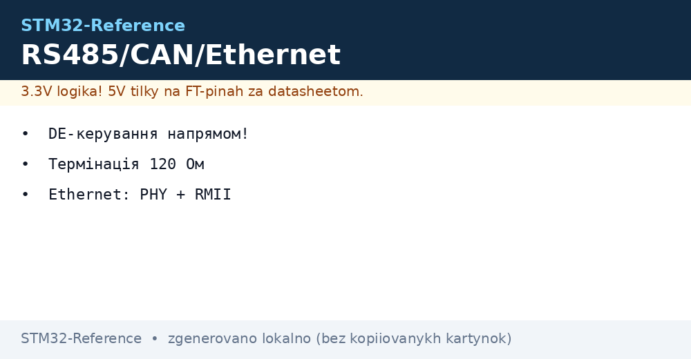
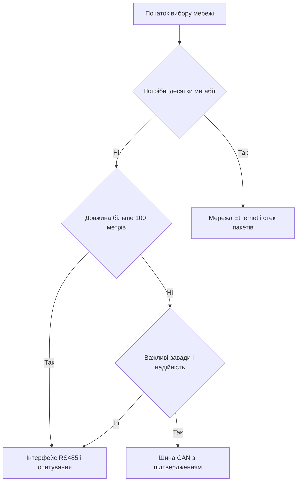

# RS485, CAN і Ethernet - дротові мережі


*Рис. Дротові мережі контролера на витій парі з узгодженням захистом і живленням.*

> [!tip] Призначення ноти
> Дати робочий мінімум трьох дротових мереж від простого опитування датчиків до повного стека пакетів.

## 1. Призначення

Вита пара дає дальність і завадостійкість. Інтерфейс RS485 дає сотні метрів на одному кабелі. Шина CAN дає надійність у транспорті і промисловості. Мережа Ethernet дає швидкість і звязок з компютерами. Контролер має вбудовані порти для всіх варіантів. Зовнішні приймачі узгоджують рівні з кабелем. Захист рятує від статики і кидків. Програмний стек перетворює байти у пакети і файли. Вибір залежить від дальності швидкості і складності.

## 2. Фізика RS485 і керування DE

Інтерфейс диференціальний з двома дротами А і В. Різниця напруг задає нуль і одиницю. Спільна земля потрібна для стійкості. Приймач має вхід дозволу і вихід дозволу. Лінія DE вмикає передачу. Низький рівень вмикає прийом. Перемикання після останнього стоп біта. Затримка перемикання мікросекунди. Швидкості від 9600 до сотень кілобіт. Довжина до 1200 метрів на низьких швидкостях.

| Сигнал | Призначення | Пояснення |
| --- | --- | --- |
| Лінія А | Неінверсний дріт | Плюс диференціальної пари |
| Лінія В | Інверсний дріт | Мінус диференціальної пари |
| Земля | Опорний потенціал | Обов'язкова на довгих лініях |
| DE | Дозвіл передачі | Високий рівень передача |
| RE | Дозвіл прийому | Низький рівень прийом |
| Живлення | 3.3 В або 5 В | За описом приймача |

```text
Вузол RS485 на витій парі:
  Контролер TX ............ до входу DI приймача
  Контролер RX ............ до виходу RO приймача
  Вивід DE і RE разом ..... до виводу PA1 через резистор
  Лінія А ................. до витої пари, підтяжка до живлення
  Лінія В ................. до витої пари, підтяжка до землі
  Земля ................... спільна по всьому кабелю
  Термінатор 120 Ом ....... на обох кінцях лінії
  Захист .................. супресори до землі на кожному вузлі
```

## 3. Узгодження і зміщення лінії

Хвиля відбивається від кінців кабелю. Резистор 120 Ом на кінцях гасить відбиття. Середні вузли без резисторів. Зміщення лінії тримає паузу у відомому стані. Підтяжка А до живлення. Підтяжка В до землі. Номінали від 560 Ом до 4.7 кОм. Забагато вузлів перевантажує лінію. Стандарт тримає 32 вузли. Сучасні приймачі тримають 256 вузлів. Відгалуження короткі до метра. Зірка топології заборонена.

| Елемент | Номінал | Де ставити |
| --- | --- | --- |
| Термінатор | 120 Ом | Два кінці лінії |
| Підтяжка А | 680 Ом до живлення | Один вузол ведучий |
| Підтяжка В | 680 Ом до землі | Один вузол ведучий |
| Захист | Супресор двоспрямований | Кожен вузол до землі |
| Запобіжник | Самовідновлюваний | У ланцюг живлення вузла |
| Кабель | Вита пара з екраном | Екран заземлений в одній точці |

## 4. Протокол Modbus RTU

Ведучий опитує ведені по адресах. Адреса від 1 до 247. Нуль це широкомовна без відповіді. Функція читання 3 для регістрів. Функція запису 6 для одного регістра. Функція 16 для групи регістрів. Кадр має адресу функцію дані і контрольну суму. Контрольна сума CRC16 з поліномом відбитим. Пауза 3.5 символи розділяє кадри. Таймаут відповіді сотні мілісекунд. Повтори 2 рази при тиші.

| Поле кадру | Довжина | Пояснення |
| --- | --- | --- |
| Адреса | 1 байт | Номер веденого вузла |
| Функція | 1 байт | Читання або запис |
| Дані | Змінна | Адреси регістрів і значення |
| CRC молодший | 1 байт | Молодша частина суми |
| CRC старший | 1 байт | Старша частина суми |
| Пауза | 3.5 символи | Межа між кадрами |

## 5. Шина CAN і приймач

Шина CAN також диференціальна з двома дротами. Рівні задає зовнішній приймач. Контролер має вбудований блок CAN. Швидкості до 1 Мбіт на коротких лініях. На 500 метрах беруть 125 кбіт. Кадр має ідентифікатор довжину і дані. Фільтри відбирають потрібні ідентифікатори. Підтвердження вбудоване в протокол. Повтори автоматичні без програми. Термінатори 120 Ом на кінцях обов'язкові. Гальваніка розв'язка бажана у транспорті.

| Параметр | Значення | Пояснення |
| --- | --- | --- |
| Дроти | Високий і низький | Вита пара 120 Ом |
| Швидкість | До 1 Мбіт | Залежить від довжини |
| Кадр | До 8 байтів класика | До 64 байтів у FD |
| Ідентифікатор | 11 або 29 біт | Пріоритет менший виграє |
| Фільтри | Маски і списки | Відсіюють чуже |
| Термінація | 120 Ом два кінці | Без них помилки кадрів |

## 6. Ethernet RMII PHY і стек LWIP

Контролер серій F407 і H7 має блок доступу до середовища. Зовнішня мікросхема фізичного рівня дає розєм. Інтерфейс RMII потребує 9 ліній і тактування 50 МГц. Кварц 25 МГц живить мікросхему фізичного рівня. Опорна частота повертається у контролер. Трансформаторна розв'язка вбудована у розєм. Світлодіоди показують звязок і активність. Стек LWIP дає адреси сокети і сервер. Пам'ять під буфери пакетів десятки кілобайтів. Швидкість 100 Мбіт достатня для телеметрії.

| Сигнал RMII | Призначення | Пояснення |
| --- | --- | --- |
| Опорний такт | 50 МГц вхід | Від мікросхеми фізичного рівня |
| Дані передачі | Два біти | Синхронно з опорним тактом |
| Дозвіл передачі | Строб | Активний під час пакета |
| Дані прийому | Два біти | Синхронно з опорним тактом |
| Достовірність | Прапорець | Показує прийом пакета |
| Керування | Два дроти | Налаштування регістрів |

## 7. Гальваніка і захист ліній

Довгі кабелі збирають завади і різниці потенціалів. Розв'язка розриває земляні петлі. Для RS485 беруть ізольований приймач. Для CAN беруть ізольований приймач з живленням. Для Ethernet розв'язка вже у розємі. Супресори зрізають імпульси перенапруги. Газові розрядники для вуличних ліній. Екран кабелю заземлюють в одній точці. Друга точка дає петлю і шум. Живлення вузлів через запобіжники.

## 8. Код HAL для Modbus і CAN

```c
#include "main.h"
#include "usart.h"
#include "fdcan.h"

extern UART_HandleTypeDef huart2;
extern FDCAN_HandleTypeDef hfdcan1;

#define RS_DE_GPIO GPIOA
#define RS_DE_PIN  GPIO_PIN_1

static uint16_t modbus_crc(uint8_t *p, uint16_t n)
{
  uint16_t crc = 0xFFFF;
  for (uint16_t i = 0; i < n; i++)
  {
    crc ^= p[i];
    for (uint8_t k = 0; k < 8; k++)
    {
      if (crc & 1) crc = (uint16_t)((crc >> 1) ^ 0xA001);
      else crc >>= 1;
    }
  }
  return crc;
}

void rs_send(uint8_t *p, uint16_t n)
{
  HAL_GPIO_WritePin(RS_DE_GPIO, RS_DE_PIN, GPIO_PIN_SET);
  HAL_UART_Transmit(&huart2, p, n, 200);
  while (__HAL_UART_GET_FLAG(&huart2, UART_FLAG_TC) == RESET) {}
  HAL_GPIO_WritePin(RS_DE_GPIO, RS_DE_PIN, GPIO_PIN_RESET);
}

uint8_t modbus_read(uint8_t addr, uint16_t reg, uint16_t cnt)
{
  uint8_t f[8];
  f[0] = addr; f[1] = 0x03;
  f[2] = (uint8_t)(reg >> 8); f[3] = (uint8_t)reg;
  f[4] = (uint8_t)(cnt >> 8); f[5] = (uint8_t)cnt;
  uint16_t c = modbus_crc(f, 6);
  f[6] = (uint8_t)c; f[7] = (uint8_t)(c >> 8);
  rs_send(f, 8);
  return 1;
}

void can_send(uint32_t id, uint8_t *d, uint8_t n)
{
  FDCAN_TxHeaderTypeDef h;
  h.Identifier = id;
  h.IdType = FDCAN_STANDARD_ID;
  h.TxFrameType = FDCAN_DATA_FRAME;
  h.DataLength = FDCAN_DLC_BYTES_8;
  h.ErrorStateIndicator = FDCAN_ESI_ACTIVE;
  h.BitRateSwitch = FDCAN_BRS_OFF;
  h.FDFormat = FDCAN_CLASSIC_CAN;
  h.TxEventFifoControl = FDCAN_NO_TX_EVENTS;
  h.MessageMarker = 0;
  uint8_t buf[8] = {0};
  for (uint8_t i = 0; i < n && i < 8; i++) buf[i] = d[i];
  HAL_FDCAN_AddMessageToTxFifoQ(&hfdcan1, &h, buf);
}
```

## 9. Вибір мережі під задачу



## Типові помилки

| # | Помилка | Чому погано | Як правильно |
| --- | --- | --- | --- |
| 1 | Немає термінаторів на кінцях | Відбиття бють кадри і контрольні суми | Два резистори 120 Ом на кінцях |
| 2 | Раннє зняття DE після передачі | Хвіст байта губиться у кабелі | Чекати прапорець завершення передачі |
| 3 | Пауза між кадрами відсутня | Приймач клеїть кадри докупи | Пауза 3.5 символи і таймаут |
| 4 | Швидкість CAN без запасу | Помилки кадрів на довгому кабелі | Нижча швидкість і вимірювання лінії |
| 5 | RMII без тактування 50 МГц | Блок не стартує і лінка немає | Кварц 25 МГц і повернення опорної частоти |
| 6 | Екран заземлений з двох боків | Петля дає шум і помилки | Заземлення екрана в одній точці |

## Офіційні джерела

- [Modbus RTU specification (Modbus Org)](https://www.modbus.org/specs.php) - кадри, функції, адреси і контрольна сума.
- [STM32 Ethernet LWIP manual (ST)](https://www.st.com/en/embedded-software/stm32cubef4.html) - RMII, фізичний рівень, стек і буфери.

## Див. також

- [Home](../../../STM32-Reference/Home.md)
- [послідовний порт UART](../../../STM32-Reference/04-Shini/01-UART.md)
- [шина FDCAN](../../../STM32-Reference/04-Shini/04-FDCAN.md)
- [шина SPI](../../../STM32-Reference/04-Shini/02-SPI.md)
- [радіо по SPI](../../../STM32-Reference/12-Moduli-zvyazku/01-NRF24-LoRa.md)
