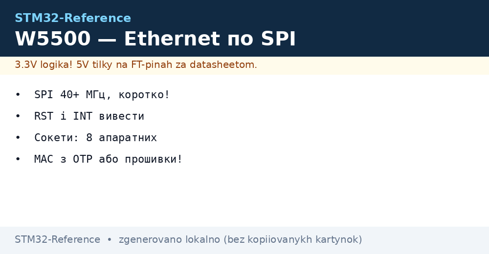
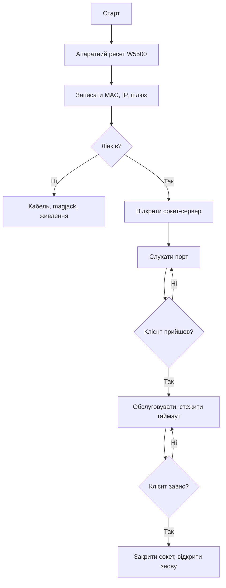

# W5500 - Ethernet по SPI для будь-якого STM32


*Рис. Мережа без RMII: SPI несе все, сокети в залізі.*

> [!tip] Призначення ноти
> Підняти Ethernet на будь-якому STM32 без RMII-блока: проводка, стек, сокети, сервер і типові граблі.

## 1. Призначення

W5500 - це Ethernet-контролер з апаратним TCP/IP: MAC, IP, сокети і буфери всередині чипа. STM32 спілкується з ним по SPI, не знаючи нічого про пакети. Працює навіть на F103: де RMII-блока немає взагалі. Для телеметрії, Modbus-TCP і веб-морди - ідеальний міст.

## 2. Чому W5500, а не RMII+LWIP

| Критерій | W5500 по SPI | RMII + LWIP (F407/H7) |
| --- | --- | --- |
| Чипи | Будь-який STM32 | Тільки з MAC-блоком |
| Пінів | 4 SPI + RST + INT | 9 RMII + MDIO |
| RAM чипа | Кілобайти | Десятки КБ під буфери |
| Швидкість | До ~15 Мбіт реально | 100 Мбіт |
| Складність коду | Сокети викликами | Стек, netconn, потоки |

```text
Правило:
  телеметрія і керування ... W5500 вистачає;
  відео і важкі файли ..... тільки RMII.
```

## 3. Підключення по SPI детально

| Пін W5500 | Куди | Нотатка |
| --- | --- | --- |
| VCC | 3.3 В | 5 В вбиває чип! |
| GND | GND | Спільна, товста |
| SCK, MOSI, MISO | SPI чипа | 40+ МГц, дроти короткі! |
| SCS | Будь-який GPIO | Вибір кристала |
| RST | GPIO | Апаратний ресет при старті |
| INT | EXTI за бажанням | Події сокетів без опитування |

| Тема | Практика |
| --- | --- |
| Швидкість SPI | Максимум стабільного: почати з 10 МГц, рости |
| Режим | Mode 0 або 3 за даташитом, перевірити! |
| Bulk | 10 мкФ біля модуля - піки передачі |
| Розєм RJ45 | З трансформатором (magjack) обов'язково! |

## 4. MAC-адреса: звідки брати

| Варіант | Коли |
| --- | --- |
| OTP чипа STM32 | Унікальний ID → згенерувати локальну MAC |
| В EEPROM плати | Серійний номер і MAC з заводу |
| Випадкова при дебагу | Тільки на столі, в серії - ні! |
| Купувати OUI-блок | Серія з претензією на легальність |

```c
// MAC з унікального ID чипа (локальний біт!):
uint8_t mac[6] = {0x02, 0x00, 0x00, 0x00, 0x00, 0x00};
uint32_t uid = HAL_GetUIDw0();
mac[3] = uid >> 16; mac[4] = uid >> 8; mac[5] = uid;
setSHAR(mac);   // перший байт 0x02 = локальна!
```

## 5. Сокети: 8 апаратних каналів

| Параметр | Значення |
| --- | --- |
| Кількість | 8 незалежних сокетів |
| Режими | TCP, UDP, MACRAW, PPPoE |
| Буфери | 32 КБ діляться між сокетами |
| Розподіл | Серверу більше TX, клієнту більше RX |

## Mermaid: підняття мережі



## 6. TCP-сервер: скелет коду

```c
// Відкриття сервера на порту 502 (Modbus-TCP):
socket(0, Sn_MR_TCP, 502, 0);
listen(0);
while (1) {
  if (getSn_SR(0) == SOCK_ESTABLISHED) {
    int n = recv(0, buf, sizeof(buf));
    if (n > 0) handle_request(buf, n);
  }
  if (sock_timeout(0)) { close(0); socket(0, Sn_MR_TCP, 502, 0); listen(0); }
}
```

| Правило | Пояснення |
| --- | --- |
| Таймаут кожному сокету | Завислий клієнт не тримає сокет вічно! |
| Перевідкриття після close | Закритий сокет сам не слухає |
| Буфер прийому читати цілком | Залишки псують наступний кадр |

## 7. DHCP чи статика

| Варіант | Коли |
| --- | --- |
| Статика | Цех, відома мережа, шлюз відомий |
| DHCP | Офіс, часті переїзди |
| Fallback | DHCP не відповів - своя статика! |
| DNS | Тільки якщо сервер за іменем |

## 8. Modbus-TCP поверх W5500

| Тема | Практика |
| --- | --- |
| Порт | 502 стандартний |
| MBAP-заголовок | Транзакція звзує запит і відповідь |
| Карта регістрів | Та сама, що для RTU! |
| Кілька клієнтів | Кожному свій сокет |

## 9. Діагностика мережі

| Симптом | Перевірка |
| --- | --- |
| Лінка немає | Кабель, magjack, живлення 3.3 В |
| Пінг є, сокетів немає | Порт, фаєрвол, слухаєш? |
| Рветься під навантаженням | SPI швидкість вниз, bulk більше |
| Працює хвилину і стоїть | Сокет не перевідкрито після close |
| Повільно | Буфери сокета замалі, пакетування |

## Типові помилки

| # | Помилка | Чому погано | Як правильно |
| --- | --- | --- | --- |
| 1 | Живлення 5 В | Чип згорає | Тільки 3.3 В! |
| 2 | Без magjack | Немає розв'язки і узгодження | Розєм з трансформатором |
| 3 | MAC випадкова в серії | Колізії в мережі | Унікальна з OTP/EEPROM |
| 4 | Сокет без таймауту | Один завислий зїдає канал | Таймаут і перевідкриття! |
| 5 | SPI на максимумі одразу | Биті байти | Рости від 10 МГц вгору |
| 6 | RST не виведено | Немає скидання при зависанні | GPIO на ресет завжди |
| 7 | Немає bulk | Скидання при TX-піках | 10 мкФ біля модуля |

## Офіційні джерела

- [W5500 datasheet (WIZnet)](https://docs.wiznet.io/Product/iEthernet/W5500/overview) - регістри, сокети, таймінги.
- [ioLibrary examples (WIZnet)](https://github.com/Wiznet/ioLibrary_Driver) - готовий драйвер під HAL.

## Див. також

- [Home](../../../STM32-Reference/Home.md)
- [дротові мережі](../../../STM32-Reference/12-Moduli-zvyazku/02-RS485-CAN-Ethernet.md)
- [промисловий протокол](../../../STM32-Reference/15-Protokoli/01-Modbus.md)
- [шлюз даних](../../../STM32-Reference/16-Proekti/04-Modbus-Gateway.md)
- [шина обміну](../../../STM32-Reference/04-Shini/02-SPI.md)
- [ланцюги живлення](../../../STM32-Reference/02-Zhivlennya/01-Lancjugi-zhivlennya.md)
