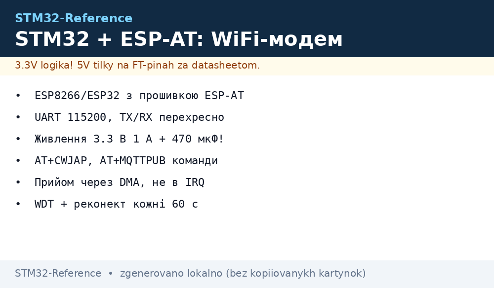
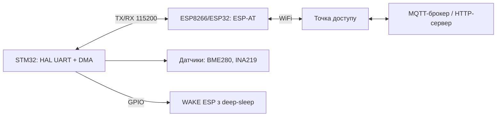

# STM32 + WiFi через ESP-AT - ESP8266/ESP32 як AT-модем по UART


*Рис. STM32 керує ESP-AT по UART: AT-команди, сокети, MQTT без WiFi-стека на STM32.*

> [!tip] Що це за нота
> Наймасовіша IoT-зв'язка для STM32 без радіо на кристалі: беремо дешевий ESP8266/ESP32, прошиваємо офіційним ESP-AT і керуємо з STM32 текстовими командами. База: [UART-шина STM32](../../../STM32-Reference/04-Shini/01-UART.md), [GPS та GSM-модеми](../../../STM32-Reference/12-Moduli-zvyazku/03-GPS-GSM.md).

## 1. Мета

Дати STM32 (Blue Pill, Nucleo, Discovery) вихід в інтернет без TCP/IP-стека на самому MCU:

- WiFi-клієнт з DHCP, перепідключенням і сигналом рівня RSSI;
- HTTP GET/POST і MQTT-публікації через AT-команди;
- весь мережевий код - на ESP, на STM32 лише парсер рядків;
- живлення і земля - за правилами силової частини.

| Задача | Рішення |
| --- | --- |
| STM32F103 без радіо в мережу | ESP-01S як модем, UART 115200 |
| Телеметрія кожні 10 с | MQTT через AT+MQTTCONN |
| Польовий датчик на батареї | ESP глибоко спить, STM32 будить по GPIO |
| Відладка | лог AT-діалогу в окремий UART |

## 2. Архітектура



STM32 ніколи не бачить TCP: він шле `AT+CIPSEND` і читає `+IPD`. Розбір відповідей - скінченний автомат на 5 станів.

## 3. Апаратна частина

| Пін STM32 (3.3V!) | Пін ESP-01S / ESP32 | Примітка |
| --- | --- | --- |
| TX (PA9) | RX | перехресно, без подільника - обидва 3.3V |
| RX (PA10) | TX | перехресно |
| 3V3 | VCC, CH_PD/EN | струм до 400 мА в піку TX! |
| GND | GND | спільна, товстий провід |
| PB5 | RST | програмний ресет модема |
| PA8 | GPIO0 | притягнути HIGH (робочий режим) |

> [!warning] Живлення - головна причина «AT мовчить»
> ESP-01S у піку передачі бере 300-400 мА. LDO на 150 мА з Blue Pill не вистачить: окремий AMS1117-3.3 або buck, конденсатор 470 мкФ біля VCC. Деталі: [розрахунок живлення STM32](../../../STM32-Reference/02-Zhivlennya/03-Power-Design.md).

Швидкість: старт 115200, після `AT+UART_DEF` можна 921600 для прошивки. Для надійності в полі лишаємо 115200.

## 4. Прошивка ESP-AT

- ESP8266: готовий бінарник ESP-AT (2 МБ flash), шиємо через esptool або Flash Download Tool;
- ESP32: ESP-AT з BLE-bridge бонусом, той же синтаксис команд;
- після прошивки перевірка в терміналі: `AT` → `OK`, `AT+GMR` → версія;
- фіксуємо параметри у flash: `AT+UART_DEF`, `AT+CWMODE_DEF=1`, `AT+CWJAP_DEF`.

## 5. Робочий код HAL

Прийом - через DMA з кільцевим буфером, розбір - у головному циклі, не в перериванні:

```c
#define AT_BUF 512
static uint8_t at_rx[AT_BUF];
static volatile uint16_t at_head = 0;

void at_send(const char *cmd) {
  HAL_UART_Transmit(&huart1, (uint8_t*)cmd, strlen(cmd), 100);
  HAL_UART_Transmit(&huart1, (uint8_t*)"\r\n", 2, 100);
}

int at_wait(const char *token, uint32_t timeout_ms) {
  uint32_t t0 = HAL_GetTick();
  static char line[128];
  uint8_t li = 0;
  while (HAL_GetTick() - t0 < timeout_ms) {
    while (at_head) {
      char c = at_pull();
      if (c == '\n') { line[li] = 0; li = 0;
        if (strstr(line, token)) return 1;
        if (strstr(line, "ERROR")) return -1;
      } else if (li < sizeof(line)-1 && c != '\r') {
        line[li++] = c;
      }
    }
  }
  return 0;
}

int wifi_join(const char *ssid, const char *pass) {
  char cmd[96];
  snprintf(cmd, sizeof(cmd), "AT+CWJAP_DEF=\"%s\",\"%s\"", ssid, pass);
  at_send(cmd);
  if (at_wait("WIFI GOT IP", 15000) != 1) return -1;
  return 0;
}
```

DMA стартує один раз: `HAL_UART_Receive_DMA(&huart1, dma_byte, 1)`, байти складаємо в `at_rx` у колбеку. Жодних блокуючих `HAL_Delay` всередині прийому.

## 6. MQTT через AT

| Крок | Команда | Очікуємо |
| --- | --- | --- |
| Конфіг | `AT+MQTTUSERCFG=0,1,"stm32-node","","",0,0,""` | OK |
| Конект | `AT+MQTTCONN=0,"broker.local",1883,1` | +MQTTCONNECTED |
| Публікація | `AT+MQTTPUB=0,"sensors/temp","23.5",0,0` | OK |
| Підписка | `AT+MQTTSUB=0,"cmd/led",0` | OK, далі +MQTTSUBRECV |
| Пінг живий | автоматично, keepalive 120 | нічого не робимо |

Пейлоад до 1 КБ збираємо в SRAM і шлемо одним `AT+MQTTPUB`. JSON формуємо вручну через `snprintf` - без важких бібліотек.

## 7. Надійність у полі

- кожні 60 с перевірка `AT+CWJAP?`: немає IP - `AT+RST` і повтор join до 5 разів;
- незалежний watchdog STM32: [таймери і сторожовий таймер](../../../STM32-Reference/07-Timeri-Son/02-LPTIM-RTC-WDT.md);
- ESP у deep-sleep між відправками: `AT+GSLP`, будимо фронтом на RST;
- лічильник перезапусків пишемо у flash: [пам'ять STM32](../../../STM32-Reference/08-Pamyat/01-Flash-OTP-EEPROM.md);
- RSSI логуємо (`AT+CWLAP`): рівень нижче −80 дБм - привід перенести антену.

## 8. Типові помилки

| Симптом | Причина | Лікування |
| --- | --- | --- |
| На `AT` тиша | переплутані TX/RX або немає 3.3V живлення | перехрестити лінії, дати окремий LDO 1 А |
| `ERROR` на CWJAP | пароль/SSID з пробілами без лапок | екранувати рядки, перевірити вручну в терміналі |
| Рветься кожні 2 хвилини | просадка живлення в піку TX | конденсатор 470 мкФ, короткі дроти живлення |
| Сміття замість OK | швидкість порту не та | `AT+UART_DEF` узгодити з `huart1.Init.BaudRate` |
| MQTT конект падає | клієнт з тим самим ID вже онлайн | унікальний ID на плату, keepalive 120 |
| Зависає на тижнях | немає WDT і реконекта | сторожовий таймер + лічильник у flash |

## 9. Суміжні ноти

- [UART-шина STM32](../../../STM32-Reference/04-Shini/01-UART.md) - налаштування USART, DMA.
- [GPS та GSM-модеми](../../../STM32-Reference/12-Moduli-zvyazku/03-GPS-GSM.md) - другий зовнішній модем.
- [провідний Ethernet W5500](../../../STM32-Reference/12-Moduli-zvyazku/04-W5500.md) - альтернатива без радіо.
- [протокол MQTT детально](../../../STM32-Reference/15-Protokoli/04-MQTT.md) - топіки, QoS.
- [розрахунок живлення STM32](../../../STM32-Reference/02-Zhivlennya/03-Power-Design.md) - струми піків.
- [шлюз Modbus](../../../STM32-Reference/16-Proekti/04-Modbus-Gateway.md) - міст між шинами.

## Офіційні джерела

- [ESP-AT User Guide (Espressif)](https://docs.espressif.com/projects/esp-at/en/latest/esp32/) - синтаксис AT, MQTT-команди.
- [ESP8266 Modules (Espressif)](https://www.espressif.com/en/products/modules/esp8266) - моделі модулів, живлення.
- [esp-at (Espressif, GitHub)](https://github.com/espressif/esp-at) - вихідники прошивок модема.
- [MQTT Specification (OASIS)](https://mqtt.org/mqtt-specification/) - формат пакетів, keepalive.
