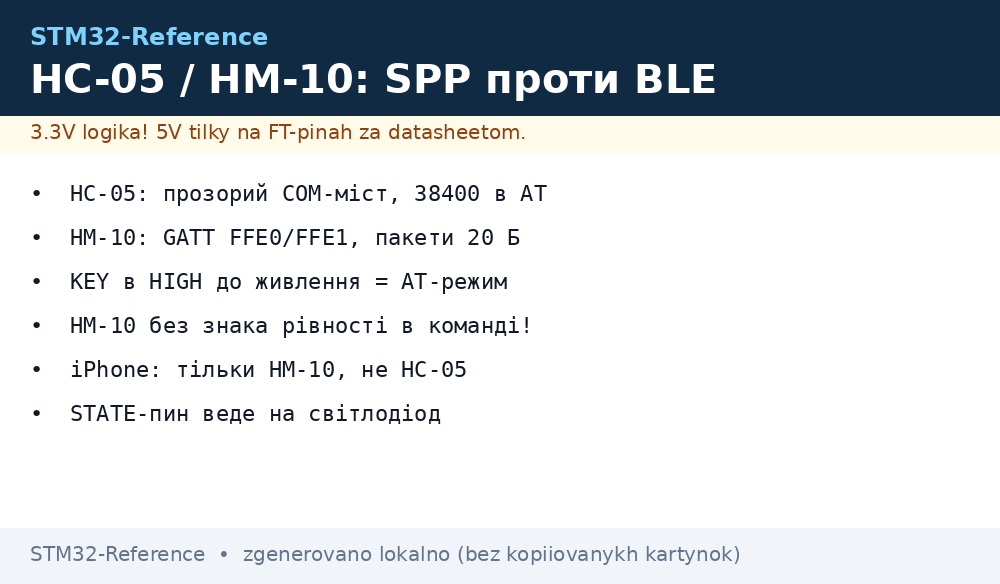
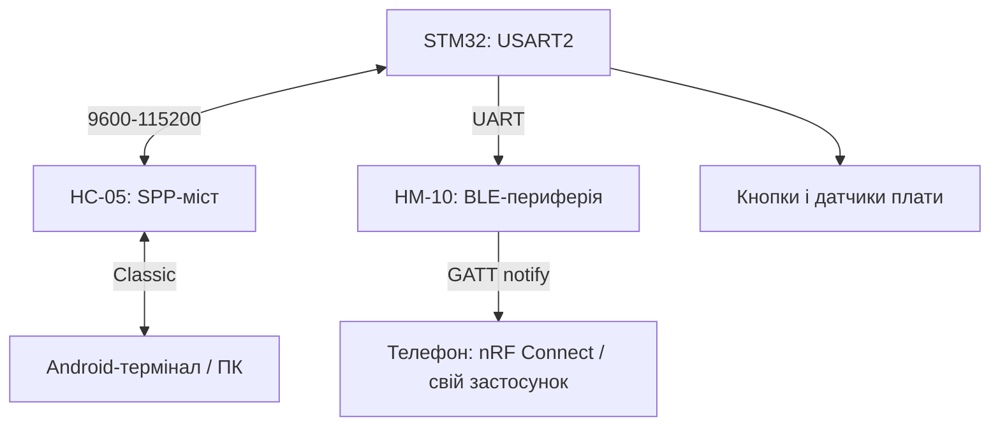

# STM32 + Bluetooth HC-05/HM-10 - SPP-класика і BLE-модеми по UART


*Рис. HC-05 - прозорий SPP-міст, HM-10 - BLE-периферія з сервісами; обидва по UART.*

> [!tip] Що це за нота
> Два різні світи за однаковою ціною: HC-05 (Bluetooth Classic, CSR BC417) - це «бездротовий COM-порт», HM-10 (BLE на CC2541) - це GATT-сервіси для телефона. Плутати їх не можна: телефон без BLE не побачить HM-10, а iPhone не дружить з SPP. База: [UART-шина STM32](../../../STM32-Reference/04-Shini/01-UART.md).

## 1. Мета

Закрити всі Bluetooth-задачі STM32 двома копійчаними модулями:

- HC-05: термінал, налагодження, керування з Android/ПК як COM-порт;
- HM-10: датчики для телефона (температура, кнопки) через BLE;
- обидва - 3.3V логіка, обидва конфігуруються AT;
- чіткий вибір: SPP чи BLE - таблиця нижче.

| Критерій | HC-05 (Classic) | HM-10 (BLE 4.0) |
| --- | --- | --- |
| Профіль | SPP, прозорий міст | GATT, сервіси/характеристики |
| Телефон | Android/ПК, iPhone - ні | Android + iPhone |
| Швидкість | до ~30 КБ/с реально | 1-5 КБ/с, пакети 20 байт |
| Споживання | ~30 мА в зв'язку | ~8 мА, сон - мікроампери |
| Ціна/складність | дешево, нуль коду на телефоні | дешево, треба BLE-застосунок |

## 2. Архітектура



HC-05 після спарювання просто пересилає байти: що зайшло в UART - полетіло в ефір. HM-10 вимагає розуміти сервіси: один сервіс FFE0, дві характеристики FFE1.

## 3. Апаратна частина

| Пін STM32 | HC-05 | HM-10 | Примітка |
| --- | --- | --- | --- |
| TX (PA2) | RXD | RXD | через подільник, якщо модуль 5V-живлення з 3.3V логікою - вхід толерантний, але перевірити ревізію |
| RX (PA3) | TXD | TXD | безпосередньо, 3.3V |
| 3V3/5V | VCC | VCC | HC-05 бере 5V версії теж є; HM-10 строго 3.3V |
| GND | GND | GND | спільна |
| PB12 | KEY/EN | - | HIGH перед живленням = AT-режим 38400 |
| PB13 | STATE | STATE | HIGH = з'єднано, ведемо на світлодіод |

> [!warning] Два UART-режими HC-05
> Звичайний режим - 9600 (або виставлений), AT-режим через KEY - завжди 38400. Половина «непрацюючих» HC-05 - це спроба слати AT на 9600 без KEY. HM-10 такої пастки не має: AT завжди на робочій швидкості.

## 4. Конфігурація HC-05

```text
AT                 → OK
AT+VERSION?        → версія прошивки
AT+NAME=STM32-Node → ім'я в ефірі
AT+PSWD=1234       → PIN спарювання
AT+UART=115200,0,0 → швидкість, стоп-біти, парність
AT+ROLE=0          → slave (плата чекає підключення)
AT+CMODE=1         → приймати всіх
```

ROLE=1 (master) потрібен лише коли STM32 сам шукає пристрої - рідкісний кейс, лишаємо slave.

## 5. Конфігурація HM-10

```text
AT                 → OK
AT+NAMESTM32BLE    → ім'я (без знака рівності!)
AT+PIN123456       → PIN
AT+MODE0           → режим даних (MODE1 = AT по ефіру)
AT+NOTI1           → повідомлення про конект
AT+PWRM0           → без автосну (PWRM1 = сон)
```

Відмінність синтаксису - пастка: HM-10 пише `AT+NAME` разом зі значенням, без `=`. Після `AT+RESET` модуль починає рекламуватись.

## 6. Робочий код HAL

Один драйвер на обидва модулі - різниця лише в ініціалізації:

```c
void bt_send(const char *s) {
  HAL_UART_Transmit(&huart2, (uint8_t*)s, strlen(s), 100);
}

void bt_send_line(const char *s) {
  bt_send(s);
  HAL_UART_Transmit(&huart2, (uint8_t*)"\r\n", 2, 100);
}

void hc05_init(void) {
  HAL_GPIO_WritePin(GPIOB, GPIO_PIN_12, GPIO_PIN_RESET);
  bt_send_line("AT+UART=115200,0,0");
  at_wait("OK", 1000);
  bt_send_line("AT+NAME=STM32-Node");
  at_wait("OK", 1000);
}

void hm10_notify(const char *payload) {
  char buf[48];
  snprintf(buf, sizeof(buf), "%s", payload);
  bt_send(buf);
}
```

Для HM-10 пакети ріжемо по 20 байт: довші рядки телефон склеює, але з затримкою. Дані датчиків форматуємо коротко: `T23.5,H61`.

## 7. Телефонна сторона

- HC-05: будь-який SPP-термінал (Serial Bluetooth Terminal), спарювання по PIN;
- HM-10: nRF Connect - знаходимо `STM32BLE`, сервіс FFE0, підписуємось на notify FFE1;
- свій застосунок - лише коли треба кнопки і графіки, протокол лишається текстовим;
- iPhone + HC-05 не працюють принципово (Apple закрив SPP) - тільки HM-10.

## 8. Типові помилки

| Симптом | Причина | Лікування |
| --- | --- | --- |
| HC-05 не відповідає на AT | немає KEY при вмиканні або швидкість не 38400 | KEY в HIGH до подачі живлення, порт 38400 |
| HM-10 мовчить | команда з `=` (AT+NAME=...) | писати `AT+NAMESTM32BLE` без рівності |
| Телефон не бачить HM-10 | телефон без BLE або модуль у MODE1 | перевірити BLE 4.0+, повернути MODE0 |
| Байти губляться на 115200 | довгі дроти без землі поруч | кручена пара TX/GND, або знизити до 57600 |
| iPhone не конектиться | намагаєтесь SPP на iOS | тільки HM-10, тільки BLE |
| Після RESET інше ім'я | параметри не збережені | HC-05 зберігає сам, HM-10 - команда `AT+SAVE` на клонах |

## 9. Суміжні ноти

- [UART-шина STM32](../../../STM32-Reference/04-Shini/01-UART.md) - USART, DMA-прийом.
- [WiFi через ESP-AT](../../../STM32-Reference/12-Moduli-zvyazku/06-WiFi-ESP-AT.md) - старший брат по UART-модемах.
- [NRF24 і LoRa](../../../STM32-Reference/12-Moduli-zvyazku/01-NRF24-LoRa.md) - радіо без телефона.
- [BLE на STM32WB](../../../STM32-Reference/05-Radio/01-BLE-WB.md) - коли BLE треба на кристалі.
- [таймери і WDT](../../../STM32-Reference/07-Timeri-Son/02-LPTIM-RTC-WDT.md) - періодична відправка.

## Офіційні джерела

- [HC-05 Bluetooth Module (Components101)](https://components101.com/wireless/hc-05-bluetooth-module) - піни, AT-команди, режими.
- [HM-10 Bluetooth Module (Components101)](https://components101.com/wireless/hm-10-bluetooth-module) - синтаксис без `=`, режими MODE/PWRM.
- [STM32CubeWB (STMicroelectronics, GitHub)](https://github.com/STMicroelectronics/STM32CubeWB) - BLE-стек для WB, приклади GATT.
- [Bluetooth Low Energy (Wikipedia)](https://en.wikipedia.org/wiki/Bluetooth_Low_Energy) - ролі, сервіси, MTU 20 байт.
- [Bluetooth Core Specification (Bluetooth SIG)](https://www.bluetooth.com/specifications/specs/core-specification/) - GATT, сервіси, характеристики.
