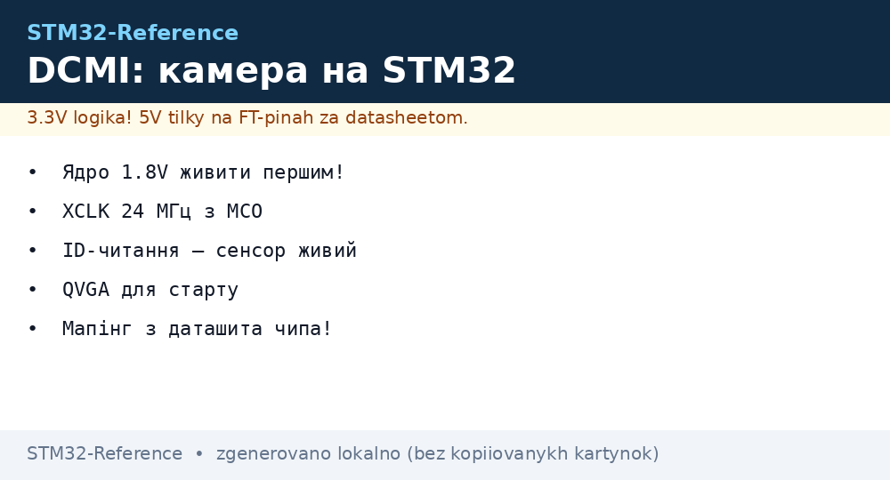
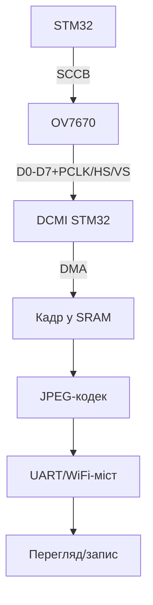

# STM32 DCMI-камера - OV7670, захват кадрів і JPEG


*Рис. DCMI-тракт: OV7670 шле пікселі по 8 бітах, DMA складає кадр у SRAM, код стискає і стрімить.*

> [!tip] Що це за нота
> Зір для STM32: наявність камери там, де ESP32 звично, а STM32 - ні. DCMI є на F4/F7/H7. База: [глибокий DMA](../../../STM32-Reference/04-Shini/07-DMA-DeepDive.md), [таймери STM32](../../../STM32-Reference/07-Timeri-Son/01-GPTIM-ADTIM.md).

## 1. Мета

Отримати картинку з STM32:

- OV7670 по DCMI: сигнали, живлення, тактування;
- SCCB-ініціалізація (I2C-подібний протокол Omnivision);
- DMA-захват кадру без участі CPU;
- JPEG-кодування програмно або апаратно (H7);
- стрім кадрів по UART/WiFi-мосту.

| Параметр | OV7670 | Примітка |
| --- | --- | --- |
| Матриця | VGA 640×480 | вистачає для детекції |
| Інтерфейс | DCMI 8 біт + PCLK/HSYNC/VSYNC | паралельний |
| Живлення | 3.3V цифра + 1.8V ядро | два LDO! |
| Такт | XCLK 24 МГц з MCO | дає STM32 |
| Формати | YUV/RGB565/JPEG | JPEG - для стріму |

## 2. Архітектура



Кадр VGA RGB565 = 600 КБ - в SRAM F4 не влізе цілком. QVGA (320×240) або зовнішня SRAM/SDRAM.

## 3. Розпіновка DCMI (F4/F7)

| Сигнал OV7670 | Пін STM32 | Примітка |
| --- | --- | --- |
| D0-D7 | PC6-PC9, PE4-PE6... | за таблицею DCMI чипа! |
| PCLK | PA6 | піксельний такт |
| HSYNC/VSYNC | за таблицею DCMI чипа | кадрова/рядкова синхронізація |
| XCLK | MCO (PA8) 24 МГц | тактує сенсор |
| SDA/SCL (SCCB) | PB7/PB6 | 100 кГц |
| 3V3/1V8/GND | LDO ×2 | порядок: ядро першим |

Мапінг DCMI-пінів різниться між F4/F7/H7 - звіряти з даташитом КОНКРЕТНОГО чипа, не з пам'яті.

## 4. SCCB-ініціалізація

- схожий на I2C, але без повторного старту (Omnivision-діалект);
- базові регістри: формат, роздільність, тактування, баланс;
- готові таблиці під QVGA/YUV - з прикладів Cube;
- перевірка ID чипа (0x76) - сенсор живий;
- після ініціалізації - чекати 2 кадри стабілізації.

## 5. Робочий код (C, HAL)

```c
#define CAM_W 320
#define CAM_H 240
static uint16_t frame[CAM_W * CAM_H];

void camera_start(void) {
  sccb_init();
  sccb_write_table(qvga_yuv_table);
  HAL_DCMI_Start_DMA(&hdcmi, DCMI_MODE_SNAPSHOT,
                     (uint32_t)frame, CAM_W * CAM_H / 2);
}

void HAL_DCMI_FrameEventCallback(DCMI_HandleTypeDef *hdcmi) {
  frame_ready = 1;
}

void app_main(void) {
  camera_start();
  while (1) {
    if (frame_ready) {
      frame_ready = 0;
      jpeg_encode_send(frame, CAM_W, CAM_H);
      HAL_DCMI_Resume(&hdcmi);
    }
  }
}
```

SNAPSHOT-режим: кадр → стоп → обробка → рестарт. Continuous - для відео з подвійним буфером.

## 6. Робочий код (MicroPython)

```python
# MicroPython: керування камерою-вузлом (захват — на C-ядрі)
import time
import machine
import network
import urequests

pwr = machine.Pin('PC13', machine.Pin.OUT, value=1)
wlan = network.WLAN(network.STA_IF)
wlan.active(True)
wlan.connect('ssid', 'pass')
while not wlan.isconnected():
    time.sleep(0.5)

SNAP_URL = 'http://192.168.1.60/snap'

while True:
    try:
        r = urequests.get(SNAP_URL)
        open('/sd/frame.jpg', 'wb').write(r.content)
        r.close()
        print('snap saved')
    except OSError as e:
        print('snap error', e)
    time.sleep(60)
```

Розділення: C-ядро захоплює і віддає HTTP, MicroPython-клієнт забирає кадри і пише на SD. DCMI-таймінги на MicroPython не тягнуться принципово.

## 7. JPEG і стрім

- програмний JPEG (TinyJPEG) - повільно, але без заліза;
- H7: апаратний JPEG-кодек - кадри на льоту;
- MJPEG-стрим: кадри підряд по HTTP;
- роздільність стріму нижча за захват (QVGA досить);
- ніч: ІЧ-модуль OV7670 + підсвітлення.

## 8. Типові помилки

| Симптом | Причина | Лікування |
| --- | --- | --- |
| Чорний кадр | немає XCLK/живлення ядра | MCO 24 МГц, обидва LDO |
| Смуги/рванина | PCLK-фазування | полярність PCLK, коротші дроти |
| SCCB NACK | адреса/живлення | ID-читання, 100 кГц |
| Кадр не влізає | VGA в малий SRAM | QVGA або зовнішня пам'ять |
| DMA зупинився | overrun без обробки | подвійний буфер, швидша обробка |
| Кольори дивні | не той формат | YUV vs RGB565 узгодити обидва кінці |

## 9. Швидка шпаргалка DCMI

- живлення ядра 1.8V першим;
- XCLK 24 МГц з MCO;
- ID-читання - сенсор живий;
- QVGA для старту, VGA - з пам'яттю;
- мапінг пінів - з даташита чипа.

## 10. Суміжні ноти

- [глибокий DMA](../../../STM32-Reference/04-Shini/07-DMA-DeepDive.md) - транспорт кадрів.
- [GPS/GSM-модулі](../../../STM32-Reference/12-Moduli-zvyazku/03-GPS-GSM.md) - UART-міст для стріму.
- [розрахунок живлення](../../../STM32-Reference/02-Zhivlennya/03-Power-Design.md) - два LDO камери.
- [родина F3/F4](../../../STM32-Reference/01-Hardware/02-F3-F4.md) - DCMI-чипи.
- [головна карта](../../../STM32-Reference/Home.md) - повна навігація.

## Офіційні джерела

- [OV7670 Camera Board (Waveshare)](https://www.waveshare.com/wiki/OV7670_Camera_Board) - підключення, SCCB, формати.
- [STM32CubeF7 (STMicroelectronics, GitHub)](https://github.com/STMicroelectronics/STM32CubeF7) - приклади DCMI.
- [STM32F4 (ST)](https://www.st.com/en/mcus-mpus/stm32f4.html) - DCMI-мапінг пінів.
