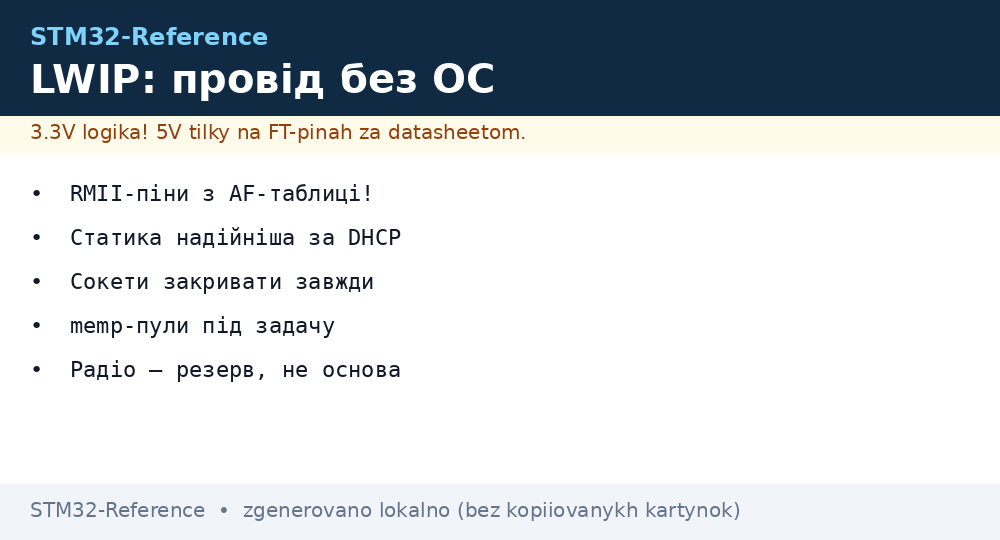
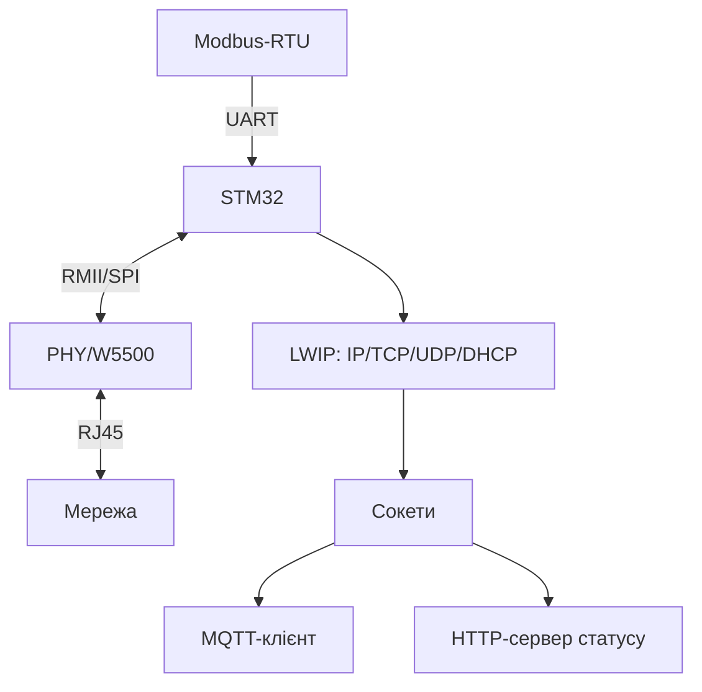

# STM32 Ethernet з LWIP - сокети, MQTT і шлюз без ОС


*Рис. Провідний вузол: MAC+PHY або W5500, LWIP без ОС, сокети вгору - MQTT і HTTP.*

> [!tip] Що це за нота
> Провід замість радіо: стабільність цеху і серверної. LWIP на голому залізі (raw API) або з FreeRTOS (socket API). База: [модуль W5500](../../../STM32-Reference/12-Moduli-zvyazku/04-W5500.md), [RS485/CAN/Ethernet](../../../STM32-Reference/12-Moduli-zvyazku/02-RS485-CAN-Ethernet.md).

## 1. Мета

Дати STM32 повноцінний IP-стек:

- два шляхи: вбудований MAC+PHY (F4/F7/H7) або W5500 по SPI;
- LWIP raw API (колбеки) vs socket API (з RTOS);
- MQTT-клієнт поверх сокетів;
- DHCP + статика + реконект;
- шлюз Modbus-RTU → MQTT.

| Шлях | Плюси | Мінуси |
| --- | --- | --- |
| Вбудований MAC + PHY | швидкість, RMII | потрібен PHY і розводка |
| W5500 по SPI | модуль готовий, 8 сокетів у залізі | межа SPI-швидкості |

## 2. Архітектура



Без ОС - raw API з колбеками (економія RAM). З FreeRTOS - звичні сокети трьома рядками.

## 3. Розпіновка вузла

| Сигнал | Пін STM32 | Примітка |
| --- | --- | --- |
| RMII REF_CLK | PA1 (50 МГц вхід) | від PHY! |
| RMII TXD, TX_EN | PB12/PB13, PB11 | дані в PHY |
| RMII RXD, CRS_DV | PC4/PC5, PA7 | дані з PHY |
| W5500 SPI | PA5/6/7 + CS | альтернатива RMII |
| W5500 INT/RST | PB0/PB1 | переривання і ресет |
| LINK/ACT LED | індикація | видно лінк одразу |

RMII-піни фіксовані мультиплексором - звірити AF-таблицю чипа. Сигнал 50 МГц - короткий і прямий.

## 4. LWIP: raw проти socket

- raw: колбеки `tcp_recv/tcp_sent`, нуль копіювань, складна логіка;
- socket (з RTOS): `lwip_socket/connect/send` - як у Linux;
- memp-пули підібрати під задачу (PBUF_POOL_SIZE!);
- DHCP з fallback на статику при таймауті;
- DNS - або статичні IP брокерів (надійніше).

## 5. Робочий код (C, socket API)

```c
#include "lwip/sockets.h"
#include "mqtt_client.h"

#define BROKER_IP "192.168.1.10"

int net_mqtt_pub(const char *topic, const char *payload) {
  int s = lwip_socket(AF_INET, SOCK_STREAM, 0);
  struct sockaddr_in a = {0};
  a.sin_family = AF_INET;
  a.sin_port = htons(1883);
  a.sin_addr.s_addr = inet_addr(BROKER_IP);
  if (lwip_connect(s, (struct sockaddr*)&a, sizeof(a)) != 0) {
    lwip_close(s);
    return -1;
  }
  mqtt_send_connect(s, "stm32-node");
  mqtt_send_pub(s, topic, payload);
  lwip_close(s);
  return 0;
}

void gateway_tick(void) {
  static uint32_t t0 = 0;
  if (HAL_GetTick() - t0 > 5000) {
    t0 = HAL_GetTick();
    char buf[64];
    snprintf(buf, sizeof(buf), "%lu,%d", t0, read_sensors());
    net_mqtt_pub("stm32/data", buf);
  }
}
```

Клієнт простий (connect-publish-close) - для телеметрії раз на 5 с достатньо. Постійне з'єднання - наступний рівень.

## 6. Робочий код (MicroPython)

```python
# MicroPython: мережевий міст через W5500-SPI (навчальний)
import time
import network
from machine import Pin, SPI

spi = SPI(1, baudrate=40000000, sck=Pin(10), mosi=Pin(11), miso=Pin(12))
nic = network.WIZNET5K(spi, Pin(13), Pin(14))
nic.active(True)
nic.ifconfig(('192.168.1.50', '255.255.255.0', '192.168.1.1', '8.8.8.8'))
print(nic.ifconfig())

import usocket
while True:
    try:
        s = usocket.socket()
        s.connect(('192.168.1.10', 1883))
        s.send(b'stm32/hello\n')
        s.close()
    except OSError as e:
        print('net error', e)
    time.sleep(5)
```

Чесно: LWIP-стек на MicroPython не пишемо - WIZNET5K-драйвер дає сокети, логіка та сама.

## 7. Шлюз Modbus→MQTT

- UART-опитування слейвів за розкладом;
- кеш регістрів у RAM;
- публікація змінами (deadband), не всім підряд;
- команди з MQTT - запис у регістри;
- watchdog каналу: тиша понад хвилину - рестарт сокетів.

## 8. Типові помилки

| Симптом | Причина | Лікування |
| --- | --- | --- |
| Лінка немає | PHY без тактування/живлення | 25 МГц кварц, RMII-піни |
| DHCP 0.0.0.0 | немає сервера/кабель | статика для тесту, інший кабель |
| Сокети течуть | немає close() при помилках | закривати в усіх гілках |
| Рветься під навантаженням | малі memp-пули | підняти PBUF_POOL_SIZE |
| W5500 мовчить | SPI-режим/швидкість | mode 0, почати з 10 МГц |
| Повільно після WiFi-мосту | подвійний NAT | провід безпосередньо в LAN |

## 9. Швидка шпаргалка Ethernet

- RMII-піни - з AF-таблиці чипа;
- статика надійніша за DHCP;
- сокети закривати завжди;
- memp-пули під задачу;
- провід - основа, радіо - резерв.

## 10. Суміжні ноти

- [модуль W5500](../../../STM32-Reference/12-Moduli-zvyazku/04-W5500.md) - залізо модуля.
- [RS485/CAN/Ethernet](../../../STM32-Reference/12-Moduli-zvyazku/02-RS485-CAN-Ethernet.md) - фізика мереж.
- [протокол Modbus](../../../STM32-Reference/15-Protokoli/01-Modbus.md) - шлюзування.
- [протокол MQTT](../../../STM32-Reference/15-Protokoli/04-MQTT.md) - верхній протокол.
- [головна карта](../../../STM32-Reference/Home.md) - повна навігація.

## Офіційні джерела

- [lwIP (GitHub)](https://github.com/lwip-tcpip/lwip) - стек, raw/socket API, memp.
- [CANopen (CAN in Automation)](https://www.can-cia.org/can-knowledge/canopen/) - сусідній промисловий стек.
- [STM32CubeF7 (STMicroelectronics, GitHub)](https://github.com/STMicroelectronics/STM32CubeF7) - приклади Ethernet.
- [W5500 (WIZnet Docs)](https://docs.wiznet.io/Product/Chip/Ethernet/W5500) - SPI-регістри, сокети, драйвер.
