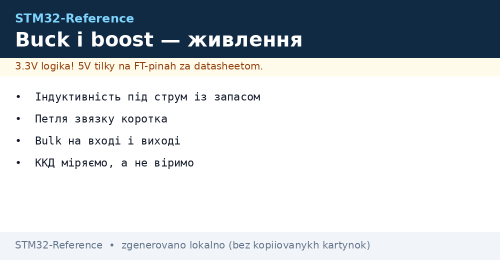
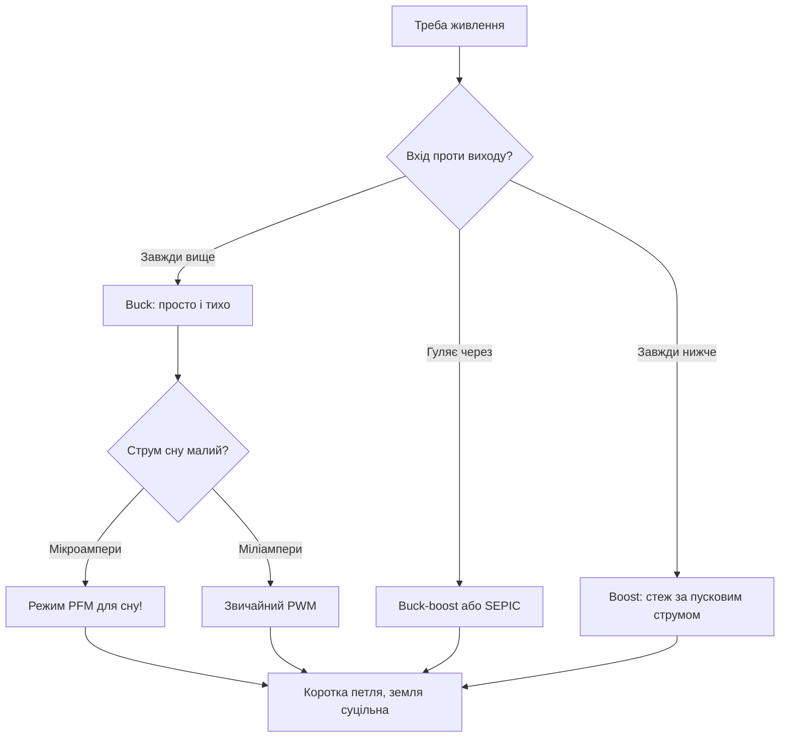

# Buck і boost - імпульсні перетворювачі на платі


*Рис. Від батареї до 3.3 В: ключ, дросель, діод і петля звязку.*

> [!tip] Призначення ноти
> Навчити вибирати дросель і розводити перетворювач так, щоб ККД був чесним, а завади тихими.

## 1. Призначення

Лінійний стабілізатор перетворює зайві вольти в тепло. Імпульсний - вмикає і вимикає ключ сотні тисяч разів на секунду і віддає майже все в навантаження. Для батарейного вузла різниця між 60 і 90 відсотками ККД - це місяці життя. Ціна - правильний дросель і акуратна розводка.

## Buck проти boost проти buck-boost

| Схема | Умова | Приклад |
| --- | --- | --- |
| Buck (понижуючий) | Вхід завжди вище виходу | 5 В в 3.3 В |
| Boost (підвищуючий) | Вхід завжди нижче виходу | 1.5 В в 3.3 В |
| Buck-boost | Вхід гуляє через вихід | Li-Ion 4.2-3.0 в 3.3 В |
| LDO | Різниця мала, струм малий | 3.6 В в 3.3 В, мікроампери сну |

```text
Швидкий вибір:
  живлення 5 В стабільне ... buck;
  одна батарейка АА ....... boost;
  Li-Ion весь діапазон .... buck-boost або LDO з запасом.
```

## Дросель: серце схеми

| Параметр | Правило |
| --- | --- |
| Індуктивність | За даташитом мікросхеми під частоту |
| Струм насичення | З запасом 30 відсотків від пікового! |
| Опір обмотки | Менший - менше гріється і вищий ККД |
| Екранування | Екранований дросель менше свистить в ефір |

> Дросель в насиченні - це майже коротке. Гріється, свистить, палить ключ.

## Конденсатори і діод

| Елемент | Правило |
| --- | --- |
| Вхідний bulk | Кераміка + електроліт поруч з ключем |
| Вихідний LC | Пульсації в межах допуску аналогу |
| Діод Шотткі | Швидкий, з запасом по струму і напрузі |
| Синхронний ключ | Замість діода в сучасних мікросхемах - ККД вище |

## Mermaid: вибір перетворювача



## Розводка силової частини

| Правило | Пояснення |
| --- | --- |
| Петля ключ-дросель-земля | Мінімальна площа - менше випромінювання |
| Зворотний звязок | Тонка доріжка далеко від дроселя |
| Земля силова і сигнальна | Одна точка з'єднання біля виходу |
| Тепловідвід | Полігони міді під гарячими корпусами |

## Режими сну перетворювача

| Режим | Поведінка |
| --- | --- |
| PWM | Постійна частота, гудить на малому струмі |
| PFM | Пачки імпульсів, тихий у сні |
| Shutdown | Вимкнено піном EN, мікроампери |

```text
Практика для батареї:
  актив — PWM, сон — PFM автоматично;
  пін EN від чипа гасить все у глибокому сні;
  струм сну самого перетворювача — у бюджет батареї!
```

## Вимір ККД чесно

| Крок | Дія |
| --- | --- |
| 1 | Навантаження електронне або резистори |
| 2 | Міряти вхід і вихід одночасно двома приладами |
| 3 | Прогнати від 10 до 100 відсотків струму |
| 4 | Перевірити пульсації осцилографом на повному |

## Типові помилки

| # | Помилка | Чому погано | Як правильно |
| --- | --- | --- | --- |
| 1 | Дросель без запасу струму | Насичення, нагрів, смерть ключа | Пік + 30 відсотків |
| 2 | Довга петля ключа | Випромінювання і дзвін | Компактно біля мікросхеми |
| 3 | Звязок поруч з дроселем | Пульсації на виході | Тонка доріжка здалеку |
| 4 | Немає PFM у батареї | Сон їсть міліампери | Мікросхема з PFM! |
| 5 | Електроліт без кераміки | Високий ESR на частоті | Кераміка біля пінів + bulk |
| 6 | Віра в ККД з даташита | Там ідеальні умови | Виміряти на своїй платі |
| 7 | Забутий струм сну | Батарея сідає в простої | Паспортний Iq у бюджет |

## Модуль готовий чи своя схема

| Варіант | Коли |
| --- | --- |
| Готовий модуль | Прототип, малі серії, час дорожчий |
| Своя схема | Серія, ціна і габарити критичні |
| Гібрид | Модуль на першій ревізії, своя на другій |

## Офіційні джерела

- [TI Buck converter basics (TI)](https://www.ti.com/lit/an/slva059a/slva059a.pdf) - теорія і розрахунок.
- [AN3435 SMPS layout (ST)](https://www.st.com/resource/en/application_note/an3435.pdf) - розводка імпульсних схем.

## Пуск і soft-start: пережити першу мілісекунду

| Проблема | Рішення |
| --- | --- |
| Заряд вихідних конденсаторів | Плавний старт: струм росте поступово |
| Просідання батареї на старті | Bulk на вході тримає перші мілісекунди |
| Послідовність живлень | Ядро після периферії - за даташитом чипа! |

```text
Перевірка пуску осцилографом:
  канал 1 — вхідна напруга, канал 2 — вихідна;
  стартує монотонно без провалів — добре;
  дзвін і просідання — більше bulk і мякший старт.
```

## Розрахунок дроселя з нуля: приклад

| Крок | Дія |
| --- | --- |
| 1 | Вхід 5 В, вихід 3.3 В, струм 1 А |
| 2 | Частота з даташита мікросхеми, наприклад 500 кГц |
| 3 | Пульсації струму 30 відсотків - класика |
| 4 | Формула з даташита дає мікрогенрі |
| 5 | Найближчий стандартний номінал вгору! |

```text
Перевірка результату:
  струм насичення дроселя понад пік з запасом;
  опір обмотки мінімальний з доступних;
  корпус не гріється на повному струмі.
```

## SEPIC: коли buck-boost не вистачає

| Тема | Практика |
| --- | --- |
| Плюс SEPIC | Немає інверсії, простіше керування |
| Мінус | Два дроселі або звзаний, ККД нижчий |
| Коли | Батарея через вихідну напругу регулярно |

## Див. також

- [Home](../../../STM32-Reference/Home.md)
- [ланцюги живлення](../../../STM32-Reference/02-Zhivlennya/01-Lancjugi-zhivlennya.md)
- [батарейне живлення](../../../STM32-Reference/02-Zhivlennya/02-Batareyne-zhivlennya.md)
- [захист від завад](../../../STM32-Reference/17-Lab/04-EMI-EMC-Protection.md)
- [узгодження рівнів](../../../STM32-Reference/13-Moduli-zhivlennya-rivniv/02-Level-Shift.md)
