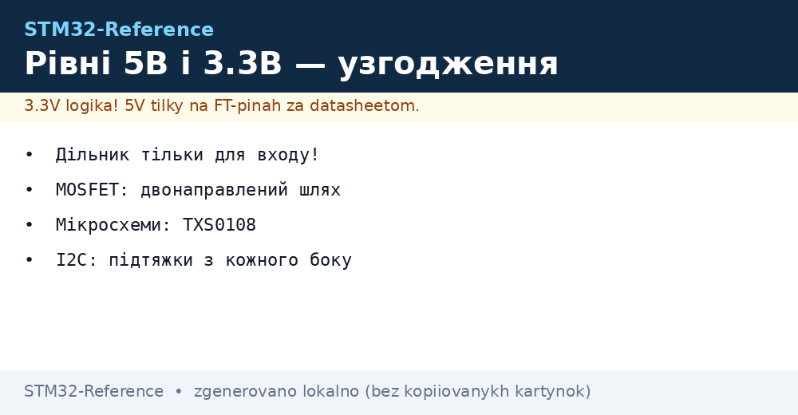
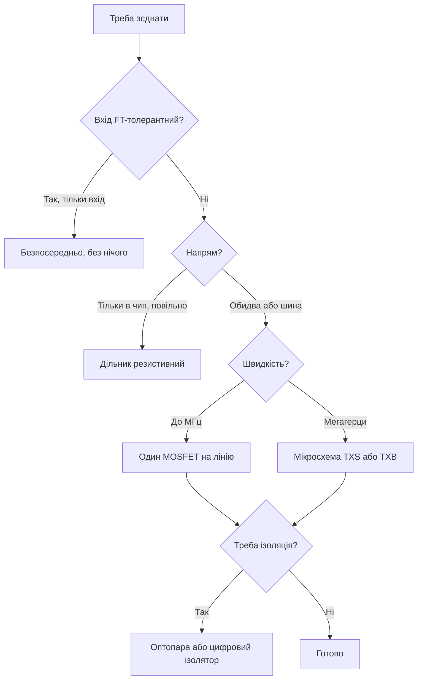

# Узгодження рівнів - 5В і 3.3В без диму


*Рис. Міст між світами: що ставити на кожен напрям і швидкість.*

> [!tip] Призначення ноти
> Навчити зєднувати 5-вольтові модулі з 3.3-вольтовим чипом так, щоб нічого не згоріло і не гальмувало.

## 1. Призначення

Світ датчиків і модулів досі наполовину 5-вольтовий, а STM32 живе на 3.3 В. Частина пінів терпить 5 В (FT), частина - ні. Пряме з'єднання навмання закінчується пробитим входом або божевільними рівнями. Правильний міст залежить від безпосередньо, швидкості і шини.

## Що терплять піни

| Тип піна | 5 В на вході | Як дізнатись |
| --- | --- | --- |
| FT (five-volt tolerant) | Можна | Колонка FT у таблиці пінів даташита! |
| Не FT (аналог, NRST) | НЕ МОЖНА | АЦП-входи, скидання, живлення |
| Вихід чипа | Завжди 3.3 В | 5-вольтовий модуль може не побачити одиницю |

```text
Перше правило:
  відкрити таблицю пінів, знайти колонку FT;
  нема позначки — вважати нетолерантним.
```

## Методи за напрямами

| Метод | Напрям | Швидкість | Ціна |
| --- | --- | --- | --- |
| Безпосередньо (FT-вхід) | В чип | Будь-яка | Безкоштовно |
| Дільник резистивний | В чип | Повільна | Копійки |
| MOSFET двонаправлений | Обидва | До мегагерців | Дешево |
| TXS0108 / TXB0108 | Обидва | Мегагерци | Мікросхема |
| Оптопара | В чип з ізоляцією | Повільна | Розв'язка бонусом |

## Дільник: тільки вхід і повільно

| Тема | Практика |
| --- | --- |
| Розрахунок | Верхній і нижній резистори під 3.3 В з 5 В |
| Опір | Десятки кОм: менше струм, більше шум |
| Швидкість | Тільки кнопки, повільні датчики |
| Вихід з чипа | Дільник НЕ потрібен - чип дає 3.3 В сам |

## MOSFET-міст для шин

| Тема | Практика |
| --- | --- |
| Схема | Один N-MOSFET + дві підтяжки, затвор на 3.3 В |
| Напрям | Автоматично в обидва боки |
| Шина | I2C класика: працює з коробки |
| Підтяжки | З кожного боку на свою напругу! |

```text
I2C між 5 В і 3.3 В:
  MOSFET на SDA і на SCL;
  підтяжка 4.7 кОм до 5 В з одного боку;
  підтяжка 4.7 кОм до 3.3 В з іншого;
  затвор обох на 3.3 В постійно.
```

## Mermaid: вибір моста



## Спеціалізовані мікросхеми

| Мікросхема | Канали | Особливість |
| --- | --- | --- |
| TXS0108 | 8, open-drain | I2C і повільні шини |
| TXB0108 | 8, push-pull | Швидкі, але вередливі до ємності |
| TXB0104 | 4 | Менше пінів для UART/SPI |
| 74LVC245 | 8, однонаправлений | Просто і дубово, напрям піном |

| Пастка TXB | Пояснення |
| --- | --- |
| Довгі дроти | Генерація на ємності лінії |
| Слабкі підтяжки | Конфлікт з внутрішніми |
| Живлення з обох боків | Обидві напруги обов'язкові! |

## Типові помилки

| # | Помилка | Чому погано | Як правильно |
| --- | --- | --- | --- |
| 1 | 5 В на не-FT пін | Пробій входу | Таблиця FT перед підключенням! |
| 2 | Дільник на швидкій шині | Зрізані фронти | MOSFET або мікросхема |
| 3 | TXB на довгих дротах | Генерація | Коротко або TXS |
| 4 | Немає живлення з одного боку TXS | Мікросхема мовчить | Обидві напруги завжди |
| 5 | 3.3 В вихід не бачиться 5 В входом | Поріг одиниці вище | Перевірити VIH модуля! |
| 6 | Спільна земля відсутня | Плаваючі рівні | GND першим дротом |
| 7 | Оптопара на мегагерци | Не встигає | Швидкі ізолятори для швидких шин |

## Офіційні джерела

- [TXS0108 datasheet (TI)](https://www.ti.com/lit/ds/symlink/txs0108e.pdf) - двонаправлений міст.
- [AN10441 Level shifting (NXP)](https://www.nxp.com/docs/en/application-note/AN10441.pdf) - MOSFET-мости для I2C.

## Вихід 3.3 В у 5-вольтовий вхід: чи побачить

| Параметр модуля | Перевірка |
| --- | --- |
| VIH мінімальний | Має бути нижче 3.3 В мінус запас! |
| TTL-пороги | Бачать 3.3 В як одиницю - добре |
| CMOS на 5 В | Хочуть 3.5 В - 3.3 В на межі! |
| Вихід | Підтяжка до 5 В через open-drain або міст вгору |

```text
Практика:
  модуль з TTL-входом — безпосередньо, працює;
  модуль з CMOS-входом на 5 В — міст вгору обовязковий;
  сумніваєшся — осцилограф на вхід модуля під навантаженням.
```

## Живлення моста: порядок подачі

| Правило | Пояснення |
| --- | --- |
| Обидві напруги до роботи | TXS без однієї сторони мовчить |
| Послідовність | За даташитом моста, зазвичай будь-яка |
| Декуплінг моста | 100 нФ біля кожної піни живлення |

## Діагностика моста: що міряти

| Симптом | Перевірка |
| --- | --- |
| Вихід не дотягує | Осцилограф під навантаженням |
| Глюки на швидкості | Фронти і дзвін на межі |
| Гріється міст | Наскрізні струми при переході |
| Працює через раз | Живлення обох боків під навантаженням |

```text
Перевірка осцилографом:
  канал на вхід моста, канал на вихід;
  фронти круті з обох боків — добре;
  сходинка посередині — міст не встигає.
```

## Довгі лінії: що додати

| Довжина | Захід |
| --- | --- |
| До 30 см | Міст біля приймача |
| До метрів | Екрановані пари, нижча швидкість |
| Метри | Диференційна пара RS485 замість логіки! |

## Див. також

- [Home](../../../STM32-Reference/Home.md)
- [імпульсні перетворювачі](../../../STM32-Reference/13-Moduli-zhivlennya-rivniv/01-Buck-Boost.md)
- [режими пінів](../../../STM32-Reference/03-GPIO/01-GPIO-rezhimi.md)
- [шина обміну](../../../STM32-Reference/04-Shini/03-I2C.md)
- [захист від завад](../../../STM32-Reference/17-Lab/04-EMI-EMC-Protection.md)
