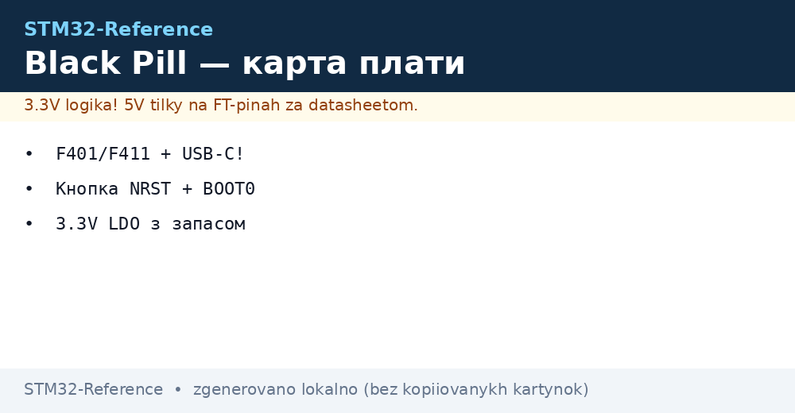
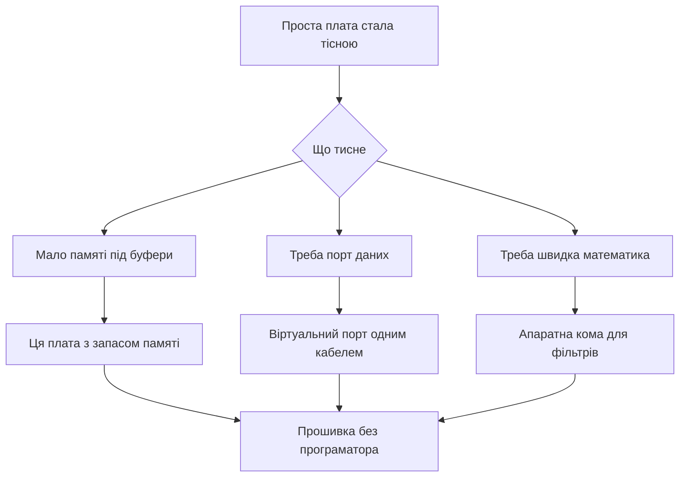

# Black Pill - карта плати і USB


*Рис. Карта Black Pill: продуктивне ядро, роз'єм даних, кнопки керування і запас живлення.*

> [!tip] Призначення ноти
> Показати наступний крок після простої плати: ті ж розміри, але швидше ядро, апаратна кома і справжній порт даних без зовнішніх перетворювачів.

## 1. Призначення

Плата лишається маленькою для макетів, але контролер вже з продуктивної родини. Апаратна кома прискорює фільтри і регулятори. Вища частота дає запас для дисплеїв і обміну.

Сучасний роз'єм несе дані, тому консоль і прошивка йдуть одним кабелем. Кнопки скидання, режиму і користувача спрощують роботу без перемичок. Стабілізатор з запасом тримає датчики і карти пам'яті.

Плата підходить для навчання з прицілом на звук, графіку і швидкий обмін. Ціна трохи вища, але економить на перетворювачах і програматорі.

## 2. Варіанти контролера

| Плата | Контролер | Пам'ять | Особливість |
| --- | --- | --- | --- |
| Базова | F401CC | 256 КБ і 64 КБ | Апаратна кома і швидкість 84 МГц |
| Старша | F411CE | 512 КБ і 128 КБ | 100 МГц і більше інтерфейсів |
| Обидві | Корпус малий | Порти виведені на гребінки | Сумісні за пінами частково |

```text
Карта плати вид зверху:
  +----------------------------------+
  |  [USB-C дані]    [Кнопка NRST]   |
  |  [Кнопка BOOT0]  [Кнопка USER]   |
  |                                  |
  |  Контролер QFN48 по центру       |
  |  Кварц 25 МГц поруч              |
  |  Стабілізатор із запасом         |
  |                                  |
  |  PC13 -- LED (активний нуль)     |
  |  PA11 -- DM  PA12 -- DP          |
  |  PA13 -- SWDIO PA14 -- SWCLK     |
  |  5V вхід -- 3V3 вихід            |
  +----------------------------------+
```

## 3. Кнопки і керування

| Кнопка | Позначення | Як тиснути |
| --- | --- | --- |
| Скидання | NRST | Коротке натискання перезапускає |
| Режим | BOOT0 | Тримати при ввімкненні для завантажувача |
| Користувача | USER на PA0 | Читати програмою як вхід |

Кнопка режиму замінює перемичку зі старої плати. Не треба пінцета і загублених ковпачків. Користувацька кнопка дає вхід для меню без макетних дротів.

## 4. Порт даних через роз'єм

| Режим | Що дає | Коли брати |
| --- | --- | --- |
| Віртуальний порт | Консоль через кабель | Налагоджувальні повідомлення |
| Завантажувач | Прошивка без програматора | Поле без інструментів |
| Пристрій свій | Клавіатура або флешка | Готові вироби |

Лінії даних виведені прямо на роз'єм через узгоджувальні резистори. Стара плата такого не мала і вимагала перетворювач. Тут один кабель закриває живлення, консоль і заливку.

## 5. Живлення із запасом

| Джерело | Напруга | Можливість |
| --- | --- | --- |
| Роз'єм | 5 В | Живлення і дані разом |
| Вивід 5 В | 5 В | Зовнішній блок |
| Вивід 3.3 В | 3.3 В | Вхід від лабораторного джерела |
| Стабілізатор | 3.3 В до 500 мА | Датчики і карта пам'яті |

Запас струму тримає дисплей і датчики одночасно. Все одно радіо з піками краще живити окремо. Конденсатори біля контролера вже стоять достатні.

## 6. Кварц 25 МГц і тактування

| Параметр | Значення | Пояснення |
| --- | --- | --- |
| Кварц | 25 МГц | Базова точна частота |
| Максимум ядра | 84 або 100 МГц | Залежить від контролера |
| Порт даних | 48 МГц від множника | Точність критична для зв'язку |
| Внутрішній | 16 МГц | Для старту без кварца |

Графічний конфігуратор сам рахує множники під 48 МГц для порту. Помилка в налаштуванні дає непрацюючий порт при живому ядрі. Перевірка це поява віртуального порту в системі.

## 7. Прошивка без програматора

```text
Заливка через заводський завантажувач:
  1. Затисни BOOT0 і натисни NRST.
  2. Відпусти NRST, потім відпусти BOOT0.
  3. Підключи кабель до роз'єму плати.
  4. Система бачить пристрій завантажувача.
  5. Залий файл утилітою dfu-util.
  6. Натисни NRST для старту з пам'яті.
```

| Утиліта | Команда приклад |
| --- | --- |
| Перевірка | dfu-util -l показує пристрій |
| Заливка | dfu-util -a 0 -D firmware.bin -s 0x08000000 |
| Скидання | Натисни NRST руками |

## 8. Порівняння зі старою платою

| Параметр | Проста плата | Ця плата |
| --- | --- | --- |
| Ядро | 72 МГц без коми | 84-100 МГц з комою |
| Пам'ять програм | 64 КБ | 256-512 КБ |
| Оперативна | 20 КБ | 64-128 КБ |
| Роз'єм | Тільки живлення | Живлення плюс дані |
| Кнопки | Скидання і перемичка | Три кнопки без перемичок |
| Кварц | 8 МГц | 25 МГц |
| Стабілізатор | Слабкий | Із запасом |
| Прошивка | Тільки програматор або порт | Плюс режим через роз'єм |

## 9. Код: перший віртуальний порт

```c
#include "usbd_cdc_if.h"

void cdc_hello(void)
{
  const char *msg = "Black Pill живий\r\n";
  CDC_Transmit_FS((uint8_t *)msg, 19);
}

void cdc_echo(uint8_t *buf, uint32_t len)
{
  CDC_Transmit_FS(buf, len);
}

int main_loop_cdc(void)
{
  cdc_hello();
  HAL_Delay(500);
  return 0;
}
```

Прийом реалізує колбек в стеку пристрою: байти з хоста приходять у буфер, програма відлунює назад. Передача це виклик відправки з копіюванням у кінцеву точку. Черги роблять для стабільного потоку.

```c
#include "stm32f4xx_hal.h"

void blackpill_led_init(void)
{
  __HAL_RCC_GPIOC_CLK_ENABLE();
  GPIO_InitTypeDef g = {0};
  g.Pin = GPIO_PIN_13;
  g.Mode = GPIO_MODE_OUTPUT_PP;
  g.Pull = GPIO_NOPULL;
  g.Speed = GPIO_SPEED_FREQ_LOW;
  HAL_GPIO_Init(GPIOC, &g);
}

void blackpill_user_button_init(void)
{
  __HAL_RCC_GPIOA_CLK_ENABLE();
  GPIO_InitTypeDef g = {0};
  g.Pin = GPIO_PIN_0;
  g.Mode = GPIO_MODE_INPUT;
  g.Pull = GPIO_PULLDOWN;
  HAL_GPIO_Init(GPIOA, &g);
}

void blackpill_poll(void)
{
  if (HAL_GPIO_ReadPin(GPIOA, GPIO_PIN_0) == GPIO_PIN_SET)
  {
    HAL_GPIO_WritePin(GPIOC, GPIO_PIN_13, GPIO_PIN_RESET);
  }
  else
  {
    HAL_GPIO_WritePin(GPIOC, GPIO_PIN_13, GPIO_PIN_SET);
  }
}
```

## 10. Mermaid: перехід на нову плату



## 11. Налагодження порту

| Симптом | Причина | Лікування |
| --- | --- | --- |
| Порт не з'являється | Множник не дає 48 МГц | Перевірити дерево тактування |
| Пристрій невідомий | Немає резистора підтяжки | Дивитись схему конкретної плати |
| Обриви на швидкості | Довгий кабель | Короткий якісний кабель |
| Скидання при передачі | Слабке живлення | Живити від блока, не від хаба |

## Типові помилки

| # | Помилка | Чому погано | Як правильно |
| --- | --- | --- | --- |
| 1 | Очікування драйвера вручну | Сучасні системи бачать порт самі | Перевірити диспетчер пристроїв після прошивки |
| 2 | Блокуюча відправка у перериванні | Зависання стеку пристрою | Відправка тільки з основного циклу |
| 3 | Довгий кабель для живлення і даних | Просідання і обриви | Короткий кабель і окреме живлення для навантаження |
| 4 | Плутанина варіантів контролера | Різний обсяг пам'яті | Читати маркування і конфігуратор |
| 5 | Ігнор тактування 48 МГц | Ядро живе, порт мовчить | Спочатку дерево частот, потім стек |
| 6 | Кнопка режиму без скидання | Завантажувач не стартує | Тримати кнопку і тиснути скидання |

## Офіційні джерела

- [Контролер F401CC з комою (ST)](https://www.st.com/en/microcontrollers-microprocessors/stm32f401cc.html) - частоти, пам'ять і порт.
- [Контролер F411CE з запасом (ST)](https://www.st.com/en/microcontrollers-microprocessors/stm32f411ce.html) - відмінності старшого варіанта.
- [Нота про порт пристрою повної швидкості (ST)](https://www.st.com/resource/en/application_note/an4879-usb-hardware-and-pcb-guidelines-using-stm32-mcus-stmicroelectronics.pdf) - плата і узгодження ліній.

## Див. також

- [Home](../../../STM32-Reference/Home.md)
- [плата Blue Pill](../../../STM32-Reference/14-Devboards/01-Blue-Pill.md)
- [прошивка через ST-Link](../../../STM32-Reference/09-Proshivka/03-ST-Link-Proshivka.md)
- [послідовний порт UART](../../../STM32-Reference/04-Shini/01-UART.md)
- [огляд плат](../../../STM32-Reference/00-Start/04-Devkit-plati.md)
