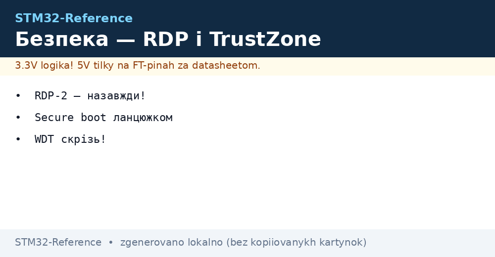
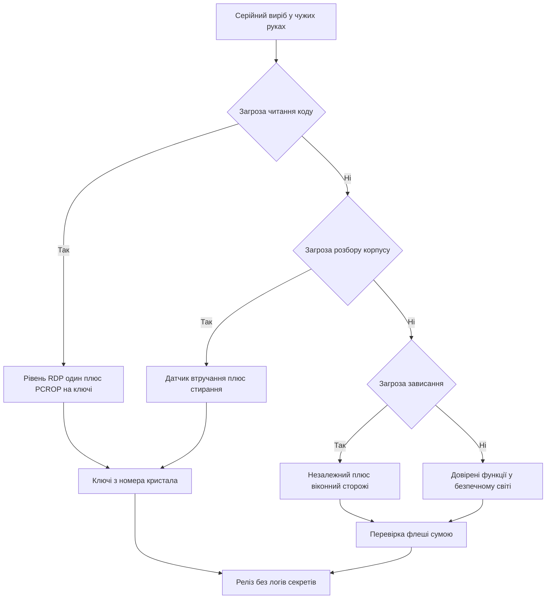

# Безпека STM32 - RDP, TrustZone і нагляд


*Рис. Схема захисту виробу: рівні доступу, довірена зона, ключі, втручання і нагляд таймерами.*

> [!tip] Призначення ноти
> Зібрати мінімальний контур захисту серійного виробу: як закрити читання, як поділити код, де тримати ключі, як прати секрети і як не дати платі зависнути.

## 1. Призначення

Серійний виріб живе у чужих руках: конкурент читає флеш, користувач лізе у корпус, прошивка висить у полі. Базовий захист закриває читання коду, ділить прошивку на довірену і звичайну частини, ховає ключі і стирає секрети при втручанні. Нагляд таймерами повертає плату з зависання без участі людини.

Апаратна основа лежить у флагманах з довіреною зоною, детальніше дивись [флагмани H5 і H7](../../../STM32-Reference/01-Hardware/04-H5-H7.md). Нагляд часом і сторожами розібраний у [час і сторожові таймери](../../../STM32-Reference/07-Timeri-Son/02-LPTIM-RTC-WDT.md). Аварійне відновлення лишається через [прошивка через ST-Link](../../../STM32-Reference/09-Proshivka/03-ST-Link-Proshivka.md) до закриття доступу.

## 2. Рівні RDP

Рівень захисту читання задається байтом опцій. Нуль відкритий для розробки, один закриває флеш від зовнішнього читання, два закриває назавжди.

| Рівень | Стан | Що означає |
| --- | --- | --- |
| Нуль | Відкрито | Читання і запис через налагоджувач вільні |
| Один | Закрито | Зовнішнє читання заборонене, оновлення можливе |
| Два | Назавжди | Налагодження мертве, відкату немає, рішення на все життя |

```text
Вибір рівня під етап:
  Розробка ............ рівень нуль, налагоджувач повний
  Тестова партія ...... рівень один, перевірка оновлення без читання
  Серія ............... рівень один для виробів з оновленням
  Одноразовий виріб ... рівень два лише коли оновлення не буде ніколи
```

| Дія | Рівень нуль | Рівень один | Рівень два |
| --- | --- | --- | --- |
| Читання через дріт | Дозволене | Заборонене | Заборонене назавжди |
| Запис нової прошивки | Дозволений | Дозволений | Заборонений |
| Стирання і повернення | Можливе | Можливе через повне стирання | Неможливе |
| Заводський завантажувач | Активний | Обмежений | Заблокований |

```text
Увага про другий рівень:
  Другий рівень не має зворотного шляху
  Помилка у прошивці стане вічною без можливості ремонту
  Перевіряй виріб на першому рівні мінімум один цикл оновлення
  Став другий рівень лише свідомо під одноразову логіку
```

## 3. Сектори PCROP і WRP

Навіть на першому рівні частину памяті можна закрити точково. Два механізми доповнюють один одного.

| Механізм | Що робить |
| --- | --- |
| PCROP | Забороняє читання вибраних секторів, код виконується але не читається |
| WRP | Забороняє запис і стирання вибраних секторів, захист від випадкового псування |

| Задача | Налаштування |
| --- | --- |
| Ключі у флеші | Сектор з ключами під PCROP, читає лише свій код |
| Завантажувач | Сектор IAP під WRP, образ не зітре сам себе |
| Калібрування | Сектор констант під WRP, поле не затре заводські дані |
| Секрети | Обидва прапорці разом для критичних ділянок |

```text
Розкладка захисту секторів:
  IAP ................. WRP, ніхто не перепише завантажувач з поля
  Ключі ............... PCROP, виконання дозволене, дамп заборонений
  Застосунок .......... без прапорців, оновлення через IAP вільне
  Калібрування ........ WRP, тільки заводський стенд знімає захист
```

## 4. TrustZone і безпечне завантаження на H5 і U5

Флагмани ділять систему на безпечний і звичайний світи. Безпечний світ тримає ключі і перевірку, звичайний робить прикладну логіку.

| Світ | Що живе | Доступ |
| --- | --- | --- |
| Безпечний | Корінь довіри, ключі, перевірка образу | Бачить усе |
| Звичайний | Застосунок, драйвери, мережа | Бачить лише своє |
| Периферія | Розподіл по світах у конфігураторі | Міст між світами лише через ворота |

```text
Ланцюжок безпечного старту:
  Корінь у памяті ---> перевіряє завантажувач
  Завантажувач ---> перевіряє застосунок по підпису
  Застосунок ---> просить ключі лише через ворота безпечного світу
  Провал перевірки ---> стоп і спроба золотого образу
```

| Етап | Перевірка |
| --- | --- |
| Старт | Хеш і підпис завантажувача |
| Стрибок | Хеш і підпис застосунку |
| Оновлення | Підпис нового образу перед записом у слот |
| Відкат | Заборона старої версії з відомою вадою |

## 5. Унікальний ID і генерація ключів

Кожен кристал має 96 біт унікального номера. З нього виводять ключі під конкретний екземпляр без зберігання мастер ключа у прошивці.

| Джерело | Довжина | Де лежить |
| --- | --- | --- |
| Унікальний номер | 96 біт | Заводські адреси системної області |
| Випадковість | Апаратний генератор | Периферія випадкових чисел |
| Сіль партії | Рядок у захищеному секторі | Той же для партії, різний між партіями |

```text
Схема виведення ключа:
  Унікальний номер плюс сіль ---> хеш ---> ключ вузла
  Один образ прошивки ---> різні ключі на різних платах
  Витік образу не дає ключів чужих плат
  Сервер рахує той самий ключ по номеру з паспорта вузла
```

```c
#define UID_BASE 0x0BFA0590U

void node_key_derive(const uint8_t *salt, uint32_t salt_len, uint8_t *out32)
{
    const uint8_t *uid = (const uint8_t *)UID_BASE;
    uint32_t acc = 0x811C9DC5U;
    for (uint32_t i = 0; i < 12; i++)
    {
        acc ^= uid[i];
        acc *= 0x01000193U;
    }
    for (uint32_t i = 0; i < salt_len; i++)
    {
        acc ^= salt[i];
        acc *= 0x01000193U;
    }
    for (int i = 0; i < 32; i++)
    {
        out32[i] = (uint8_t)(acc >> ((i % 4) * 8));
        acc = acc * 1664525U + 1013904223U;
    }
}
```

| Правило ключів | Пояснення |
| --- | --- |
| Не класти ключі у код | Образ читають, ключ з образу витягають за хвилини |
| Один пристрій один ключ | Витік одного вузла не кладе всю серію |
| Ключі у PCROP | Читання дампом закрите, виконання дозволене |
| Оберт ключів | Новий образ вміє прийняти новий ключ без цегли |

## 6. Втручання і стирання секретів

Блок втручання стежить за корпусом і живленням. При спрацюванні стирає резервні регістри і ключі.

| Подія | Реакція |
| --- | --- |
| Відкриття корпусу | Стирання резервних регістрів з ключами |
| Провал живлення | Фіксація мітки часу і закриття доступу |
| Зовнішній фронт | Переривання з негайним затиранням секретів |
| Скидання фільтра | Ігнор коротких завад без стирання |

```text
Контур втручання:
  Датчик корпусу ---> фільтр завад ---> подія втручання
  Подія ---> стирання резервних регістрів і ключів у RAM
  Журнал ---> запис факту у захищений лічильник без самих секретів
```

| Налаштування | Пояснення |
| --- | --- |
| Фільтр | Відсікає брязкіт кришки без хибних стирань |
| Активний рівень | Підтяжка щоб обрив шлейфа теж вважався втручанням |
| Резервне живлення | Стирання встигає завершитись на батарейці домену |
| Тест | Кнопка сервісу імітує втручання на стенді |

## 7. Нагляд IWDG і WWDG від зависань

Безпека це не лише секрети. Виріб що висить з відкритим приводом небезпечний фізично. Два сторожі повертають керування.

| Сторож | Такт | Що ловить |
| --- | --- | --- |
| Незалежний | Свій генератор | Зависання будь-де, навіть при падінні шин |
| Віконний | Шина ядра | Раннє і пізнє оновлення у циклі |

```text
Правило погладжування:
  Гладити в одному місці кінця головного циклу
  Не гладити у перериваннях, вони маскують зависання основи
  Період сторожів під реальний цикл плюс запас на зв'язок
  Причина скидання у журнал після старту
```

```c
IWDG_HandleTypeDef hiwdg;
WWDG_HandleTypeDef hwwdg;

void watchdog_init(void)
{
    HAL_IWDG_Init(&hiwdg);
    HAL_WWDG_Init(&hwwdg);
}

void main_loop_tick(void)
{
    HAL_IWDG_Refresh(&hiwdg);
    HAL_WWDG_Refresh(&hwwdg);
}
```

## 8. CRC периферія для перевірки флеші

Апаратний блок суми рахує цілісність флеші без навантаження ядра. Періодична перевірка ловить биті сектори.

```c
CRC_HandleTypeDef hcrc;

uint32_t flash_crc_check(uint32_t *base, uint32_t words)
{
    uint32_t acc = 0U;
    for (uint32_t i = 0; i < words; i++)
    {
        acc = HAL_CRC_Accumulate(&hcrc, &base[i], 1U);
    }
    return acc;
}

int boot_image_ok(uint32_t *base, uint32_t words, uint32_t expect)
{
    uint32_t got = flash_crc_check(base, words);
    return (got == expect) ? 1 : 0;
}
```

| Задача | Період |
| --- | --- |
| Перевірка IAP на старті | Кожен старт перед стрибком |
| Перевірка застосунку | Кожен старт і раз на добу у фоні |
| Перевірка ключів | Після кожного втручання у корпус |
| Журнал | Невідповідність у лічильник подій без зупинки виробу |

## 9. Правила релізної прошивки

| Правило | Пояснення |
| --- | --- |
| Закрити налагодження | Перший рівень мінімум, другий лише свідомо |
| Прибрати логи з секретами | Ключі і паролі не виводяться у порт |
| Вимкнути тестові команди | Сервісне меню без обходу захисту |
| Перевірити відкат | Битий образ повертається на робочий слот |
| Зберегти карту опцій | Файл байтів опцій лежить у репозиторії релізу |

```text
Чекліст перед серією:
  1. Прошивка зібрана у релізі без символів налагодження
  2. Логи не містять ключів і персональних даних
  3. Рівень один ставиться штатним скриптом, не вручну
  4. Оновлення і відкат перевірені на трьох платах
  5. Байти опцій і версії записані у паспорт партії
  6. Тест втручання стирає ключі і лишає журнал
```

## Mermaid: побудова захисту



## Типові помилки

| # | Помилка | Чому погано | Як правильно |
| --- | --- | --- | --- |
| 1 | Другий рівень поставили одразу | Відкату немає, бракована партія вічна | Починати з першого рівня, другий лише свідомо |
| 2 | Ключі лежать у коді як рядки | Дамп образу віддає всі секрети | Виводити ключі з номера кристала, сектор під PCROP |
| 3 | Сторожа гладять у перериванні | Зависання основи маскується живим тиком | Гладити в одному місці кінця головного циклу |
| 4 | Без WRP на завантажувач | Поле перезапише сам IAP при збої | Закрити сектор IAP від запису |
| 5 | Логи шлють ключі у порт | Секрети осідають у терміналах сервісу | Прибрати секрети з виводу у релізі |
| 6 | Немає перевірки образу | Битий код стартує і висить | Перевіряти суму і підпис перед стрибком |
| 7 | Тестові команди лишили у релізі | Обхід захисту через сервісне меню | Вимикати тестовий інтерфейс прапорцем збірки |

## Офіційні джерела

- [STM32H563ZI datasheet (ST)](https://www.st.com/en/microcontrollers-microprocessors/stm32h563zi.html) - довірена зона, безпечне завантаження, опції захисту.
- [STM32U585AI datasheet (ST)](https://www.st.com/en/microcontrollers-microprocessors/stm32u585ai.html) - рівні RDP, сектори PCROP і WRP, втручання.
- [IWDG and WWDG ST](https://www.st.com/en/microcontrollers-microprocessors/stm32-32-bit-arm-cortex-mcus.html) - вибір сторожового таймера під задачу нагляду.

## Див. також

- [Home](../../../STM32-Reference/Home.md)
- [час і сторожові таймери](../../../STM32-Reference/07-Timeri-Son/02-LPTIM-RTC-WDT.md)
- [флагмани H5 і H7](../../../STM32-Reference/01-Hardware/04-H5-H7.md)
- [прошивка через ST-Link](../../../STM32-Reference/09-Proshivka/03-ST-Link-Proshivka.md)
- [промисловий протокол Modbus](../../../STM32-Reference/15-Protokoli/01-Modbus.md)
- [оновлення прошивки](../../../STM32-Reference/15-Protokoli/02-DFU-Bootloader.md)
