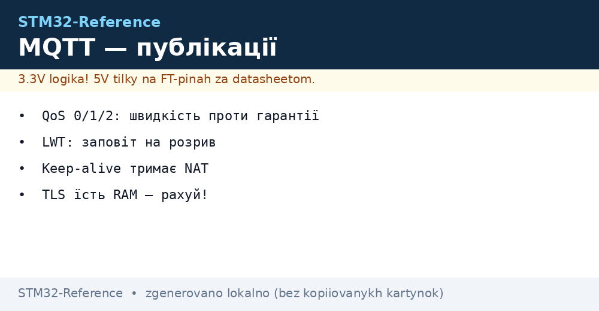
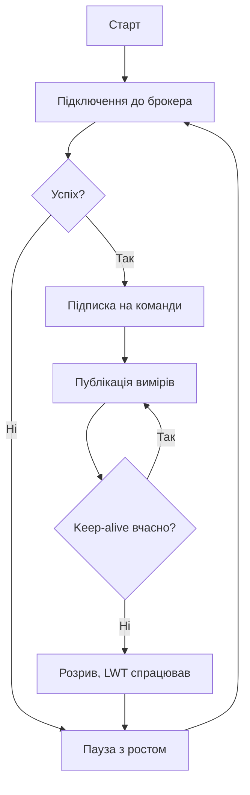

# MQTT на STM32 - публікації через LWIP і GSM


*Рис. Міст у хмару: вузол, брокер, підписники.*

> [!tip] Призначення ноти
> Навчити слати дані в хмару: QoS за задачею, заповіт на розрив, TLS без загибелі RAM.

## 1. Призначення

MQTT - це пошта для датчиків: вузол публікує в топік, хто хоче - підписується. Легкий протокол тягне навіть GSM-модем. На STM32 клієнт живе поверх LWIP (Ethernet) або AT-модему (GSM). Розуміння QoS і сесій відрізняє надійну телеметрію від дірявої.

## QoS: три рівні доставки

| Рівень | Гарантія | Ціна |
| --- | --- | --- |
| QoS 0 | Раз - і забули | Втрати можливі |
| QoS 1 | Дійде хоча б раз | Дублікати можливі! |
| QoS 2 | Рівно раз | Повільно і важко |

```text
Практика:
  телеметрія датчиків .... QoS 0, часта;
  аварії і команди ........ QoS 1 з ідемпотентністю;
  QoS 2 на мікроконтролері — майже ніколи.
```

## Топіки: ієрархія без хаосу

| Правило | Приклад |
| --- | --- |
| Дерево за обєктом | цех1/лінія2/температура |
| Статус окремо | .../status: online і offline |
| Команди вниз | .../cmd з підтвердженням |
| Без пробілів і кирилиці | Тільки ASCII! |

## LWT: заповіт на розрив

| Тема | Практика |
| --- | --- |
| Ідея | Брокер публікує offline, якщо вузол пропав |
| Keep-alive | Пінг тримає NAT і детектить смерть |
| Чиста сесія | Нуль - брокер памятає підписки |
| Перепідключення | Експоненційна пауза, не спам! |

## Mermaid: життя клієнта



## Транспорт: Ethernet чи GSM

| Варіант | Плюси | Мінуси |
| --- | --- | --- |
| Ethernet + LWIP | Швидко, стабільно | Дріт потрібен |
| GSM-модем AT | Скрізь, де є стільниковий | Повільно, трафік гроші |
| Вбудований TLS модема | Не їсть RAM чипа! | AT-команди складніші |

## TLS на мікроконтролері: повна практика

| Тема | Практика |
| --- | --- |
| Бібліотека | mbedTLS у Cube-пакеті, конфіг обрізати під себе! |
| RAM на сесію | Десятки КБ: буфери, сертифікат, handshake |
| Flash | Кореневий сертифікат в прошивці як константа |
| Час | RTC синхронізовано, інакше перевірка терміну падає! |
| Шифри | Тільки сучасні, старі вимкити в конфігу |

| Конфіг mbedTLS | Що різати |
| --- | --- |
| Непотрібні шифри | Мінус кілобайти Flash і RAM |
| Великі буфери | Під свій MTU, не з запасом х10 |
| Дебаг-логи | Виключити в релізі - їдять час і пам'ять |

## Взаємний TLS: клієнт з сертифікатом

| Крок | Дія |
| --- | --- |
| 1 | Свій CA, клієнтський сертифікат на вузол |
| 2 | Приватний ключ у захищеній памяті, не в git! |
| 3 | Брокер перевіряє клієнта, клієнт - брокера |
| 4 | Відкликання: список або короткі терміни |

## TLS у модемі: розвантаження чипа

| Варіант | Коли |
| --- | --- |
| SIM7600 робить TLS сам | RAM чипа ціла, AT складніші |
| Чип робить TLS | Повний контроль, більше RAM |
| Без TLS взагалі | Тільки закрита мережа або VPN! |

```text
Перевірка TLS-зєднання при пуску:
  час синхронізовано? -> handshake проходить? -> сертифікат валідний?;
  ні на будь-якому кроці — зрозуміла помилка в лог, не мовчання.
```

## Альтернативи TLS

| Варіант | Коли вистачає |
| --- | --- |
| Приватний брокер у VPN | Канал захищено тунелем |
| Локальна мережа без інтернету | Фізична ізоляція |
| Шифр корисного вручну | Тільки з готовим протоколом, не самописним! |

## Типові помилки

| # | Помилка | Чому погано | Як правильно |
| --- | --- | --- | --- |
| 1 | Усе QoS 2 | Гальма і пам'ять | QoS за критичністю |
| 2 | Без LWT | Мертвий вузол виглядає живим | Заповіт завжди! |
| 3 | Keep-alive великий за NAT | Тихі розриви | Пінг частіше за таймаут NAT |
| 4 | Дублікати QoS 1 ламають логіку | Подвійні команди | Ідемпотентні обробники |
| 5 | TLS без точного часу | Сертифікат не проходить | RTC синхронізовано! |
| 6 | Трафік без ліміту на GSM | Рахунок | Рідше, пачками, QoS 0 |
| 7 | Паролі в коді | Прошивка читається | Секрети в захищеній памяті |

## Моніторинг флоту: що дивитись

| Метрика | Сигнал біди |
| --- | --- |
| Онлайн за LWT | Вузол мовчить довше циклу |
| Вік останніх даних | Теплова карта прострочень |
| Перепідключення | Спам - проблема з мережею |
| Дубльовані команди | QoS 1 без ідемпотентності |

## Офіційні джерела

- [MQTT Specification (OASIS)](https://mqtt.org/mqtt-specification/) - QoS, сесії, LWT.
- [LWIP Documentation (Savannah)](https://www.nongnu.org/lwip/) - TCP під клієнтом.

## Retained: останнє значення для новачків

| Тема | Практика |
| --- | --- |
| Ідея | Брокер тримає останнє і віддає новим підписникам |
| Статус | Retained offline і online - must have |
| Телеметрія | Не retained, інакше старе за свіже! |
| Очищення | Порожнє retained видаляє залишок |

## Код: скелет публікації

```c
// Логіка циклу телеметрії (клієнт умовний):
mqtt_connect(broker, client_id, LWT_TOPIC, LWT_MSG);
mqtt_subscribe(cmd_topic, on_command);
for (;;) {
  read_sensors(&sample);
  mqtt_publish(telemetry_topic, &sample, QOS0, false);
  keep_alive_tick();
  vTaskDelay(pdMS_TO_TICKS(60000));
}
```

## Безпека брокера: мінімум

| Захід | Навіщо |
| --- | --- |
| Логін і пароль | Не анонімний доступ з інтернету! |
| ACL по топіках | Вузол пише тільки своє дерево |
| TLS на 8883 | Шифр в дорозі |
| Білий список IP | Для статики - просто і надійно |

## Див. також

- [Home](../../../STM32-Reference/Home.md)
- [промисловий протокол](../../../STM32-Reference/15-Protokoli/01-Modbus.md)
- [супутники і стільниковий](../../../STM32-Reference/12-Moduli-zvyazku/03-GPS-GSM.md)
- [дротові мережі](../../../STM32-Reference/12-Moduli-zvyazku/02-RS485-CAN-Ethernet.md)
- [шлюз даних](../../../STM32-Reference/16-Proekti/04-Modbus-Gateway.md)
