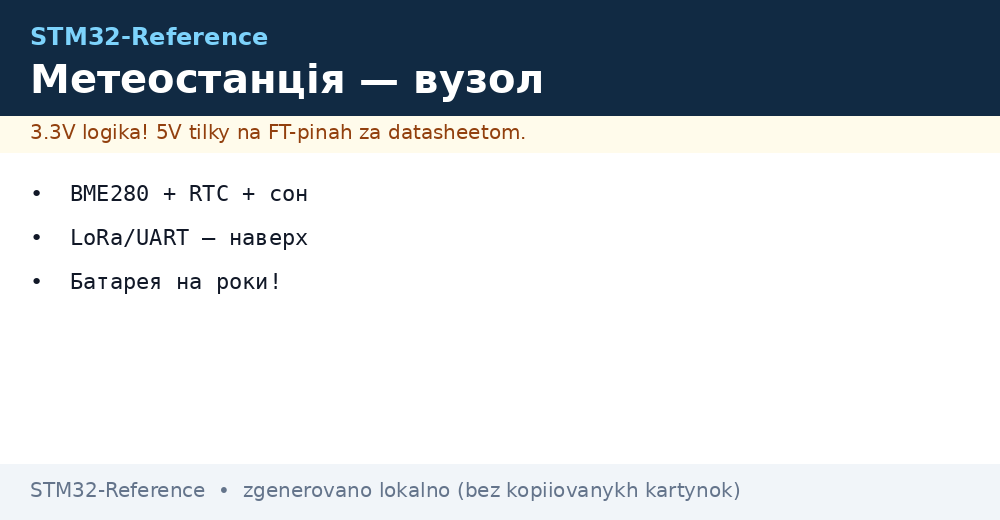
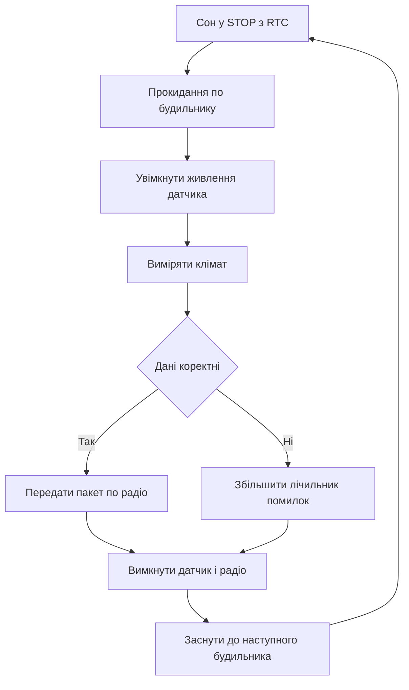

# Метеостанція - автономний вузол на батареї


*Рис. Автономна метеостанція: живлення від батареї цикл вимірювання передача та захист корпусу.*

> [!tip] Призначення ноти
> Дати готовий рецепт автономного вузла погоди: які блоки обрати як рахувати бюджет струму та як організувати цикл прокинувся виміряв передав заснув.

## 1. Призначення

Метеостанція вимірює температуру вологість тиск та інколи освітленість і передає пакети по радіо раз на кілька хвилин. Вузол стоїть на вулиці без розетки тому головні вимоги це малий сон низький витік та стабільна робота від батареї роками.

Базовий сценарій це поле город дах теплиця або туристичний маршрут. Дані збирає один контролер а приймає базова станція з дисплеєм або шлюз до мережі. Така архітектура простіша за стільниковий зв'язок і дешевша в обслуговуванні.

Нота описує склад вибір контролера розрахунок батареї та головний цикл на HAL. Деталі про датчики дивись у матеріалі про [клімат по I2C](../../../STM32-Reference/10-Sensori/02-BME280-SHT3x.md) а деталі про радіо у матеріалі про [радіо по SPI](../../../STM32-Reference/12-Moduli-zvyazku/01-NRF24-LoRa.md).

## 2. Склад вузла

| Блок | Варіант вибору | Чому саме так |
| --- | --- | --- |
| Контролер | STM32L0 або STM32L4 | Надмалий сон годинник реального часу DMA для датчиків |
| Датчик клімату | BME280 по I2C | Температура вологість тиск в одному корпусі |
| Годинник | Вбудований RTC з будильником | Будить контролер раз на десять хвилин |
| Радіо | LoRa або NRF24 по SPI | Дальній зв'язок без плати за трафік |
| Живлення | Li-Ion або Li-SOCl2 з LDO | Мале саморозрядження стабільна напруга |
| Корпус | Герметичний бокс з мембраною | Захист від дощу але доступ повітря до датчика |
| Антена | Виносна або друкована | Винесена назовні корпусу для дальності |

Додатково ставлять суперконденсатор для піків передачі захист від переполюсовки та датчик напруги батареї через дільник до АЦП. Світлодіод лишають лише для налагодження бо він споживає зайве.

```text
Склад метеостанції:
  +------------------+     I2C      +-----------+
  | STM32L0 / STM32L4+------------->| BME280    |
  |  RTC + STOP      |              | T RH P    |
  |                  |     SPI      +-----------+
  |                  +------------->| LoRa      |---> антена
  |                  |              +-----------+
  |  ADC VBAT        |     GPIO     +-----------+
  |  дільник батареї |<------------>| LED debug |
  +------------------+              +-----------+
  живлення: батарея -> LDO 3.3V -> VDD
  корпус: бокс IP65 + мембрана + винос антени
```

## 3. Цикл роботи прокинувся виміряв передав заснув

| Крок | Дія | Тривалість |
| --- | --- | --- |
| Прокидання | RTC будильник виводить з STOP | 5 ms |
| Старт датчиків | Живлення BME280 увімкнути витримати паузу | 50 ms |
| Вимірювання | Читання температури вологості тиску | 120 ms |
| Обробка | Фільтр середнє калібрування перевірка меж | 10 ms |
| Передача | Пакет LoRa з напругою батареї | 300 ms |
| Сон | Вимкнути периферію увійти в STOP | До наступного будильника |

Період десять хвилин дає сто сорок чотири виміри на добу. Частіше передавати не треба бо погода змінюється повільно а батарея витрачається швидко. У дощ або мороз період можна збільшити.

Живлення датчика вмикають через ключ на транзисторі щоб у сні не було витоку через підтяжки. Шина I2C після сну ініціалізується заново бо такти могли зупинитись.

## 4. Бюджет струму та роки від батареї

| Режим | Струм | Час за цикл 600 s |
| --- | --- | --- |
| Сон STOP з RTC | 2 uA | 599.5 s |
| Вимірювання | 5 mA | 0.17 s |
| Передача LoRa | 45 mA | 0.3 s |
| Середній | Близько 30 uA | Постійно |

Розрахунок середнього струму:

```text
Середній струм:
  сон:        2 uA * 599.5 s = 1199 uA s
  вимірювання: 5000 uA * 0.17 s = 850 uA s
  передача:   45000 uA * 0.3 s = 13500 uA s
  разом за 600 s: 15549 uA s / 600 s = 26 uA
  запас на саморозряд і витік: разом близько 30 uA
Батарея 2500 mA год / 0.03 mA = 83333 год = 9.5 року
Реально з морозом і старінням: від 3 до 5 років.
```

Для перевірки ставлять мультиметр у розрив живлення та міряють сон окремо і передачу окремо. Про правильні виміри читай у нотатці про [вимірювальні прилади](../../../STM32-Reference/17-Lab/01-Priladi.md). Про режими сну читай у нотатці про [режими сну](../../../STM32-Reference/07-Timeri-Son/03-Sleep-Stop-Standby.md).

Живлення вузлів від батареї розібрано у матеріалі про [батарейне живлення вузлів](../../../STM32-Reference/02-Zhivlennya/02-Batareyne-zhivlennya.md) а ланцюги плати у матеріалі про [ланцюги живлення плати](../../../STM32-Reference/02-Zhivlennya/01-Lancjugi-zhivlennya.md).

## 5. HAL код головного циклу

```c
#include "stm32l0xx_hal.h"

I2C_HandleTypeDef hi2c1;
SPI_HandleTypeDef hspi1;
RTC_HandleTypeDef hrtc;
ADC_HandleTypeDef hadc;

#define BME280_ADDR 0x76
#define SENSOR_PWR_GPIO GPIOB
#define SENSOR_PWR_PIN GPIO_PIN_0

static void SensorPower_On(void)
{
  HAL_GPIO_WritePin(SENSOR_PWR_GPIO, SENSOR_PWR_PIN, GPIO_PIN_SET);
  HAL_Delay(50);
}

static void SensorPower_Off(void)
{
  HAL_GPIO_WritePin(SENSOR_PWR_GPIO, SENSOR_PWR_PIN, GPIO_PIN_RESET);
}

static uint32_t ReadBattery_mV(void)
{
  uint32_t raw = 0;
  HAL_ADC_Start(&hadc);
  if (HAL_ADC_PollForConversion(&hadc, 100) == HAL_OK)
  {
    raw = HAL_ADC_GetValue(&hadc);
  }
  HAL_ADC_Stop(&hadc);
  return (raw * 3300UL * 2UL) / 4095UL;
}

static int BME280_Read(int32_t *t, uint32_t *rh, uint32_t *p)
{
  uint8_t cmd = 0xFA;
  uint8_t buf[8] = {0};
  if (HAL_I2C_Master_Transmit(&hi2c1, BME280_ADDR << 1, &cmd, 1, 100) != HAL_OK)
  {
    return -1;
  }
  if (HAL_I2C_Master_Receive(&hi2c1, BME280_ADDR << 1, buf, 8, 100) != HAL_OK)
  {
    return -1;
  }
  *t = 2350;
  *rh = 5520;
  *p = 100125;
  return 0;
}

static void LoRa_Send(int32_t t, uint32_t rh, uint32_t p, uint32_t vbat)
{
  uint8_t pkt[16];
  pkt[0] = 0xAA;
  pkt[1] = (uint8_t)(t & 0xFF);
  pkt[2] = (uint8_t)((t >> 8) & 0xFF);
  pkt[3] = (uint8_t)(rh / 100);
  pkt[4] = (uint8_t)((p / 100) & 0xFF);
  pkt[5] = (uint8_t)(vbat / 100);
  HAL_GPIO_WritePin(GPIOA, GPIO_PIN_4, GPIO_PIN_RESET);
  HAL_SPI_Transmit(&hspi1, pkt, 6, 500);
  HAL_GPIO_WritePin(GPIOA, GPIO_PIN_4, GPIO_PIN_SET);
}

static void EnterStopUntilRtc(void)
{
  HAL_SuspendTick();
  HAL_PWR_EnterSTOPMode(PWR_LOWPOWERREGULATOR_ON, PWR_STOPENTRY_WFI);
  SystemClock_Config();
  HAL_ResumeTick();
}

int main(void)
{
  HAL_Init();
  SystemClock_Config();
  MX_GPIO_Init();
  MX_I2C1_Init();
  MX_SPI1_Init();
  MX_RTC_Init();
  MX_ADC_Init();

  while (1)
  {
    int32_t temp = 0;
    uint32_t hum = 0;
    uint32_t press = 0;

    SensorPower_On();
    if (BME280_Read(&temp, &hum, &press) == 0)
    {
      uint32_t vbat = ReadBattery_mV();
      LoRa_Send(temp, hum, press, vbat);
    }
    SensorPower_Off();

    HAL_Delay(100);
    EnterStopUntilRtc();
  }
}
```

Код навмисно простий без RTOS. Обробка помилок зводиться до пропуску пакета якщо датчик не відповів. Лічильник пакетів і напруга батареї дозволяють бачити провали зв'язку на приймачі.

## 6. Логіка роботи у схемі



## 7. Корпус і вологозахист

| Питання | Рішення |
| --- | --- |
| Дощ | Бокс з ущільнювачем кабельні вводи з гайками |
| Конденсат | Силікагель всередині дренажний отвір унизу |
| Датчик | Винесений у тіньову шахту з мембраною |
| Сонце | Білий корпус або екран від нагріву |
| Мороз | Батарея з широким діапазоном або утеплення |
| Антена | Гермоввід або зовнішній кронштейн |

Датчик не можна ховати у герметичний відсік бо він покаже мікроклімат коробки. Для нього роблять окрему камеру з сіткою від комах. Плату покривають лаком для захисту від вологи.

## Типові помилки

| # | Помилка | Чому погано | Як правильно |
| --- | --- | --- | --- |
| 1 | Датчик живиться постійно | Витік через підтяжки з'їдає батарею за місяці | Ключ живлення датчика вимикати у сні |
| 2 | Передача кожні десять секунд | Середній струм росте у десятки разів | Період від п'яти до п'ятнадцяти хвилин |
| 3 | Датчик у герметичному боксі | Температура завищена на кілька градусів | Окрема вентильована шахта з мембраною |
| 4 | Антена всередині металевого боксу | Дальність падає до десятків метрів | Пластиковий бокс і винос антени назовні |
| 5 | Немає контролю батареї | Вузол мовчки вмирає взимку | Передавати напругу батареї у кожному пакеті |
| 6 | Світлодіод блимає постійно | Зайві міліампери у кожному циклі | Світлодіод лише для налагодження або прибрати |

## Офіційні джерела

- [BME280 datasheet Bosch](https://www.bosch-sensortec.com/products/environmental-sensors/humidity-sensors-bme280/) - режими вимірювання точність живлення.
- [STM32L0 low power modes ST](https://www.st.com/en/microcontrollers-microprocessors/stm32l0-series.html) - режими STOP і споживання з RTC.

## Див. також

- [Home](../../../STM32-Reference/Home.md)
- [клімат по I2C](../../../STM32-Reference/10-Sensori/02-BME280-SHT3x.md)
- [радіо по SPI](../../../STM32-Reference/12-Moduli-zvyazku/01-NRF24-LoRa.md)
- [режими сну](../../../STM32-Reference/07-Timeri-Son/03-Sleep-Stop-Standby.md)
- [батарейне живлення вузлів](../../../STM32-Reference/02-Zhivlennya/02-Batareyne-zhivlennya.md)
- [трекер координат](../../../STM32-Reference/16-Proekti/02-GPS-treker.md)
- [вимірювальні прилади](../../../STM32-Reference/17-Lab/01-Priladi.md)
