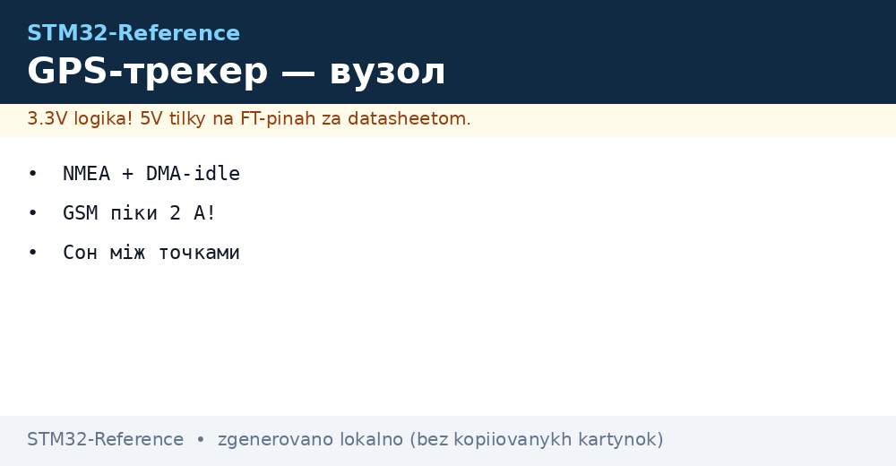
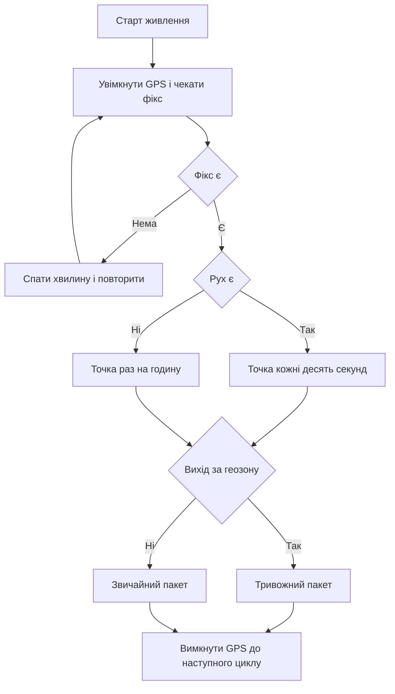

# GPS-трекер - координати і передача


*Рис. Трекер координат: приймач супутників контролер передача даних та живлення з піками струму.*

> [!tip] Призначення ноти
> Показати повний цикл трекера: як приймати координати як розбирати рядки обміну як економити батарею та як передавати точки на сервер.

## 1. Призначення

Трекер пише маршрут рухомого об'єкта: велосипед авто тварина I2C-адаптер або вантаж. Він визначає координати за супутниками та відправляє їх по радіо або у стільникову мережу. У спокої він спить а у русі пише точки часто.

Головна складність це живлення. Приймач супутників споживає десятки міліампер а передавач у піку бере до двох ампер. Тому батарея конденсатори та обмеження живлення вирішують чи буде трекер жити добу або місяць.

Основи приймачів та модемів дивись у нотатці про [супутники і стільниковий зв'язок](../../../STM32-Reference/12-Moduli-zvyazku/03-GPS-GSM.md) а основи радіо без мережі у нотатці про [радіо по SPI](../../../STM32-Reference/12-Moduli-zvyazku/01-NRF24-LoRa.md).

## 2. Склад трекера

| Блок | Вибір | Пояснення |
| --- | --- | --- |
| Контролер | STM32L4 або STM32F4 | UART з DMA вистачає для потоку рядків |
| Приймач GPS | Модуль з UART 9600 або 115200 | Видає рядки обміну раз на секунду |
| Передача | GSM модем або LoRa модуль | Місто бере стільниковий зв'язок поле бере LoRa |
| Акумулятор | Li-Ion 2000 mA год | Тримає піки передавача |
| Конденсатор | 1000 uF біля модема | Згладжує піки до двох ампер |
| Акселерометр | Опційно по I2C | Будить трекер при старті руху |
| Корпус | Пластиковий без металу над антеною | Метал закриває небо і глушить сигнал |

Антена приймача має дивитись у небо. У машині трекер кладуть під скло а не під металевий дах. Зовнішню антену виносять на дах через короткий кабель.

```text
Склад трекера:
  +--------+   UART 9600   +-----------+
  | GPS    +-------------->| STM32     |
  | антена |   NMEA потік  | UART + DMA|
  +--------+               +-----+-----+
                                 | UART / SPI
                           +-----+-----+
                           | GSM / LoRa|
                           | антена    |
                           +-----------+
  живлення: Li-Ion -> 4.0V -> модем безпосередньо
                 \-> LDO 3.3V -> STM32 + GPS
  конденсатор 1000 uF біля живлення модема
```

## 3. Рядки обміну та розбір координат

Приймач шле текстові рядки раз на секунду. Найвідоміші типи це положення та швидкість. Приклад потоку:

```text
Потік приймача:
  $GPRMC,123519,A,4807.038,N,01131.000,E,022.4,084.4,230394,003.1,W*6A
  $GPGGA,123519,4807.038,N,01131.000,E,1,08,0.9,545.4,M,46.9,M,,*47
  $GPGSV,2,1,08,01,40,083,46,02,17,308,41,12,07,344,39,14,11,292,42*70
Розбір:
  RMC дає час статус широту довготу швидкість дату
  GGA дає висоту кількість супутників точність
  GSV дає список супутників і рівень сигналу
```

| Поле | Звідки | Як читати |
| --- | --- | --- |
| Широта | RMC або GGA | Градуси хвилини перерахувати у десяткові |
| Довгота | RMC або GGA | Так само з урахуванням півкулі |
| Швидкість | RMC вузли | Помножити на коефіцієнт для км за год |
| Час | RMC UTC | Додати пояс та літній час на сервері |
| Валідність | Поле статусу A або V | V означає немає фікса ігнорувати точку |
| Контрольна сума | Після зірочки | Перерахувати XOR та порівняти |

Розбір роблять посимвольно у перериванні DMA з кільцевим буфером. Цілі рядки шукають за символами початку та кінця рядка. Довгі рядки з контрольною сумою що не зійшлась відкидають.

## 4. Режими трекінг сон геозони

| Режим | Коли | Що робить |
| --- | --- | --- |
| Трекінг | Рух є | GPS увімкнено точка кожні десять секунд |
| Еко трекінг | Повільний рух | Точка раз на хвилину без GSM між точками |
| Сон | Стоїть довго | Все спить будить акселерометр або таймер |
| Геозона | Навколо бази | Перевірка виходу за коло та тривога |
| Тривога | Кнопка SOS | Негайна передача координат поза чергою |

Геозона це коло з центром та радіусом. Контролер рахує відстань за формулою для сфери та порівнює з радіусом. Вихід за коло формує окремий пакет тривоги.

Для сну вимикають живлення GPS через ключ бо навіть у черговому режимі він бере міліампери. Будильник RTC раз на годину дає контрольну точку що об'єкт на місці.

## 5. Живлення та піки два ампери

| Вузол | Струм | Вимога |
| --- | --- | --- |
| STM32 сон | 2 uA | STOP з RTC |
| STM32 робота | 20 mA | Обробка рядків |
| GPS пошук | 35 mA | Поки немає фікса |
| GPS стеження | 25 mA | Коли фікс є |
| GSM реєстрація | 300 mA середній | Піки до 2000 mA |
| LoRa передача | 45 mA | Короткий пакет |

Лабораторний блок живлення з обмеженням струму покаже просадку якщо конденсатора мало. Про правильне живлення читай у нотатці про [ланцюги живлення плати](../../../STM32-Reference/02-Zhivlennya/01-Lancjugi-zhivlennya.md) а про батареї у нотатці про [батарейне живлення вузлів](../../../STM32-Reference/02-Zhivlennya/02-Batareyne-zhivlennya.md).

```text
Живлення трекера:
  Li-Ion 3.7V --+--> DC-DC 4.0V --> GSM VCC + 1000 uF
                |
                +--> LDO 3.3V --> STM32 VDD
                              -> GPS VCC через ключ
                              -> акселерометр
  земля: широка доріжка або полігон без розривів
  вимірювання: шунт або кліщі для піків передачі
```

Прошивка через налагоджувач описана у матеріалі про [прошивка через ST-Link](../../../STM32-Reference/09-Proshivka/03-ST-Link-Proshivka.md) а вимірювання струмів у матеріалі про [вимірювальні прилади](../../../STM32-Reference/17-Lab/01-Priladi.md).

## 6. HAL код трекера

```c
#include "stm32f4xx_hal.h"
#include <string.h>
#include <stdlib.h>

UART_HandleTypeDef huart1;
UART_HandleTypeDef huart2;
RTC_HandleTypeDef hrtc;

#define GPS_BUF_LEN 256
uint8_t gps_dma_buf[GPS_BUF_LEN];
char line_buf[128];
uint8_t line_len = 0;

typedef struct
{
  double lat;
  double lon;
  float speed_kmh;
  uint8_t valid;
} GpsFix_t;

static uint8_t NmeaCrc(const char *s)
{
  uint8_t crc = 0;
  while (*s && *s != '*')
  {
    crc ^= (uint8_t)(*s);
    s++;
  }
  return crc;
}

static double NmeaToDeg(const char *f, char hemi)
{
  double v = atof(f);
  int deg = (int)(v / 100.0);
  double min = v - deg * 100.0;
  double res = deg + min / 60.0;
  if (hemi == 'S' || hemi == 'W')
  {
    res = -res;
  }
  return res;
}

static int ParseRMC(char *line, GpsFix_t *fix)
{
  char *tok = NULL;
  char *save = NULL;
  if (strncmp(line, "$GPRMC", 6) != 0 && strncmp(line, "$GNRMC", 6) != 0)
  {
    return -1;
  }
  char *star = strchr(line, '*');
  if (star == NULL)
  {
    return -1;
  }
  uint8_t calc = 0;
  for (char *p = line + 1; p < star; p++)
  {
    calc ^= (uint8_t)(*p);
  }
  uint8_t recv = (uint8_t)strtoul(star + 1, NULL, 16);
  if (calc != recv)
  {
    return -1;
  }
  tok = strtok_r(line, ",", &save);
  int idx = 0;
  char *lat_s = NULL;
  char *lat_h = NULL;
  char *lon_s = NULL;
  char *lon_h = NULL;
  char *stat = NULL;
  char *spd = NULL;
  while (tok != NULL)
  {
    if (idx == 2) stat = tok;
    if (idx == 3) lat_s = tok;
    if (idx == 4) lat_h = tok;
    if (idx == 5) lon_s = tok;
    if (idx == 6) lon_h = tok;
    if (idx == 7) spd = tok;
    tok = strtok_r(NULL, ",", &save);
    idx++;
  }
  if (stat == NULL || stat[0] != 'A')
  {
    fix->valid = 0;
    return -1;
  }
  fix->lat = NmeaToDeg(lat_s, lat_h[0]);
  fix->lon = NmeaToDeg(lon_s, lon_h[0]);
  fix->speed_kmh = (float)(atof(spd) * 1.852);
  fix->valid = 1;
  return 0;
}

void GpsByte_Handler(uint8_t b)
{
  if (b == '\n')
  {
    line_buf[line_len] = 0;
    GpsFix_t fix = {0};
    if (ParseRMC(line_buf, &fix) == 0)
    {
      Tracker_OnFix(&fix);
    }
    line_len = 0;
  }
  else if (b != '\r')
  {
    if (line_len < (sizeof(line_buf) - 1))
    {
      line_buf[line_len++] = (char)b;
    }
    else
    {
      line_len = 0;
    }
  }
}

void Tracker_OnFix(GpsFix_t *fix)
{
  static double base_lat = 48.45;
  static double base_lon = 35.05;
  double dlat = fix->lat - base_lat;
  double dlon = fix->lon - base_lon;
  double dist_m = 111320.0 * sqrt(dlat * dlat + dlon * dlon);
  if (dist_m > 500.0)
  {
    Modem_SendAlarm(fix);
  }
  else
  {
    Modem_SendPoint(fix);
  }
}
```

Прийом через DMA з простоєм лінії дає цілі рядки без втрат. Розбір не використовує динамічну пам'ять тому придатний для довгої роботи без перезавантажень.

## 7. Логіка роботи у схемі



## 8. Налагодження у полі

| Крок | Дія |
| --- | --- |
| Перевірка неба | Вийти на відкрите місце чекати фікс до п'яти хвилин |
| Контроль рядків | Вивести потік у термінал подивитись статус та суми |
| Перевірка піків | Осцилограф на живленні модема шукати просадку |
| Тест геозони | Обійти навколо бази з трекером у кишені |
| Тест сну | Заміряти струм у спокої має бути мікроампери |

Перший запуск роблять з живленням від лабораторного блока з обмеженням щоб побачити реальні піки. Плати для дослідів зручно брати з родини [плати Nucleo](../../../STM32-Reference/14-Devboards/03-Nucleo.md).

## Типові помилки

| # | Помилка | Чому погано | Як правильно |
| --- | --- | --- | --- |
| 1 | Антена під металом | Супутників не видно фікса немає годинами | Антена у небо пластиковий корпус |
| 2 | Ігнорування поля статусу | Записуються хибні точки з нулями | Перевіряти статус та кількість супутників |
| 3 | Немає конденсатора біля модема | Просадка і перезавантаження при передачі | 1000 uF та широкі доріжки живлення |
| 4 | GPS живиться у сні | Десятки міліампер з'їдають батарею за добу | Ключ живлення вимикати GPS повністю |
| 5 | Парсинг без контрольної суми | Биті рядки дають стрибки маршруту | Перевіряти суму після зірочки |
| 6 | Точка кожну секунду по GSM | Тариф і батарея тануть на очах | Адаптивний період залежно від руху |

## Офіційні джерела

- [NMEA 0183 interface standard NMEA](https://www.nmea.org/content/STANDARDS/NMEA_0183_Standard) - формат рядків контрольні суми типи речень.
- [STM32 UART DMA reception ST](https://www.st.com/en/microcontrollers-microprocessors/stm32f4-series.html) - прийом з DMA та простоєм лінії.

## Див. також

- [Home](../../../STM32-Reference/Home.md)
- [супутники і стільниковий зв'язок](../../../STM32-Reference/12-Moduli-zvyazku/03-GPS-GSM.md)
- [радіо по SPI](../../../STM32-Reference/12-Moduli-zvyazku/01-NRF24-LoRa.md)
- [батарейне живлення вузлів](../../../STM32-Reference/02-Zhivlennya/02-Batareyne-zhivlennya.md)
- [режими сну](../../../STM32-Reference/07-Timeri-Son/03-Sleep-Stop-Standby.md)
- [погодний вузол](../../../STM32-Reference/16-Proekti/01-Meteostantsiya.md)
- [проєктування плати](../../../STM32-Reference/17-Lab/02-Plata-PCB.md)
