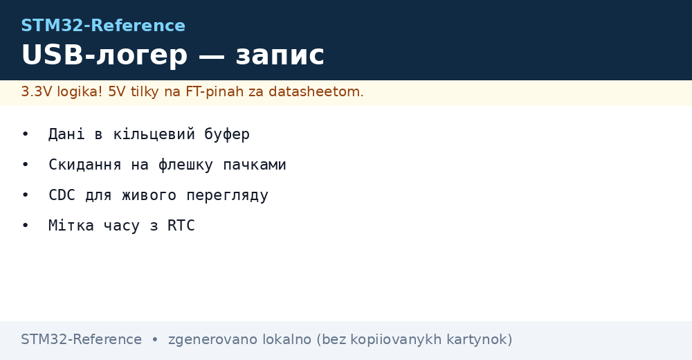
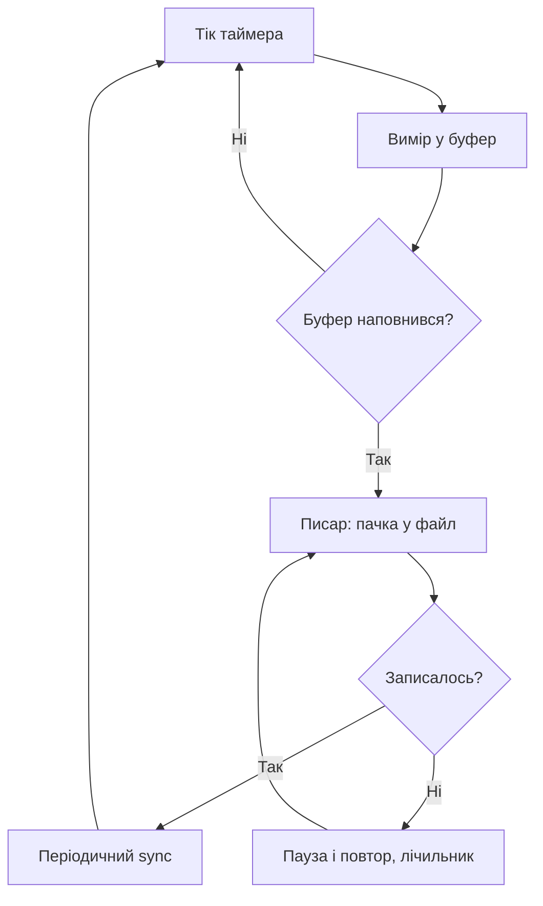

# USB-логер - запис даних з міткою часу


*Рис. Потік: вимір, буфер, файл, перегляд.*

> [!tip] Призначення ноти
> Навчити писати логер, що не губить дані: буфер переживає флешку, час точний, файли читаються.

## 1. Призначення

Логер сидить на обєкті тижнями і пише виміри з точним часом. Потім флешку забирають і розбирають. Головні вороги: повільна флешка, збій живлення посеред запису і брехливий годинник. Правильна архітектура переживає все троє.

## Архітектура логера

| Шар | Роль |
| --- | --- |
| Вимір по таймеру | Рівні інтервали, джиттер мінімум |
| Кільцевий буфер | Переживає паузи флешки |
| Писар на флешку | Скидає пачками, не по байту! |
| RTC з батареєю | Мітка часу навіть без живлення |
| CDC-порт | Живий перегляд без виймання флешки |

```text
Потік:
  таймер будить -> вимір у буфер -> писар пачкою у файл;
  буфер глибше за найдовшу паузу флешки.
```

## Кільцевий буфер: серце

| Параметр | Правило |
| --- | --- |
| Розмір | Мінімум на хвилину запису! |
| Переповнення | Лічильник втрат, не мовчання |
| Атомарність | Індекси через критичні секції |
| Перевірка | Тест переповненням при розробці |

```c
// Запис у кільце з ISR таймера:
buf[head] = sample;
head = (head + 1) % BUF_SZ;
if (head == tail) { lost++; tail = (tail + 1) % BUF_SZ; }
```

## Mermaid: цикл запису



## Файли: формат і ротація

| Тема | Практика |
| --- | --- |
| Формат | CSV: час і значення, читається скрізь |
| Імя файла | Дата старту, новий файл щодоби |
| Ротація | Старі видаляються при заповненні |
| Заголовок | HAT-плата з версією і налаштуваннями |

## Живлення і збої

| Захист | Як |
| --- | --- |
| Конденсатор на просідання | Дописати буфер при падінні (PVD!) |
| Sync перед сном | Файл закрито коректно |
| Перевірка при старті | Останній файл цілий чи рваний |
| Дві флешки | Критичний лог дублюється |

## RTC: час без брехні

| Тема | Практика |
| --- | --- |
| Батарейка VBAT | Годинник живе без основного живлення |
| Синхронізація | GPS PPS або вручну при обслуговуванні |
| Перевірка дрейфу | Раз на місяць звіряти |
| Мітка кожного запису | Без часу лог - сміття |

## Типові помилки

| # | Помилка | Чому погано | Як правильно |
| --- | --- | --- | --- |
| 1 | Запис по байту | Флешка вмирає швидко | Пачками через буфер! |
| 2 | Малий буфер | Втрати при паузах | Мінімум хвилина запису |
| 3 | Немає sync | Файл рваний при збої | Періодичний sync |
| 4 | Час без батареї | Після ресету - 1970 рік | VBAT-батарейка! |
| 5 | Один файл на все | Росте безмежно | Ротація щодоби |
| 6 | Втрати мовчать | Діри в даних непомітні | Лічильник втрат у лог |
| 7 | Флешка без запасу | Перезапис вбиває | Запас і wear-leveling |

## Носій: що вибрати

| Носій | Плюси | Мінуси |
| --- | --- | --- |
| SD-карта | Змінна, велика | Розєм зношується |
| USB-флешка | Зручно забирати | Гніздо на вулиці |
| QSPI-чип | Надійно, без розємів | Треба зливати кабелем |

## Офіційні джерела

- [FatFs module (ChaN)](http://elm-chan.org/fsw/ff/00index_e.html) - файлова система для мікроконтролерів.
- [AN4039 RTC calibration (ST)](https://www.st.com/resource/en/application_note/an4039.pdf) - точний годинник.

## Живий перегляд через CDC

| Команда | Відповідь |
| --- | --- |
| STATUS | Стан, вільне місце, втрати |
| TAIL | Останні рядки логу |
| TIME | Поточний час RTC |
| SYNC | Примусовий sync файлів |

```text
Протокол текстовий:
  команда рядком, відповідь рядками;
  ніяких бінарних чудес — читається терміналом;
  доступ без виймання флешки.
```

## Вивантаження файлів: порядок

| Крок | Дія |
| --- | --- |
| 1 | Команда SYNC - все дописано |
| 2 | Зупинити запис на час копіювання |
| 3 | Скопіювати файли mass storage або CDC |
| 4 | Перевірити цілість копії |
| 5 | Продовжити запис |

## Див. також

- [Home](../../../STM32-Reference/Home.md)
- [облік енергії](../../../STM32-Reference/16-Proekti/03-Energomonitor.md)
- [порт USB](../../../STM32-Reference/04-Shini/05-USB.md)
- [карти памяті](../../../STM32-Reference/04-Shini/06-SDMMC-QUADSPI.md)
- [час і нагляд](../../../STM32-Reference/07-Timeri-Son/02-LPTIM-RTC-WDT.md)
