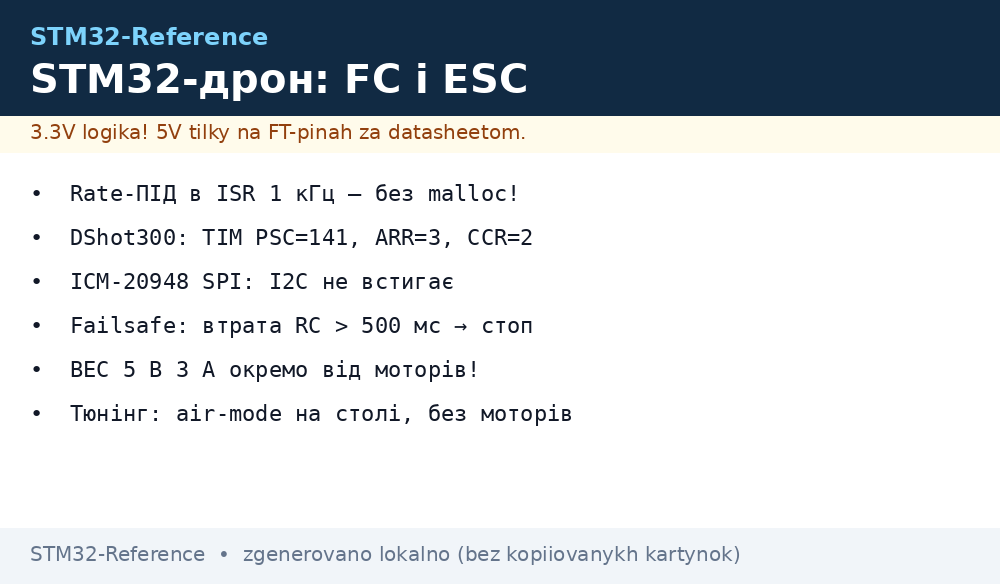
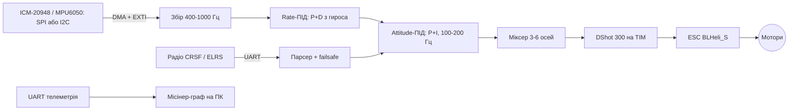

# Дрон і ESC на STM32: ПІД з гироскопа, DShot, FreeRTOS


*Рис. FC: гироскоп → ПІД 1 кГц → DShot PWM → ESC → мотори; телеметрія UART.*

> [!tip] Що це за нота
> Чому FC - це STM32, а не ESP32: детермінований цикл 1 кГц без розривів від Wi-Fi, жодних проклять. База: [F3/F4](../../../STM32-Reference/01-Hardware/02-F3-F4.md) або [H5/H7](../../../STM32-Reference/01-Hardware/04-H5-H7.md), [HAL/LL](../../../STM32-Reference/09-Proshivka/02-HAL-LL.md), [RTOS](../../../STM32-Reference/09-Proshivka/06-FreeRTOS.md). Базові RC-протоколи - [Betaflight setup guide](https://betaflight.com/docs/wiki/getting-started/setup-guide).

## 1. Архітектура



## 2. Вимоги до таймінгу

| Блок | Частота | Де виконується |
| --- | --- | --- |
| Читання гироскопа | 400-1000 Гц | ISR SPI з DMA + EXTI |
| Rate-петля | = частота гироса | ISR таймера (TIM2), без FreeRTOS |
| Attitude-петля | 100-200 Гц | та ж ISR, кожні N тактів |
| DShot | 300-600 Гц | TIM CH, вручну не чіпати |
| Телеметрія | 10-50 Гц | FreeRTOS-задача, UART TX DMA |

Rate-петля - тільки в ISR, без malloc, без Serial, без блокуючих викликів.

## 3. DShot: що це і як енкодувати

- кадр DShot300: 16 біт (CRC5 + 11 біт throttle) по ШІМ ~300 кбіт/с, пауза ~2 мс;
- throttle 1000…2000 «цифрове», 0 - стоп;
- TIM2 на F4 @168 МГц: PSC=141, ARR=3, CCR=2 → ~300 кбіт/с (DShot300); DShot250 - PSC=167, ARR=3.

```c
// DShot300 на TIM2 CH1-CH3 (F4): скелет
static uint8_t crc5(uint16_t v) { /* таблиця 5 біт */ }

uint16_t dshot_frame(uint16_t thr) {
  uint16_t t = (thr >= 1000) ? (thr - 1000) : 0;
  t = (t << 5) | crc5(t & 0x3FF);
  return t;
}

void dshot_set(uint32_t ch, uint16_t thr) {
  // записуємо 10 МС1 + кадр: TIM PWM, 16 імпульсів по 3.33 мкс
  dshot_push(ch, dshot_frame(thr));
}
```

Готові бібліотеки є в [BLHeli_S](https://github.com/Betaflight/blheli_s) і [Betaflight](https://github.com/betaflight/betaflight) - під свого фрейму зазвичай «з варіння» не пишуть.

## 4. ПІД: структура і стартові значення

- rate: P + D (D - з EMA-фільтром α=0.1 на вихід гироса);
- attitude: P + I (I з windup-clamp, інакше «закрутиться в себе»);
- стартові значення для 100×100×100 мм фрейму з ICM-20948:

| Контур | P | I | D |
| --- | --- | --- | --- |
| rate roll/pitch | 0.04 | 0 | 0.00018 |
| rate yaw | 0.06 | 0 | 0.0004 |
| att P (roll/pitch) | 4.5 | | |
| att I | 0.5 | | |

Tuning: тільки air-mode на столі (мотори зняті або на підставках), без польоту на старті.

Правила тюнінгу:

- починати з air-mode: мотори в повітрі, на підставках;
- збільшувати P на 10 % кожні 5 с спостереження;
- D додавати, коли P починає «трептувати»;
- I attitude - тільки якщо є постійний дрифт.

## 5. FreeRTOS: поділ задач

| Задача | Пріоритет | Деталі |
| --- | --- | --- |
| gyro_collect | ISR, поза RTOS | SPI DMA + EXTI, подвійний буфер 16 |
| control (1 кГц) | configMAX-1 | TIM2 ISR, ніколи не блокується |
| telemetry | 2 | UART TX DMA, 20 Гц |
| cli/config | 1 | SPI-Flash JSON, менше 512 КБ |

Правила поділу:

- rate/attitude - не чекають черги: ISR обходить FreeRTOS;
- telemetry - єдина задача, що блокується (UART DMA + FIFO);
- config - тільки через сервіс (окремий flag), не прямо з меню.

## 6. Калібрування і failsafe

- gyro calibration: 5 с нерухомо, offset зберігається у Flash;
- failsafe: втрима RC > 500 мс → throttle=1000 (стоп) або безпечна посадка - сценарій обирається в конфігурації;
- батарея: телеграма при VBAT < 10.2 В для 3S; лічильник, а не довіра «щоб довелося».

## 7. Живлення FC

- BEC 5 В 3 А окремо від моторів: просадки LiPo не мають діставати до STM32;
- цифрове: VDD 3.3 В, 4×100 нФ біля кристалу, bulk 100 мкФ;
- роз'єм: XT60 для батарей, XT30 для BEC (див. [Ланцюги](../../../STM32-Reference/02-Zhivlennya/01-Lancjugi-zhivlennya.md)).

## 8. Типові помилки

| Симптом | Причина | Лікування |
| --- | --- | --- |
| ESC бипить 3-5 разів і вимикається | DShot300 не підтримується старим ESC | DShot150/100 або переписати протокол у меню ESC |
| Гироскоп «пливе» | offset не збережено, плата поводиться | калібрувати при постійній температурі |
| I2C timeout під ШІМом | спільна земля, шум на 5 В | I2C → SPI-гироскоп, RC-фільтр, земля |
| FC «відлітає» при старті | BEC слабкіший за пік моторів | BEC 5 В 3 А, заміри просадок осцилографом |
| Мотор крутить «навпростусь» навпаки | direction у DShot/ESC | поворот осі в міксері, direction=−1 |
| Дрон «вибиває» в типовий рейс | gain занадто велика / aliasing | менший P rate, LPF 100 Гц на гироскоп |

## 9. Суміжні ноти

- [RTOS](../../../STM32-Reference/09-Proshivka/06-FreeRTOS.md), [DMA](../../../STM32-Reference/04-Shini/07-DMA-DeepDive.md), [EXTI/NVIC](../../../STM32-Reference/03-GPIO/03-EXTI-NVIC.md)
- [MPU6050](../../../STM32-Reference/10-Sensori/03-MPU6050-IMU.md), [Таймери](../../../STM32-Reference/07-Timeri-Son/01-GPTIM-ADTIM.md)
- [Плата F411](../../../STM32-Reference/14-Devboards/01-Blue-Pill.md) - F411 як базова плата
- [Живлення-дизайн](../../../STM32-Reference/02-Zhivlennya/03-Power-Design.md) - просадки і LDO

## 9.1 BOM: стартік для 3S

| Компонент | Кількість | Примітка |
| --- | --- | --- |
| STM32F411 (Blue Pill) | 1 | [Плата F411](../../../STM32-Reference/14-Devboards/01-Blue-Pill.md) |
| ICM-20948 (SPI) | 1 | [MPU6050](../../../STM32-Reference/10-Sensori/03-MPU6050-IMU.md) - SPI-варіант |
| BLHeli_S ESC 15 А (DShot) | 3 | [Живлення](../../../STM32-Reference/02-Zhivlennya/03-Power-Design.md) |
| LiPo 3S 1300 мАг | 1 | XT60, 100A balance |
| CRSF / ELRS ресивер | 1 | UART 57600, failsafe |
| BEC 5 В 3 А + XT30 | комплект | окремо від моторів |

## Офіційні джерела

- [Betaflight - setup guide](https://betaflight.com/docs/wiki/getting-started/setup-guide) - петлі, failsafe, конфігурація.
- [Betaflight (GitHub)](https://github.com/betaflight/betaflight) - код FC, порівнювати зі своїм.
- [BLHeli_S (GitHub)](https://github.com/Betaflight/blheli_s) - прошивка ESC, DShot.
- [STM32F4 (ST)](https://www.st.com/en/mcus-mpus/stm32f4.html) - серія F4, периферія, TIM.
- [ICM-20948 (TDK InvenSense)](https://www.tdk.com/en/products/sensor/inertial-measurement-units/) - IMU, SPI до 1 кГц.
