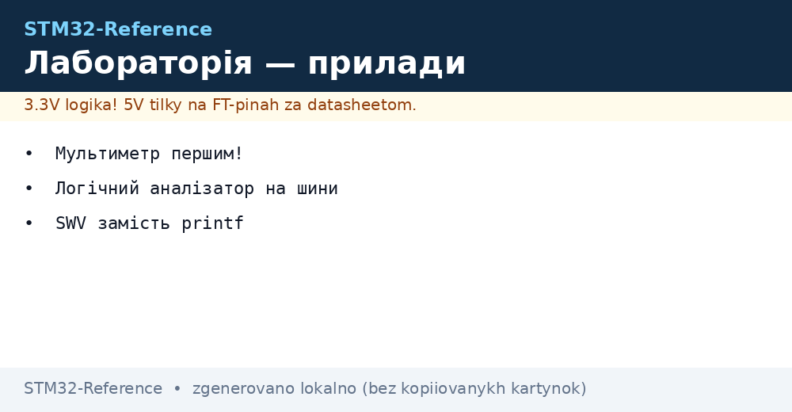
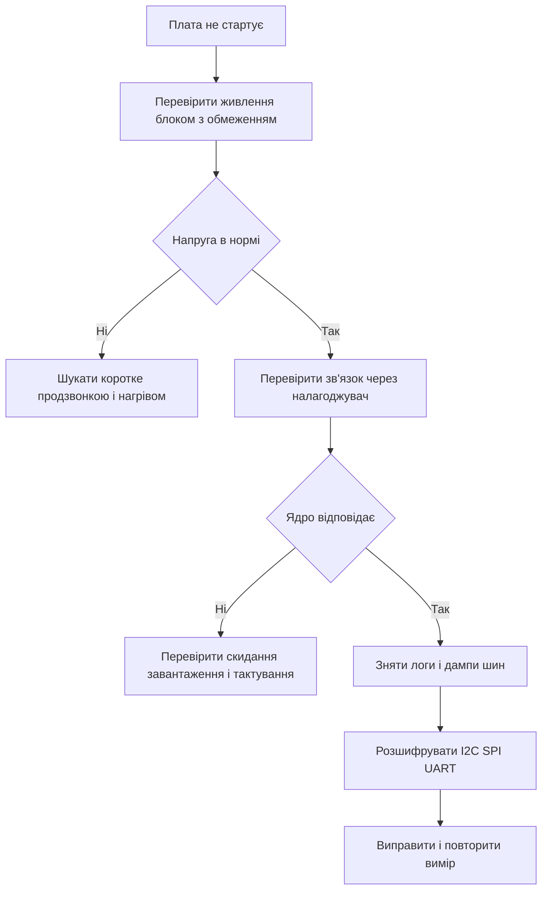

# Прилади лабораторії - міряти правильно


*Рис. Прилади лабораторії: мультиметр осцилограф логічний аналізатор блок живлення та трасування налагодження.*

> [!tip] Призначення ноти
> Навчити міряти без магії: куди ставити щупи як не спалити плату як розшифрувати шини та як бачити що робить прошивка.

## 1. Призначення

Лабораторія це стіл де плата оживає або вмирає. Мінімальний набір це мультиметр осцилограф лабораторний блок живлення та логічний аналізатор. Далі йдуть програматор трасування та захист від статики.

Правильні виміри економлять тижні. Неправильні дають хибні висновки: шукають помилку у коді коли пливе живлення або звинувачують датчик коли щуп вносить наведення.

Про прошивку плат дивись матеріал про [прошивка через ST-Link](../../../STM32-Reference/09-Proshivka/03-ST-Link-Proshivka.md) а про проєктування плат матеріал про [проєктування плати](../../../STM32-Reference/17-Lab/02-Plata-PCB.md).

## 2. Мультиметр струм у розрив напруга паралельно

| Вимір | Як підключати | Типові межі |
| --- | --- | --- |
| Напруга живлення | Паралельно до VDD та землі | Межа 20 V точність до мілівольт |
| Струм сну | У розрив живлення послідовно | Межа mA або uA чекати усталення |
| Струм роботи | У розрив через клеми 10 A | Короткі дроти інакше просадка |
| Опір доріжок | Без живлення | Шукати короткі замикання |
| Продзвонка | Без живлення | Перевірка перемичок і холодних паянь |

Струм міряють у розрив а не паралельно. Щупи у гніздах струму не можна ставити на напругу бо буде коротке. Після виміру струму щуп повертають у гніздо напруги.

Сон у мікроамперах міряють окремо бо дешевий прилад на межі амперів його не побачить. Для піків передачі дивляться осцилографом на шунті.

```text
Мультиметр:
  напруга:  COM -> GND, V -> VDD (паралельно, плата живиться)
  струм:    розірвати + живлення, COM -> батарея -, mA -> плата -
            чекати 10 s поки конденсатори зарядяться
  продзвонка: живлення ВИМКНУТИ, щупи на два кінці доріжки
  увага: гніздо 10A без запобіжника, не міряти мережу!
```

## 3. Осцилограф щупи помножувач земля

| Питання | Правило |
| --- | --- |
| Дільник щупа | Ставити x10 для швидких сигналів і менше навантаження |
| Калібрування | Перед роботою підкрутити компенсацію за меандром 1 kHz |
| Земля | Короткий повідок до землі плати поруч із точкою виміру |
| Два канали | Один на сигнал другий на живлення видно просадку |
| Смуга | 100 MHz вистачає для SPI 20 MHz з запасом |
| Запуск | За фронтом пакета або по спаду живлення |

Довга земля щупа це антена. На SPI 10 MHz вона покаже дзвін якого немає. Крокодил замінюють пружинкою заземлення або міряють диференційно.

Гальванічної розв'язки у дешевого осцилографа немає. Корпус щупа з'єднаний з мережевою землею. Міряти мережу без розв'язки заборонено.

```text
Осцилограф:
  канал 1: PA9 TX UART, x10, запуск за стартом байта
  канал 2: VDD біля чипа, x1, шукати просадку при передачі
  земля: пружинка до GND за 5 mm від точки, без довгого дроту
  приклад: SPI SCK 8 MHz - чистий меандр без дзвону
           I2C SCL - підтяжка 4.7 kOhm фронт до 1 us
```

## 4. Логічний аналізатор декодери шин

| Шина | Що дивитись |
| --- | --- |
| UART | Швидкість старт стоп парність обмін без розривів |
| I2C | Адреса ACK NACK повтори старту зависання шини |
| SPI | Фаза і полярність порядок біт вибір кристала |
| SWD | Чи є зв'язок з ядром чи тримає скидання |

Аналізатор на 8 каналів з частотою 24 MHz вистачає для шин до кількох мегагерц. Сигнали чіпляють тонкими гачками до тестових точок. Землю беруть одним коротким дротом.

Декодер одразу показує байти а не лише меандри. Збережений дамп прикладають до звіту про помилку. Це швидше за читання осцилограм вручну.

Про шари драйверів для цих шин читай у нотатці про [шари HAL і LL](../../../STM32-Reference/09-Proshivka/02-HAL-LL.md).

## 5. Блок живлення з обмеженням струму

| Крок | Дія |
| --- | --- |
| Напруга | Виставити 3.3 V до підключення плати |
| Обмеження | Виставити 100 mA для першого вмикання |
| Вмикання | Увімкнути і дивитись струм має бути десятки mA |
| Коротке | Струм уперся у межу напруга впала шукати нагрів |
| Норма | Підняти межу до 500 mA після перевірки |

Перше вмикання нової плати завжди через обмеження. Так згорає запобіжник блока а не доріжки. Нагрітий елемент шукають пальцем або тепловізором.

Про ланцюги живлення плати читай у матеріалі про [ланцюги живлення плати](../../../STM32-Reference/02-Zhivlennya/01-Lancjugi-zhivlennya.md) а про батареї у матеріалі про [батарейне живлення вузлів](../../../STM32-Reference/02-Zhivlennya/02-Batareyne-zhivlennya.md).

## 6. Трасування замість виводу у порт

Вивід тексту у порт гальмує програму та змінює час. Апаратне трасування через вивід налагодження дає логи без зупинки ядра.

```c
#include "stm32f4xx_hal.h"
#include <stdio.h>

int _write(int file, char *ptr, int len)
{
  for (int k = 0; k < len; k++)
  {
    ITM_SendChar((uint32_t)ptr[k]);
  }
  return len;
}

void Trace_Init(void)
{
  CoreDebug->DEMCR |= CoreDebug_DEMCR_TRCENA_Msk;
  DBGMCU->CR |= DBGMCU_CR_TRACE_IOEN_Msk;
}

void App_Task(void)
{
  static uint32_t cnt = 0;
  cnt++;
  printf("tick %lu adc %u\r\n", (unsigned long)cnt, (unsigned)1234);
  HAL_Delay(500);
}
```

| Метод | Плюс | Мінус |
| --- | --- | --- |
| UART логи | Просто видно у терміналі | Гальмує черги переповнюються |
| SWV траса | Швидко без зупинки мітки часу | Треба налагоджувач і налаштування |
| LED коди | Працює без нічого | Мало інформації |
| Збереження у RAM | Дивитись після зупинки | Обмежений обсяг |

Трасу вмикають у середовищі розробки вибирають тактову частоту та вивід. Логи дивляться у вікні трасування а не у терміналі порту.

## 7. Захист від статики та порядок на столі

| Захід | Як робити |
| --- | --- |
| Браслет | На зап'ястя через резистор до землі столу |
| Килимок | Струмопровідний килимок заземлений |
| Зберігання | Плати у антистатичних пакетах а не на батареї |
| Вологість | Не терти пластик поряд із платами взимку |
| Живлення | Спочатку земля потім сигнали потім живлення |

Статика вбиває входи тихо. Плата наче працює а АЦП бреше або пін тече. Взимку у сухому повітрі ризик найбільший.

## 8. Логіка вимірювання у схемі



## Типові помилки

| # | Помилка | Чому погано | Як правильно |
| --- | --- | --- | --- |
| 1 | Струм міряють паралельно | Коротке через амперметр і спалений запобіжник | Тільки у розрив послідовно з навантаженням |
| 2 | Довга земля осцилографа | Дзвін і хибні викиди на швидких фронтах | Коротка пружинка до землі поруч |
| 3 | Щуп x1 на SPI 10 MHz | Щуп вантажить шину і рве обмін | Режим x10 та калібрування компенсації |
| 4 | Логи у перериванні | Затримки зрив обміну втрата байтів | Логи у головному циклі або траса |
| 5 | Перше вмикання без обмеження | Згорає доріжка або стабілізатор | Межа 100 mA і контроль струму |
| 6 | Робота без антистатики | Приховані пошкодження входів | Браслет килимок пакети |

## Офіційні джерела

- [Oscilloscope probes ABC Tektronix](https://www.tek.com/en/documents/primer/oscilloscope-probe-fundamentals) - дільники компенсація заземлення.
- [ST-Link debug and trace ST](https://www.st.com/en/development-tools/st-link-v3.html) - налагодження трасування SWV.

## Див. також

- [Home](../../../STM32-Reference/Home.md)
- [прошивка через ST-Link](../../../STM32-Reference/09-Proshivka/03-ST-Link-Proshivka.md)
- [шари HAL і LL](../../../STM32-Reference/09-Proshivka/02-HAL-LL.md)
- [ланцюги живлення плати](../../../STM32-Reference/02-Zhivlennya/01-Lancjugi-zhivlennya.md)
- [облік енергії](../../../STM32-Reference/16-Proekti/03-Energomonitor.md)
- [проєктування плати](../../../STM32-Reference/17-Lab/02-Plata-PCB.md)
