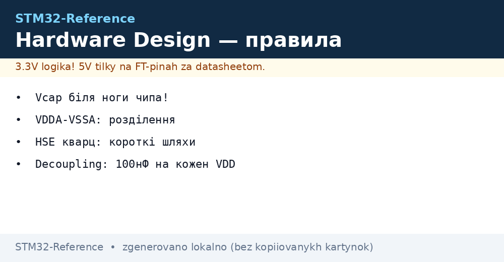
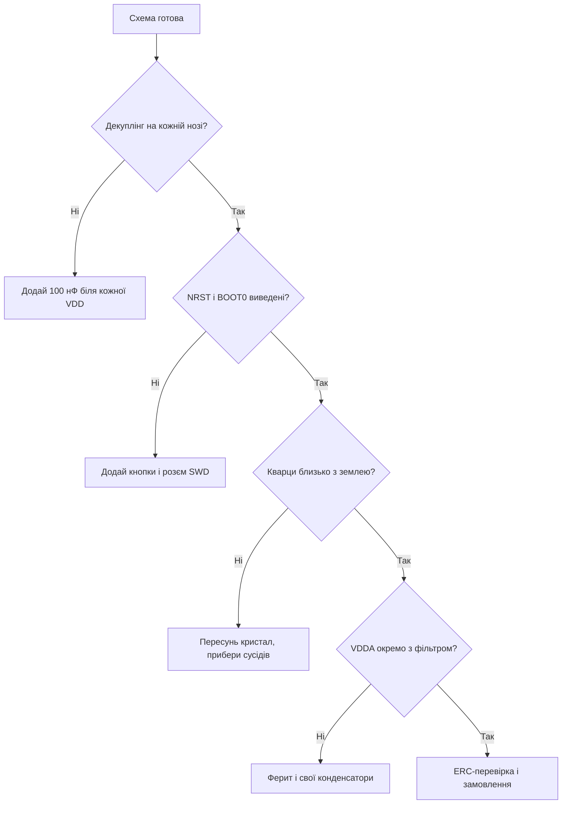

# Проєктування плати STM32 - живлення, кварци і розводка


*Рис. Плата, що стартує з першого разу: живлення, кварци, дебаг.*

> [!tip] Призначення ноти
> Дати чекліст схемотехніки, щоб своя плата запускалась одразу, а не з третьої ревізії.

## 1. Призначення

Мікроконтролер - лише частина плати. Девяносто відсотків «чип бракований» - це помилки схеми: забутий конденсатор, довга доріжка кварцу, спільна земля аналогу і цифри. Ця нота збирає обов'язковий мінімум схеми і розводки.

## Живлення: обов'язковий мінімум

| Елемент | Правило | Чому |
| --- | --- | --- |
| Декуплінг VDD | 100 нФ біля КОЖНОЇ піни живлення | Імпульсні струми ядра |
| Bulk-конденсатор | 4.7-10 мкФ на вхід плати | Просідання при старті радіо і реле |
| VDDA-фільтр | Ферит + 1 мкФ + 100 нФ окремо | АЦП без шуму цифрової частини |
| VCAP (H7) | 2.2 мкФ за даташитом, близько до пінів | Без них ядро не стартує! |
| VBAT | Батарейка або перемичка на VDD | Інакше RTC і backup мертві |

```text
Типова схема живлення плати:
  5V вхід -> діод захисту -> LDO 3.3V -> bulk 10 мкФ
  3.3V -> кожна нога VDD через 100 нФ (доріжка коротка!)
  3.3V -> ферит -> VDDA + VREF через свої конденсатори
```

## Скидання і завантаження

| Сигнал | Схема | Пастка |
| --- | --- | --- |
| NRST | Підтяжка 10 кОм до 3.3V + 100 нФ на землю + кнопка | Без конденсатора - хибні скидання від завад |
| BOOT0 | Перемичка або резистор на землю + кнопка на 3.3V | Без доступу - не зайти в bootloader! |
| SWDIO/SWCLK | Розєм 2.54 або Tag-Connect + підтяжки | Без розєму - прошивка тільки до запайки |

## Кварци: близько і коротко

| Резонатор | Вимоги до розводки |
| --- | --- |
| HSE 8-25 МГц | Кристал максимально близько, доріжки симетричні і короткі |
| Навантажувальні конденсатори | За даташитом кристала (зазвичай 12-22 пФ) |
| Земля під кварцом | Суцільний полігон, ніяких цифрових доріжок поруч! |
| LSE 32.768 кГц | Окремий маленький кристал, своя земляна зона |

```text
НІ Femto під кварцом:
  ніяких перехідних отворів у зоні кристала;
  ніяких швидких сигналів (SPI, USB) поруч;
  корпус кристала на землю.
```

## Mermaid: ревізія схеми перед замовленням



## Аналогова частина

| Тема | Практика |
| --- | --- |
| Розділення земель | Одна точка з'єднання AGND і DGND біля джерела |
| VREF | Точне джерело або VREFBUF, конденсатор за даташитом |
| Входи АЦП | RC-фільтр проти аліасингу, захисні діоди |
| Шунти струму | Кельвінівське підключення, короткі симетричні пари |

## Цифрові інтерфейси на платі

| Інтерфейс | Вимоги |
| --- | --- |
| USB | Диференційна пара 90 Ом, однакова довжина, без отворів! |
| SDMMC/SDIO | Короткі рівні доріжки, земля поруч |
| Ethernet RMII | Довжини пар, кристал 50 МГц близько до PHY |
| Антена (WB/WL) | Keepout-зона, pi-ланцюг, 50 Ом |

## Налагоджувальні зручності

| Елемент | Навіщо |
| --- | --- |
| SWD-розєм | Прошивка і дебаг після монтажу |
| UART-вивід | Лог без дебагера |
| Тестові точки | VDD, GND, ключові сигнали для щупа |
| LED живлення + LED користувача | Видно, що плата жива |
| Перемичка виміру струму | Розрив живлення під амперметр |

## Типові помилки

| # | Помилка | Чому погано | Як правильно |
| --- | --- | --- | --- |
| 1 | Один конденсатор на всі VDD | Просідання і збої ядра | 100 нФ біля кожної піни! |
| 2 | Немає VCAP на H7 | Не стартує взагалі | За даташитом, близько до пінів |
| 3 | BOOT0 без доступу | Не зайти в bootloader | Кнопка або перемичка на платі |
| 4 | Кварц далеко з сусідами | Не стартує, пливе частота | Близько, коротко, тиха зона |
| 5 | AGND розірвана | Шум АЦП і гули | Одна точка з'єднання біля джерела |
| 6 | USB парою абияк | Не бачиться хостом | 90 Ом, рівні довжини, без отворів |
| 7 | Немає SWD-розєму | Цегла після першої невдалої прошивки | Розєм або тестові точки з NRST |

## Маркування ревізій плати

| Правило | Пояснення |
| --- | --- |
| Номер ревізії на шовкографії | Інакше не відрізниш плати з різними багами |
| Журнал змін ревізії | Що виправлено від попередньої |
| Зберігати гербери кожної ревізії | Повторне замовлення без сюрпризів |

## Офіційні джерела

- [AN2586 Getting started with hardware (ST)](https://www.st.com/resource/en/application_note/an2586.pdf) - базова схема плати STM32.
- [AN2867 Oscillator design guide (ST)](https://www.st.com/resource/en/application_note/an2867.pdf) - кварци і конденсатори.

## Перше ввімкнення: порядок дій

| Крок | Дія |
| --- | --- |
| 1 | Візуальний огляд: перемички, полярність, відсутність зайвого припою |
| 2 | Продзвонити живлення: немає короткого між 3.3V і GND! |
| 3 | Подати живлення через БЖ з обмеженням 100 мА |
| 4 | Перевірити 3.3V мультиметром, потім струм спокою |
| 5 | Підключити ST-Link, прочитати ID чипа |
| 6 | Залити Blink, перевірити LED і UART-лог |

```text
Якщо струм одразу в обмеження:
  вимкнути НЕГАЙНО, шукати коротке тепловізором або пальцем;
  типові винуватці: переплутаний LDO, намистина припою, ТВС навпаки.
```

## Див. також

- [Home](../../../STM32-Reference/Home.md)
- [проєктування плати](../../../STM32-Reference/17-Lab/02-Plata-PCB.md)
- [вимірювальні прилади](../../../STM32-Reference/17-Lab/01-Priladi.md)
- [ланцюги живлення](../../../STM32-Reference/02-Zhivlennya/01-Lancjugi-zhivlennya.md)
- [флагмани і домени](../../../STM32-Reference/01-Hardware/04-H5-H7.md)
