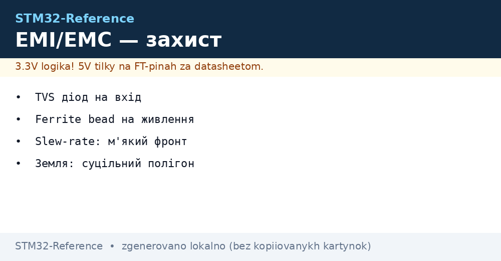
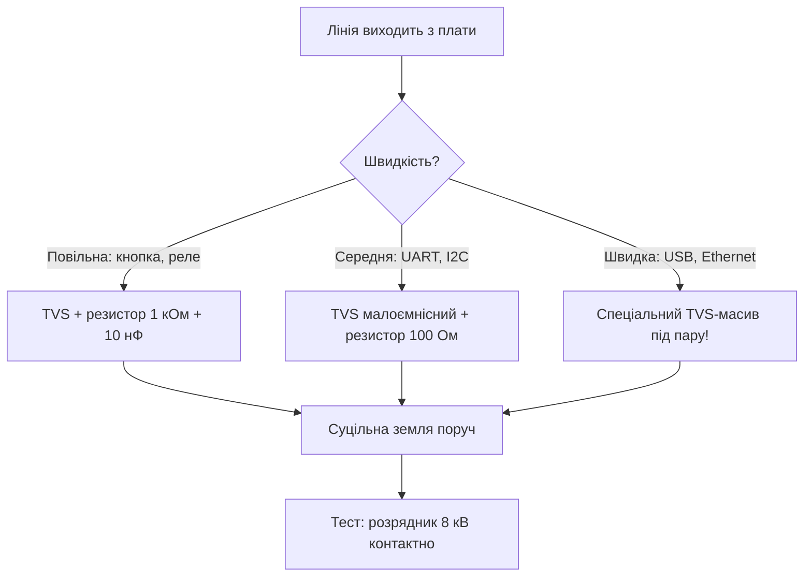

# EMI і захист плати STM32 - TVS, ферити і земля


*Рис. Тиха плата: захист на входах, фільтри на живленні, суцільна земля.*

> [!tip] Призначення ноти
> Навчити гасити завади і захищати піни так, щоб плата проходила випробування і жила в полі.

## 1. Призначення

Мікроконтролер бачить світ через піни - і кожен пін це антена для завад і ворота для статики. Без захисту один дотик пальцем або клацання реле поруч перетворюється на хибне переривання, скидання або пробитий вхід. Захист коштує копійки на етапі схеми і тисячі на етапі рекламацій.

## Два напрями: випромінювання і сприйнятливість

| Напрям | Питання | Інструменти |
| --- | --- | --- |
| Emission (випромінюєш) | Чи не глушиш сусідів? | Мякі фронти, фільтри, екрани |
| Immunity (терпиш чуже) | Чи виживаєш біля контактора? | TVS, ферити, розв'язка, земля |

```text
Правило: спочатку не випромінюй сам (дешево),
потім захищайся від чужого (дорожче).
Тихе джерело не потребує товстих стін.
```

## TVS-захист входів

| Елемент | Куди | Як вибрати |
| --- | --- | --- |
| TVS-діод однонаправлений | DC-лінії, кнопки, датчики | Напруга пробою вище робочої, нижче максимуму піна! |
| TVS-діод двонаправлений | RS485, CAN, диференційні пари | Ємність мала, інакше зїсть швидкі фронти |
| Резистор-обмежувач | Послідовно перед піном, 100 Ом - 1 кОм | Обмежує струм в захисні діоди кристала |
| Конденсатор на землю | 1-10 нФ біля розєму | Зрізає високочастотний дзвін |

```text
Ланцюжок захисту дискретного входу:
  розєм -> TVS на землю -> резистор 1 кОм -> конденсатор 1 нФ -> пін.
  TVS бере удар, резистор ріже струм, конденсатор давить дзвін.
```

## Живлення: ферити і фільтри

| Елемент | Куди | Ефект |
| --- | --- | --- |
| Феритова намистина | Послідовно в 3.3V перед шумною частиною | Давить мегагерци, пропускає постійний струм |
| LC-фільтр VDDA | Ферит + конденсатори | Чистий аналог поруч з цифровим штормом |
| Окремий LDO для аналогу | Вимогливі виміри | Ізоляція від просідань цифри |
| Діод від зворотної полярності | Вхід плати | Рятує від переплутаного БЖ |

## Mermaid: вибір захисту лінії



## Земля і розводка проти завад

| Правило | Пояснення |
| --- | --- |
| Суцільний полігон землі | Ніяких щілин під швидкими сигналами! |
| Зворотний струм під доріжкою | Розрив полігона змушує струм обходити і випромінювати |
| Аналог і цифра | Окремі зони, одна точка з'єднання |
| Кварц у тихій зоні | Ніяких силових доріжок під резонатором |
| Екран кабеля на землю | З одного боку для низьких частот, з обох для високих |

## Slew-rate: мякі фронти

| Тема | Практика |
| --- | --- |
| Швидкість піна OSPEEDR | Мінімальна, якої вистачає для задачі! |
| Резистор послідовно | 22-100 Ом на швидких лініях гасить дзвін |
| Диференційні пари | Рівні довжини, постійний зазор |
| ШІМ на мотор | Ферит + RC-снабер на ключах |

```c
// Приклад: знизити швидкість фронту неважливого піна:
LL_GPIO_SetPinSpeed(GPIOA, LL_GPIO_PIN_5, LL_GPIO_SPEED_FREQ_LOW);
```

## Випробування: мінімум для себе

| Тест | Як робити | Критерій |
| --- | --- | --- |
| Електростатика | Пєзо-запальничка або розрядник біля корпусу | Без скидань і зависань |
| Просадка живлення | Коротке вимкнення БЖ на 10-100 мс | BOR/PVD відпрацьовують чисто |
| Реле поруч | Клацання навантаженням 220V поруч | Немає хибних переривань |
| Довгі лінії | Максимальна довжина кабеля | Протокол тримається без повторів |

## Типові помилки

| # | Помилка | Чому погано | Як правильно |
| --- | --- | --- | --- |
| 1 | TVS з пробоєм нижче робочої | Клинить лінію постійно | Пробій між робочою і максимумом піна |
| 2 | Велика ємність TVS на USB | Зїдає сигнал | Спеціальні малоємнісні масиви |
| 3 | Щілина в землі під SPI | Випромінювання і дзвін | Суцільний полігон без розрізів |
| 4 | OSPEEDR максимум скрізь | Дзвін і випромінювання | Мінімум, якого вистачає |
| 5 | Екран кабеля нікуди | Антена замість екрана | На землю, правилом одного/двох боків |
| 6 | Немає захисту взагалі | Перша гроза або дотик | TVS + резистор хоча б на зовнішніх лініях |
| 7 | Ферит в загальне живлення | Падає напруга під навантаженням | Ферит тільки на чутливі гілки, не в силову |

## Офіційні джерела

- [AN1709 EMC design guide (ST)](https://www.st.com/resource/en/application_note/an1709.pdf) - придушення завад на платах STM32.
- [IEC 61000-4-2 ESD standard (IEC)](https://webstore.iec.ch/en/publication/26121) - рівні випробувань статикою.

## Гальванічна розв'язка: коли землі різні

| Випадок | Рішення |
| --- | --- |
| RS485/CAN на довгій лінії | Ізольований трансивер + ізольований DC-DC |
| Вимір мережі 220V | Оптопара або цифровий ізолятор, ніякого спільного GND! |
| USB при різних потенціалах | Ізолятор USB або живлення від одного джерела |
| Стрічкові шлейфи між платами | Кручена пара на землю поруч із сигналом |

```text
Правило розвязки:
  барєр має тримати кіловольти, а не вольти;
  землі з обох боків барєру НІКОЛИ не зєднуються;
  живлення кожної сторони — своє, з своїм декуплінгом.
```

## Компонування плати: порядок зон

| Зона | Що всередині |
| --- | --- |
| Вхід живлення | Діод, bulk, LDO, ферити |
| Цифрове ядро | Чип, декуплінг, кварци, SWD |
| Аналог | VDDA-фільтр, VREF, входи АЦП |
| Силові ключі | MOSFET, реле, снаббери - якнайдалі від кварців! |
| Розєми | TVS-барєр на межі плати |

## Див. також

- [Home](../../../STM32-Reference/Home.md)
- [схемотехніка плати](../../../STM32-Reference/17-Lab/03-Hardware-Design-Guidelines.md)
- [проєктування плати](../../../STM32-Reference/17-Lab/02-Plata-PCB.md)
- [ланцюги живлення](../../../STM32-Reference/02-Zhivlennya/01-Lancjugi-zhivlennya.md)
- [режими пінів](../../../STM32-Reference/03-GPIO/01-GPIO-rezhimi.md)
