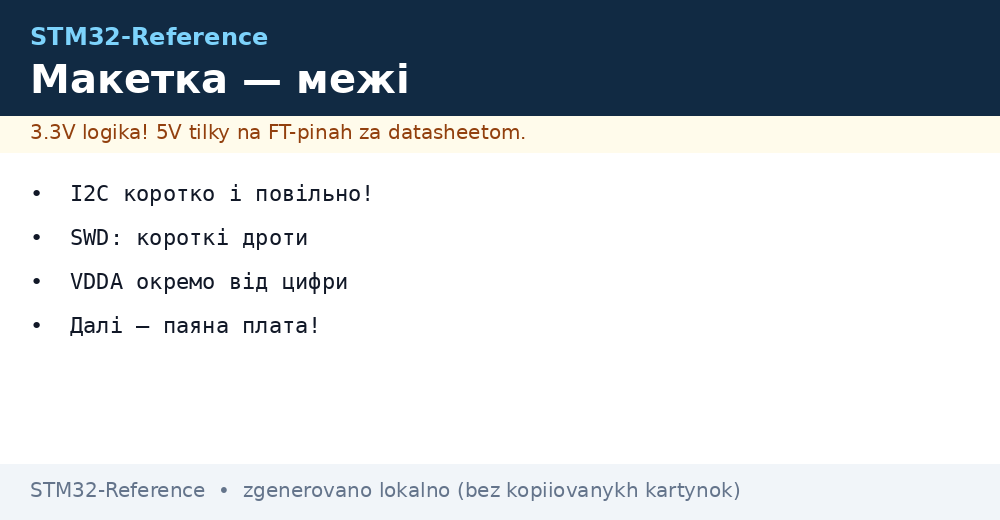
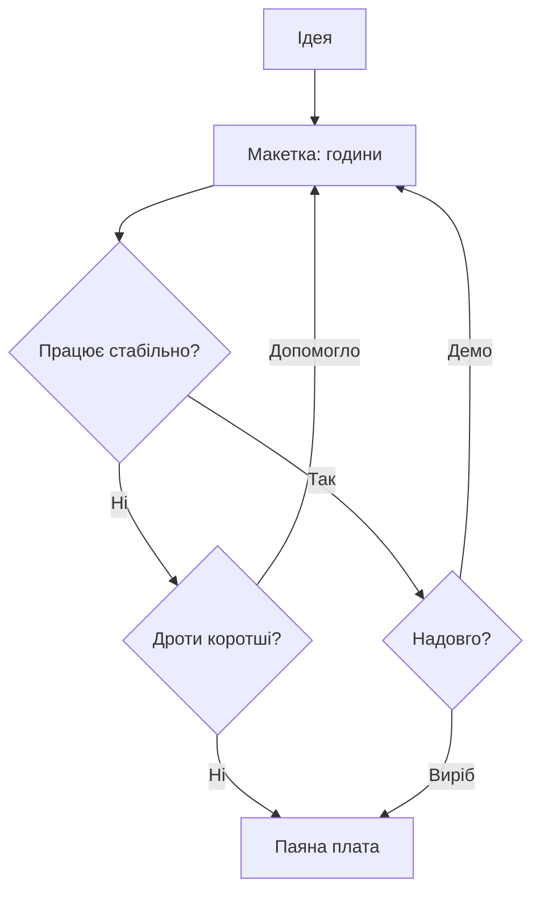

# Макетка - збірка STM32 без паяння і її межі


*Рис. Макетка як етап: швидко зібрати, вчасно піти.*

> [!tip] Призначення ноти
> Навчити збирати STM32-вузол на макетці так, щоб глюки були від коду, а не від дротів.

## 1. Призначення

Макетка - це перша година проєкту: Blue Pill встромив, дроти кинув, Blink блимає. Але кожен контакт додає пікофаради і міліоми, а кожен дріт - антену. Ця нота дає правила, за яких макетка працює, і ознаки, що пора паяти.

## Шини живлення макетки

| Правило | Пояснення |
| --- | --- |
| Червона і синя смуги | Плюс і земля по всій довжині |
| Перемички посередині | Смуги часто розірвані в центрі! |
| Bulk біля чипа | 10 мкФ + 100 нФ прямо в сусідні гнізда |
| Товсті дроти живлення | Тонкі просідають на піках радіо |

```text
Перевірка шин мультиметром:
  продзвонити безперервність смуг з краю в край;
  знайти розрив посередині до, а не після години дебагу.
```

## SWD на макетці: коротко

| Сигнал | Правило |
| --- | --- |
| SWDIO, SWCLK | До 10 см, поруч земляний дріт! |
| GND | Першим дротом, товстим |
| NRST | Вивести на кнопку |
| Частота | Знизити, якщо обриви |

## Що працює, а що ні

| Задача | На макетці |
| --- | --- |
| Blink, кнопки, UART-лог | Так, без питань |
| I2C датчики | Так, до 100 кГц і коротко |
| SPI дисплей | Так, до 1 МГц |
| Швидкий SPI, SDIO | Ні - глюки гарантовані |
| USB дані | Ні, тільки живлення |
| АЦП точний | Ні, шум від сусідів |
| Кварц HSE | Тільки на платі модуля, не голий чип! |

## Mermaid: макетка чи паяти



## BOOT0 і кнопки на макетці

| Елемент | Як |
| --- | --- |
| BOOT0-перемичка | Джампер на 3.3 В або GND |
| RESET-кнопка | На землю через підтяжку |
| USER-кнопка | На EXTI-пін для меню |
| Світлодіоди | PC13 на Blue Pill вже є |

## Шум VDDA на макетці

| Проблема | Вихід |
| --- | --- |
| Сусідні цифрові дроти | Аналогові лінії окремим боком! |
| Спільний декуплінг | Свій 100 нФ біля VDDA-піни |
| Довгі щупи АЦП | Кручена пара або коротше |
| Точність | Для калібрування - тільки паяна плата |

## Перехід на паяну плату: ознаки

| Ознака | Дія |
| --- | --- |
| Глюк зникає від дотику | Контакти - паяти |
| Працює тільки з конкретним положенням дротів | Паяти |
| Треба в корпус | Паяти |
| Друга копія потрібна | Паяти одразу дві |

## Типові помилки

| # | Помилка | Чому погано | Як правильно |
| --- | --- | --- | --- |
| 1 | Смуги живлення з розривом | Половина схеми без живлення | Продзвонити спочатку! |
| 2 | Довгий SWD через всю макетку | Обриви прошивки | До 10 см + земля поруч |
| 3 | I2C на 400 кГц довгими дротами | NACK і клини | 100 кГц і коротко |
| 4 | Немає bulk біля чипа | Скидання на піках | 10 мкФ у сусідні гнізда |
| 5 | АЦП поруч з SPI-дротами | Шум у вимірах | Аналог окремим боком |
| 6 | Голий чип без кварца | HSE не стартує | Тільки модулі з кварцом! |
| 7 | Макетка як виріб | Окислення і відвали | Демо - так, серія - паяти |

## Зберігання збірки між сесіями

| Правило | Пояснення |
| --- | --- |
| Фото зверху | Відновити за хвилину після розвалу |
| Коробка з кришкою | Пил в контактах - глюки |
| Не носити в I2C-адаптеру | Дроти випадають і плутаються |

## Офіційні джерела

- [AN2586 Getting started (ST)](https://www.st.com/resource/en/application_note/an2586.pdf) - живлення і декуплінг.
- [Nucleo boards guide (ST)](https://www.st.com/en/evaluation-tools/stm32-nucleo-boards.html) - Morpho як заміна макетці.

## Організація дротів: кольори і довжина

| Колір | Сигнал |
| --- | --- |
| Червоний | Плюс живлення |
| Чорний або синій | Земля |
| Жовтий | Сигнали I2C і SPI |
| Зелений | UART і керування |

| Правило | Пояснення |
| --- | --- |
| Довжина за потребою | Зайві петлі - антени |
| Сигнальні поруч із землею | Кручена пара з GND для довгих |
| Не перетинати силові | Реле і мотори окремим жмутом |

## Живлення модулів: 5 В і 3.3 В поруч

| Тема | Практика |
| --- | --- |
| Дві шини на макетці | Одна смуга 5 В, друга 3.3 В |
| LDO-модуль AMS1117 | Дешевий перехідник з 5 на 3.3 |
| Струм AMS1117 | Гріється понад пів ампера! |
| FT-піни | 5-вольтові модулі тільки на FT-входи |

## Див. також

- [Home](../../../STM32-Reference/Home.md)
- [проєктування плати](../../../STM32-Reference/17-Lab/02-Plata-PCB.md)
- [схемотехніка плати](../../../STM32-Reference/17-Lab/03-Hardware-Design-Guidelines.md)
- [прошивка через ST-Link](../../../STM32-Reference/09-Proshivka/03-ST-Link-Proshivka.md)
- [плата Blue Pill](../../../STM32-Reference/14-Devboards/01-Blue-Pill.md)
